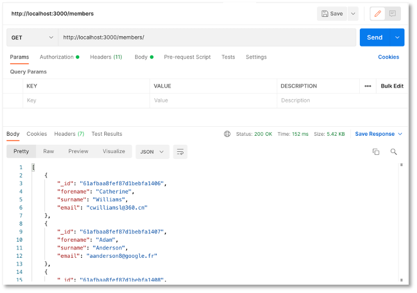
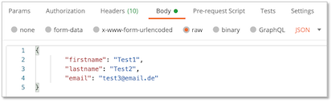
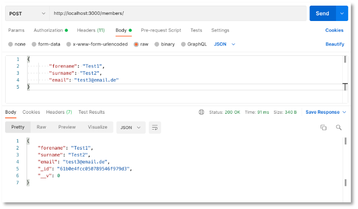
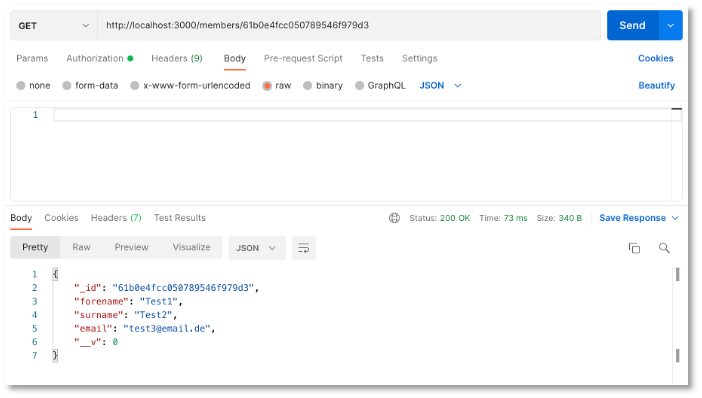
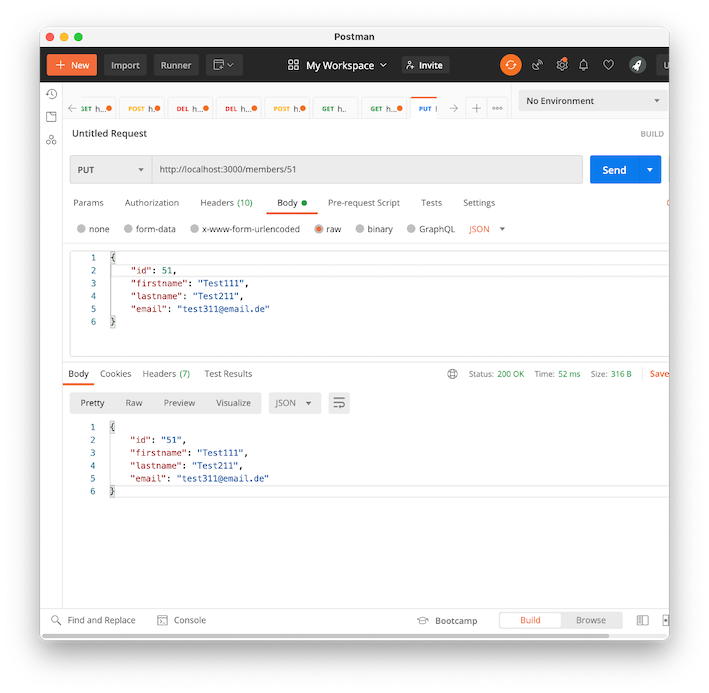
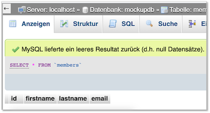

# REST-API

Die wesentlichsten Konzepte, wie Komponenten, Services und Routing für Angular-Projekte haben wir bereits kennengelernt. Ehe wir uns weiter mit dem Frontend beschäftigen, erstellen wir einen Server, der uns die Daten liefert. Derzeit haben wir unsere Mockup-Daten noch clientseitig vom `DataService` verwalten lassen und sie auch dort gespeichert. Das wollen wir nun ändern. Die Daten speichern wir in einer Datenbank. 

Für diese Datenbank stellen wir die Implementierung einer Schnittstelle bereit, so dass wir die wesentlichen Datenbankanfragen darüber ausführen können. Diese wesentlichen Datenbankfragen werden mit [CRUD](https://en.wikipedia.org/wiki/Create,_read,_update_and_delete) abgekürzt, für <strong>C</strong>reate, <strong>R</strong>ead, <strong>U</strong>pdate und <strong>D</strong>elete. Das bedeutet, wir implementieren Funktionalitäten, mit denen wir einen neuen Datensatz in die Datenbank einfügen (*create*), aus der Datenbank auslesen (*read*), in der Datenbank aktualisieren (*update*) und aus der Datenbank löschen (*delete*) können. 

Die Schnittstelle, die wir implementieren, ist eine sogenannte [REST-API](https://www.redhat.com/de/topics/api/what-is-a-rest-api). *REST* steht für [*Representational State Transfer*](https://de.wikipedia.org/wiki/Representational_State_Transfer) und basiert auf einigen wenigen Prinzipien:

1. Alles wird als eine *Ressource* betrachtet, z.B. `book`.
2. Jede Ressource ist durch *URIs* (*Uniform Resource Identifiers*) eindeutig identifizierbar, z.B. `http://localhost/books`.
3. Es werden die [Standard-HTTP-Methoden](https://de.wikipedia.org/wiki/Hypertext_Transfer_Protocol#HTTP-Anfragemethoden) verwendet, also `GET`, `POST`, `PUT`, `UPDATE`.  
4. Ressourcen können in verschiedenen Formaten vorliegen, z.B. in [HTML](https://html.spec.whatwg.org/multipage/), [XML](https://www.w3.org/TR/xml/), [JSON](https://jsonapi.org/format/), ...
5. Die Kommunikation ist *zustandslos*. Jede einzelne HTTP-Anfrage wird komplett isoliert bearbeitet. Es gibt keinerlei Anfragehistorie. 

Das bedeutet, wir erstellen ein Backend (einen REST-Server), an den HTTP-Anfragen mit der eindeutig identifizierbaren Ressource gestellt werden. Das Backend erstellt daraus die entsprechende SQL-Query. Das Resultat der Datenbankanfrage wird im `JSON`- oder `HTML`- oder `XML`- oder in einem anderen Format bereitsgestellt.


Prinzipiell gibt es also ein *Mapping*  von HTTP-Anfragen auf SQL-Anfragen:

|CRUD |SQL |HTTP |
|-----|----|-----|
|create |INSERT |POST |
|read |SELECT |GET |
|update |UPDATE |PUT |
|delete |DELETE |DELETE |


Wir wollen uns ein Backend erstellen, über das wir unsere Daten verwalten. Dazu überlegen wir uns zunächst ein paar *Endpunkte* und die Zugriffsmethoden, mit denen wir auf unsere Daten zugreifen wollen.

| Methode | URL | Bedeutung |
|---------|-----|-----------|
| GET     | /members | hole alle Datensätze |
| GET     | /members/11 | hole den Datensatz mit der id=11 |
| POST    | /members | füge einen neuen Datensatz hinzu |
| PUT     | /members/11 | ändere den Datensatz mit der id=11 |
| DELETE  | /members/11 | lösche den Datensatz mit der id=11 |
| DELETE  | /members | lösche alle Datensätze |

Der Wert der `id` ist natürlich nur ein Beispiel. Es soll für alle `id`-Werte funktionieren, die in unserem Datensatz enthalten sind. 

Wir starten damit, uns ein `node.js`-Projekt zu erstellen. Dazu erstellen wir uns zunächst einen Ordner `backend`, wechseln in diesen Ordner und führen dann `npm init` aus:

```bash
mkdir backend
cd backend
npm init
```

Sie werden ein paar Sachen gefragt. Im Prinzip können Sie immer `Enter` drücken:

```bash
This utility will walk you through creating a package.json file.
It only covers the most common items, and tries to guess sensible defaults.

See `npm help init` for definitive documentation on these fields
and exactly what they do.

Use `npm install <pkg>` afterwards to install a package and
save it as a dependency in the package.json file.

Press ^C at any time to quit.
package name: (backend) 
version: (1.0.0) 
description: Backend REST-API
entry point: (index.js) 
test command: 
git repository: 
keywords: restapi, backend
author: J. Freiheit
license: (ISC) 
About to write to /Users/jornfreiheit/Sites/WT21/backend/package.json:

{
  "name": "backend",
  "version": "1.0.0",
  "description": "Backend REST-API",
  "main": "index.js",
  "scripts": {
    "test": "echo \"Error: no test specified\" && exit 1"
  },
  "keywords": [
    "restapi",
    "backend"
  ],
  "author": "J. Freiheit",
  "license": "ISC"
}


Is this OK? (yes) 
```

Die `package.json` wurde erstellt. Nun benötigen wir noch das Modul [Express](https://expressjs.com/de/). Express bietet uns eine unkomplizierte *Middleware* für die Weiterverwaltung von `http`-Anfragen an die Datenbank und zurück. 

```bash
npm install express --save
```

Sie erhalten eine Meldung in der Form:

```bash
% npm install express --save

added 50 packages, and audited 51 packages in 844ms

found 0 vulnerabilities
```

In der `package.json` wurde die entsprechende Abhängigkeit eingetragen: 

=== "package.json"
	```json linenums="1" hl_lines="15-17"
	{
	  "name": "backend",
	  "version": "1.0.0",
	  "description": "Backend REST-API",
	  "main": "index.js",
	  "scripts": {
	    "test": "echo \"Error: no test specified\" && exit 1"
	  },
	  "keywords": [
	    "restapi",
	    "backend"
	  ],
	  "author": "J. Freiheit",
	  "license": "ISC",
	  "dependencies": {
	    "express": "^4.17.1"
	  }
	}
	``` 


Öffnen Sie nun das `backend`-Projekt in Ihrer IDE und erstellen Sie sich dort eine Datei `server.js` mit folgendem Inhalt:

=== "server.js"
	```javascript linenums="1"
	import express from 'express';

	const app = express();
	const PORT = 3000;

	app.get('/', (request, response) => {
	    response.json({ message: "Hello FIW!" });
	});

	app.listen(PORT, (error) => {
	    if (error) {
	        console.log(error);
	    } else {
	        console.log(`Server started and listening on port ${PORT} ...`);
	    }
	});
	``` 

Das bedeutet, wir importieren `express` (Zeile `1`), erzeugen uns davon ein Objekt und speichern dieses in der Variablen `app` (Zeile `3`). Wir legen in einer Konstanten `PORT` die Portnummer `3000` fest (Zeile `4` - die Portnummer können Sie wählen). Das `backend` ist somit unter `http://localhost:3000` verfügbar. Wenn wir diese URL aufrufen, dann wird ein `request` ausgelöst, den wir hier mit `Hello FIW!` als `response` beantworten (Zeilen `6-8`). Das eigentliche Starten des Webservers erfolgt in den Zeilen `10-16`.

In unserer `package.json` führen wir nun noch zwei Anpassungen durch. Erstens soll unser `main`-Skript nun nicht mehr `index.js`, sondern `server.js` sein. Zweitens haben wir in Zeile `1` in der `server.js` das `express`-Paket mittels

```
import express from 'express';
```

importiert. Dies entspricht der "neuen" Syntax zum Importieren eines ES6-Modules (ES6 - ECMAScript 6). "Früher" hat man stattdessen

```
const express = require('express');
```

geschrieben. Allerdings erfordert diese "neue" Syntax eine Erweiterung in der `package.json`:

=== "package.json"
	```json linenums="1" hl_lines="5-6"
	{
	    "name": "backend",
	    "version": "1.0.0",
	    "description": "Backend REST-API",
	    "main": "server.js",
	    "type": "module",
	    "scripts": {
	        "test": "echo \"Error: no test specified\" && exit 1"
	    },
	    "keywords": [
	        "restapi",
	        "backend"
	    ],
	    "author": "J. Freiheit",
	    "license": "ISC",
	    "dependencies": {
	        "express": "^4.17.1"
	    }
	}
	``` 


#### Starten des Projektes und Installation von nodemon

Das Projekt lässt sich nun starten. Wir geben dazu im Terminal im `backend`-Ordner

```bash
node server.js
```

ein. Im Terminal erscheint 

```bash
Server started and listening on port 3000 ...
```

und wenn Sie im Browser die URL `http://localhost:3000/` eingeben, wird dort


angezeigt. Sie können auch Postman öffnen und `http://localhost:3000` eintragen (`GET`-Methode):


Wann immer wir jetzt jedoch etwas an der Implementierung ändern, müssen wir im Terminal zunächst den Webserver mit 

```bash
Strg-C		// bzw. Control-C
```

stoppen, um ihn dann wieder mit `node server.js` zu starten. Um das zu umgehen, gibt es das Paket [nodemon](https://www.npmjs.com/package/nodemon). Da es nur sinnvoll während der Entwicklung eingesetzt werden kann (und sollte), installieren wir es als eine *development dependency*:

```bash
npm install --save-dev nodemon
```

Die `package.json` sieht daraufhin so aus:

=== "package.json"
	```json linenums="1" hl_lines="22-24"
	{
	    "name": "backend",
	    "version": "1.0.0",
	    "description": "Backend REST-API",
	    "main": "server.js",
	    "type": "module",
	    "scripts": {
	        "test": "echo \"Error: no test specified\" && exit 1"
	    },
	    "keywords": [
	        "restapi",
	        "backend"
	    ],
	    "author": "J. Freiheit",
	    "license": "ISC",
	    "dependencies": {
	        "express": "^4.17.1"
	    },
	    "devDependencies": {
	        "nodemon": "^2.0.15"
	    }
	}
	```

Zur Verwendung von `nodemon` fügen wir in die `package.json` unter `"scripts"` noch die Eigenschaft `watch` (frei gewählt) und den dazugehörigen Wert `nodemon server.js` ein:

=== "package.json"
	```json linenums="1" hl_lines="8"
	{
	    "name": "backend",
	    "version": "1.0.0",
	    "description": "Backend REST-API",
	    "main": "server.js",
	    "type": "module",
	    "scripts": {
	        "watch": "nodemon ./server.js",
	        "test": "echo \"Error: no test specified\" && exit 1"
	    },
	    "keywords": [
	        "restapi",
	        "backend"
	    ],
	    "author": "J. Freiheit",
	    "license": "ISC",
	    "dependencies": {
	        "express": "^4.17.1"
	    },
	    "devDependencies": {
	        "nodemon": "^2.0.15"
	    }
	}
	```

Nun lässt sich die Anwendung mithilfe von `nodemon` per 

```bash
npm run watch
```

starten und muss auch nicht mehr gestoppt und neu gestartet werden, wenn Änderungen an der Implementierungen durchgeführt wurden. Die Ausgabe im Terminal nach Eingabe von `npm run watch` ist ungefähr so:

```bash

> backend@1.0.0 watch
> nodemon ./server.js

[nodemon] 2.0.15
[nodemon] to restart at any time, enter `rs`
[nodemon] watching path(s): *.*
[nodemon] watching extensions: js,mjs,json
[nodemon] starting `node ./server.js`
Server started and listening on port 3000 ...

```


### Datenbank erstellen

[MongoDB](https://www.mongodb.com/de-de) ist die am meisten verwendete *NoSQL (not only SQL)* Datenbank. Sie basiert nicht auf Relationen, Tabellen und ihren Beziehungen zueinander (ist also keine *relationale* Datenbank), sondern speichert Dokumente in JSON-ähnlichem Format. Die [Community Edition der MongoDB](https://github.com/mongodb/mongo) ist Open Source und kostenlos verfügbar. 
Sollten Sie mit *Visual Studio Code* arbeiten, sollten Sie sich am besten die [MongoDB for VS Code](https://code.visualstudio.com/docs/azure/mongodb)-Ereiterung installieren. 

Zur Verwendung von *MongoDB* im Backend verwenden wir das Modul [Mongoose](https://mongoosejs.com/). Wir installieren *Mongoose* mithilfe von

```bash
npm install mongoose --save
```

In die `package.json` wird das Paket und die entsprechende Abhängigkeit eingetragen:

=== "package.json"
	```json linenums="1" hl_lines="19"
	{
	    "name": "backend",
	    "version": "1.0.0",
	    "description": "Backend REST-API",
	    "main": "server.js",
	    "type": "module",
	    "scripts": {
	        "watch": "nodemon ./server.js",
	        "test": "echo \"Error: no test specified\" && exit 1"
	    },
	    "keywords": [
	        "restapi",
	        "backend"
	    ],
	    "author": "J. Freiheit",
	    "license": "ISC",
	    "dependencies": {
	        "express": "^4.17.1",
	        "mongoose": "^6.0.14"
	    },
	    "devDependencies": {
	        "nodemon": "^2.0.15"
	    }
	}
	```

*Mongoose* stellt eine einfach zu verwendende Schnittstelle zwischen Node.js und MongoDB bereit. Die
MongoDB benötigen wir aber trotzdem (wir könnten jdoch auch eine Cloud von MongoDB oder z.B. `mlab.com` verwenden). Bevor wir uns mit der MongoDB verbinden, erstellen wir zunächst noch eine Datenbank. 


### Mongosh - MongoDB in der Shell

Um eine Datenbank mithilfe von MongoDB zu erstellen, verwenden wir [mongosh](https://docs.mongodb.com/mongodb-shell/). Installationsanleitungen zu *mongosh* finden Sie [hier](https://docs.mongodb.com/mongodb-shell/install/#std-label-mdb-shell-install). Nach der Installation von *mongosh* geben wir im Terminal 

```bash
mongosh 
```

ein. Es erscheint etwas in der Form:

```bash
Current Mongosh Log ID:	61ae3471fef87d1bebfa13a1
Connecting to:		mongodb://127.0.0.1:27017/?directConnection=true&serverSelectionTimeoutMS=2000
Using MongoDB:		5.0.3
Using Mongosh:		1.1.6

For mongosh info see: https://docs.mongodb.com/mongodb-shell/


To help improve our products, anonymous usage data is collected and sent to MongoDB periodically (https://www.mongodb.com/legal/privacy-policy).
You can opt-out by running the disableTelemetry() command.

------
   The server generated these startup warnings when booting:
   2021-12-03T08:35:22.188+01:00: Access control is not enabled for the database. Read and write access to data and configuration is unrestricted
------

Warning: Found ~/.mongorc.js, but not ~/.mongoshrc.js. ~/.mongorc.js will not be loaded.
  You may want to copy or rename ~/.mongorc.js to ~/.mongoshrc.js.
test> 
```

Die Warnung kann [ignoriert](https://www.mongodb.com/community/forums/t/warning-found-mongorc-js-but-not-mongoshrc-js-mongorc-js-will-not-be-loaded/129716/4) werden. Die Datei `mongorc.js` wurde erstellt, als einmal in die Shell `mongo` eingegeben wurde. Das ist aber `deprecated` und es soll stattdessen die `mongosh` verwendet werden, was wir ja auch machen. 


```bash
> use rest
```

(ohne das `>` - das soll nur symbolisieren, dass wir in der MongoDB-Shell sind). Es entsteht die Datenbank `rest`. Wir befüllen diese Datenbank probehalber mit Daten (löschen wir wieder)

```
> db.user.insert({name: "Ada Lovelace", age: 206})
```

- Falls Sie *Visual Studio Code*  verwenden und darin die [MongoDB for VS Code](https://code.visualstudio.com/docs/azure/mongodb)-Ereiterung installiert haben, können Sie auf der linken Seite auf das MongoDB-Blatt klicken und das `Advanced Connection Settings` mit dem Formular `Open form` anklicken.

Sie geben `mongodb://127.0.0.1:27017` ein und dass Sie keine Authentifizierung verwenden. Öffnen Sie die `connection` und darin `rest` und es erscheint

```json
{
  "_id": {
    "$oid": "60ddc2e80de75bf12565e491"
  },
  "name": "Ada Lovelace",
  "age": 206
}
```

- Um sich in Node.js mit der DB zu verbinden, geben Sie 

=== "app.js"
	```js linenums="1" hl_lines="2 15-20"
	const express = require('express');
	const mongoose = require('mongoose');
	const app = express();

	// Routen
	app.get('/', (req, res) => {
	    res.send('Hello FIW! (home)');
	});

	app.get('/test', (req, res) => {
	    res.send('Hello FIW! (home/test)');
	});

	// connect to mongoDB
	mongoose.connect('mongodb://127.0.0.1:27017/rest', { useNewUrlParser: true, useUnifiedTopology: true });
	const db = mongoose.connection;
	db.on('error', console.error.bind(console, 'connection error:'));
	db.once('open', () => {
	    console.log('connected to DB');
	});

	app.listen(3000); // port 3000
	```

ein. Im Terminal sollte dann

```bash
[nodemon] restarting due to changes...
[nodemon] starting `node app.js`
connected to DB
```

erscheinen. 

- für die "geheimen" Zugangsdaten (die jetzt noch gar nicht "geheim" sind) verwenden wir das [dotenv](https://www.npmjs.com/package/dotenv)-Paket

```bash
npm install dotenv
```

- Im Projektordner erstellen wir und eine Datei `.env` (mit Punkt!) und schreiben darein:


=== ".env"
	```js linenums="1"
	DB_CONNECTION = 'mongodb://127.0.0.1:27017/rest';
	```

und in die `app.js`:


=== "app.js"
	```js linenums="1" hl_lines="4 16"
	const express = require('express');
	const mongoose = require('mongoose');
	const app = express();
	require('dotenv/config');

	// Routen
	app.get('/', (req, res) => {
	    res.send('Hello FIW! (home)');
	});

	app.get('/test', (req, res) => {
	    res.send('Hello FIW! (home/test)');
	});

	// connect to mongoDB
	mongoose.connect(process.env.DB_CONNECTION, { useNewUrlParser: true, useUnifiedTopology: true });
	const db = mongoose.connection;
	db.on('error', console.error.bind(console, 'connection error:'));
	db.once('open', () => {
	    console.log('connected to DB');
	});

	app.listen(3000); // port 3000
	```


Bevor wir mit der Implementierung des Backends fortfahren, erstellen wir unsere Datenbank. Am einfachsten ist es, wenn wir `phpmyadmin` unter `localhost` öffnen (`http://localhost/phpmyadmin`) und dort zunächst eine Datenbank anlegen (unter `Neu`); benennen Sie die Datenbank am besten `mockupdb` und darin folgende `sql`-Datei importieren:

??? "members.sql"
	```sql
	-- phpMyAdmin SQL Dump
	-- version 5.0.2
	-- https://www.phpmyadmin.net/
	--
	-- Host: localhost
	-- Erstellungszeit: 23. Nov 2020 um 16:23
	-- Server-Version: 8.0.17
	-- PHP-Version: 7.3.22-(to be removed in future macOS)

	SET SQL_MODE = "NO_AUTO_VALUE_ON_ZERO";
	START TRANSACTION;
	SET time_zone = "+00:00";


	/*!40101 SET @OLD_CHARACTER_SET_CLIENT=@@CHARACTER_SET_CLIENT */;
	/*!40101 SET @OLD_CHARACTER_SET_RESULTS=@@CHARACTER_SET_RESULTS */;
	/*!40101 SET @OLD_COLLATION_CONNECTION=@@COLLATION_CONNECTION */;
	/*!40101 SET NAMES utf8mb4 */;

	--
	-- Datenbank: `mockupdb`
	--

	-- --------------------------------------------------------

	--
	-- Tabellenstruktur für Tabelle `members`
	--

	CREATE TABLE `members` (
	  `id` int(11) NOT NULL,
	  `firstname` varchar(25) NOT NULL,
	  `lastname` varchar(25) NOT NULL,
	  `email` varchar(30) NOT NULL
	) ENGINE=InnoDB DEFAULT CHARSET=utf8mb4 COLLATE=utf8mb4_0900_ai_ci;

	--
	-- Daten für Tabelle `members`
	--

	INSERT INTO `members` (`id`, `firstname`, `lastname`, `email`) VALUES
	(1, 'Catherine', 'Williams', 'cwilliamsl@360.cn'),
	(2, 'Adam', 'Anderson', 'aanderson8@google.fr'),
	(3, 'Susan', 'Andrews', 'sandrewsn@google.co.jp'),
	(4, 'Catherine', 'Andrews', 'candrewsp@noaa.gov'),
	(5, 'Alan', 'Bradley', 'abradley1c@globo.com'),
	(6, 'Anne', 'Brooks', 'abrooks16@bravesites.com'),
	(7, 'Russell', 'Brown', 'rbrownq@nifty.com'),
	(8, 'Ryan', 'Burton', 'rburton18@foxnews.com'),
	(9, 'Roy', 'Campbell', 'rcampbell1@geocities.com'),
	(10, 'Russell', 'Campbell', 'rcampbell17@eventbrite.com'),
	(11, 'Bonnie', 'Coleman', 'bcoleman11@fc2.com'),
	(12, 'Ernest', 'Coleman', 'ecoleman15@businessweek.com'),
	(13, 'Richard', 'Cruz', 'rcruz7@unc.edu'),
	(14, 'Sean', 'Cruz', 'scruz10@answers.com'),
	(15, 'Rebecca', 'Cunningham', 'rcunninghamd@mac.com'),
	(16, 'Margaret', 'Evans', 'mevansh@pcworld.com'),
	(17, 'Jeffrey', 'Ford', 'jford14@cnet.com'),
	(18, 'Andrea', 'Gardner', 'agardnerv@woothemes.com'),
	(19, 'Deborah', 'George', 'dgeorge6@furl.net'),
	(20, 'Sean', 'Gibson', 'sgibsony@alexa.com'),
	(21, 'Virginia', 'Graham', 'vgrahamk@aol.com'),
	(22, 'Steven', 'Hamilton', 'shamiltonu@state.tx.us'),
	(23, 'Virginia', 'Hawkins', 'vhawkinsf@ehow.com'),
	(24, 'Edward', 'Hicks', 'ehicksc@pcworld.com'),
	(25, 'Mark', 'Johnson', 'mjohnsonj@hostgator.com'),
	(26, 'Ruth', 'Jordan', 'rjordan1a@smugmug.com'),
	(27, 'Antonio', 'Kim', 'akim4@odnoklassniki.ru'),
	(28, 'Jennifer', 'Marshall', 'jmarshallt@gnu.org'),
	(29, 'Eric', 'Matthews', 'ematthews5@independent.co.uk'),
	(30, 'Raymond', 'Mcdonald', 'rmcdonald2@ihg.com'),
	(31, 'Eric', 'Miller', 'emillere@creativecommons.org'),
	(32, 'Jonathan', 'Morales', 'jmoralesa@ovh.net'),
	(33, 'Marie', 'Morgan', 'mmorganb@cloudflare.com'),
	(34, 'Amanda', 'Nelson', 'anelson13@indiatimes.com'),
	(35, 'Lisa', 'Olson', 'lolsonr@telegraph.co.uk'),
	(36, 'Alice', 'Ortiz', 'aortizw@histats.com'),
	(37, 'Peter', 'Phillips', 'pphillipss@1688.com'),
	(38, 'Matthew', 'Porter', 'mporter9@europa.eu'),
	(39, 'Tammy', 'Ray', 'trayx@weather.com'),
	(40, 'Mark', 'Richardson', 'mrichardson1d@ihg.com'),
	(41, 'Joan', 'Roberts', 'jroberts12@alibaba.com'),
	(42, 'Kathleen', 'Rose', 'kroseg@pinterest.com'),
	(43, 'Steve', 'Sanders', 'ssanders1b@wikispaces.com'),
	(44, 'Shirley', 'Scott', 'sscottm@macromedia.com'),
	(45, 'Lillian', 'Stephens', 'lstephens19@hugedomains.com'),
	(46, 'Nicole', 'Thompson', 'nthompson3@admin.ch'),
	(47, 'Marie', 'Thompson', 'mthompsonz@yelp.com'),
	(48, 'Alan', 'Vasquez', 'avasquezo@miibeian.gov.cn'),
	(49, 'Mildred', 'Watkins', 'mwatkins0@miibeian.gov.cn'),
	(50, 'Eugene', 'Williams', 'ewilliamsi@deliciousdays.com');

	--
	-- Indizes der exportierten Tabellen
	--

	--
	-- Indizes für die Tabelle `members`
	--
	ALTER TABLE `members`
	  ADD PRIMARY KEY (`id`);

	--
	-- AUTO_INCREMENT für exportierte Tabellen
	--

	--
	-- AUTO_INCREMENT für Tabelle `members`
	--
	ALTER TABLE `members`
	  MODIFY `id` int(11) NOT NULL AUTO_INCREMENT, AUTO_INCREMENT=51;
	COMMIT;

	/*!40101 SET CHARACTER_SET_CLIENT=@OLD_CHARACTER_SET_CLIENT */;
	/*!40101 SET CHARACTER_SET_RESULTS=@OLD_CHARACTER_SET_RESULTS */;
	/*!40101 SET COLLATION_CONNECTION=@OLD_COLLATION_CONNECTION */;
	```

Falls Sie MySQL vom Studi-Server verwenden, dann müssen Sie 

```sql
COLLATE=utf8mb4_0900_ai_ci
```

durch 

```sql
COLLATE=utf8mb4_general_ci
```

ersetzen! Sie können sich diese Datei auch [hier](./files/members.sql) herunterladen. Prüfen Sie, ob alle 50 Datensätze korrekt eingelsen wurden. Unter `Anzeigen` in `phpmyadmin` sollte folgende Tabelle erscheinen:


### Datenbank im Backend anbinden

Wir binden nun die Datenbank an unser Backend an. Erstellen Sie sich am besten in Ihrem `backend`-Ordner einen Ordner `config` und darin eine `db.config.js`-Datei mit folgendem Inhalt:

=== "config/db.config.js"
	```javascript
	module.exports = {
	    HOST: "localhost",
	    USER: "root",
	    PASSWORD: "IhrPasswort",
	    DB: "mockupdb"
	};
	```

Falls Sie MySQL des Studi-Servers verwenden, sieht die `db.config.js` so aus:

=== "config/db.config.js"
	```javascript
	module.exports = {
	    HOST: "db.f4.htw-berlin.de",
	    USER: "s05xxx",
	    PASSWORD: "IhrPassword",
	    DB: "_s05xxx__mockupdb"
	};
	```


Sie müssen Ihr Passwort eintragen und, falls Sie Ihre Datenbank anders genannt haben, auch den Datenbanknamen anpassen. 

Erstellen Sie sich in Ihrem `backend`-Ordner einen Ordner `app` und darin einen Ordner `model`. In diesem Ordner erstellen Sie sich ein `db.js`, um die Verbindung zur Datenbank zu implementieren: 

=== "app/model/db.js"
	```javascript
	const mysql = require("mysql");
	const dbConfig = require("../../config/db.config.js");

	// Create a connection to the database
	const connection = mysql.createConnection({
	    host: dbConfig.HOST,
	    user: dbConfig.USER,
	    password: dbConfig.PASSWORD,
	    database: dbConfig.DB
	});

	// open the MySQL connection
	connection.connect(error => {
	    if (error) throw error;
	    console.log("Successfully connected to the database.");
	});

	module.exports = connection;
	```

### Ein Model erstellen

In dem `app/model`-Ordner erstellen wir eine Datei `members.model.js` mit folgendem Inhalt:

=== "app/model/members.model.js"
	```javascript
	const sql = require("./db.js");

	// constructor
	const Member = function(member) {
	    this.firstname = member.firstname;
	    this.lastname = member.lastname;
	    this.email = member.email;
	};

	Member.create = (newMember, result) => {
	    sql.query("INSERT INTO members SET ?", newMember, (err, res) => {
	        if (err) {
	            console.log("error: ", err);
	            result(err, null);
	            return;
	        }

	        console.log("created member: ", { id: res.insertId, ...newMember });
	        result(null, { id: res.insertId, ...newMember });
	    });
	};

	Member.findById = (memberId, result) => {
	    sql.query(`SELECT * FROM members WHERE id = ${memberId}`, (err, res) => {
	        if (err) {
	            console.log("error: ", err);
	            result(err, null);
	            return;
	        }

	        if (res.length) {
	            console.log("found member: ", res[0]);
	            result(null, res[0]);
	            return;
	        }

	        // not found Member with the id
	        result({ kind: "not_found" }, null);
	    });
	};

	Member.getAll = result => {
	    sql.query("SELECT * FROM members", (err, res) => {
	        if (err) {
	            console.log("error: ", err);
	            result(null, err);
	            return;
	        }

	        console.log("members: ", res);
	        result(null, res);
	    });
	};

	Member.updateById = (id, member, result) => {
	    sql.query(
	        "UPDATE members SET firstname = ?, lastname = ?, email = ? WHERE id = ?",
	        [member.firstname, member.lastname, member.email, id],
	        (err, res) => {
	            if (err) {
	                console.log("error: ", err);
	                result(null, err);
	                return;
	            }

	            if (res.affectedRows == 0) {
	                // not found Customer with the id
	                result({ kind: "not_found" }, null);
	                return;
	            }

	            console.log("updated member: ", { id: id, ...member });
	            result(null, { id: id, ...member });
	        }
	    );
	};

	Member.remove = (id, result) => {
	    sql.query("DELETE FROM members WHERE id = ?", id, (err, res) => {
	        if (err) {
	            console.log("error: ", err);
	            result(null, err);
	            return;
	        }

	        if (res.affectedRows == 0) {
	            // not found Member with the id
	            result({ kind: "not_found" }, null);
	            return;
	        }

	        console.log("deleted member with id: ", id);
	        result(null, res);
	    });
	};

	Member.removeAll = result => {
	    sql.query("DELETE FROM members", (err, res) => {
	        if (err) {
	            console.log("error: ", err);
	            result(null, err);
	            return;
	        }

	        console.log(`deleted ${res.affectedRows} members`);
	        result(null, res);
	    });
	};

	module.exports = Member;
	```


### Die Routen definieren

Erstellen Sie sich im `app`-Ordner einen Ordner `routes` und erstellen darin eine Datei `members.routes.js` mit folgendem Inhalt:

=== "app/routes/members.routes.js"
	```javascript
	module.exports = app => {
	    const members = require("../controller/members.controller.js");

	    // Create a new Member
	    app.post("/members", members.create);

	    // GET all Members
	    app.get("/members", members.findAll);

	    // GET one single Member with memberId
	    app.get("/members/:memberId", members.findOne);

	    // Update one Member with memberId
	    app.put("/members/:memberId", members.update);

	    // Delete the Member with memberId
	    app.delete("/members/:memberId", members.delete);

	    // Delete all members
	    app.delete("/members", members.deleteAll);
	};
	```

Diese Datei lesen wir in unsere `server.js` ein:

```javascript linenums="1" hl_lines="17"
const express = require("express");
const bodyParser = require("body-parser");

const app = express();

// parse requests of content-type: application/json
app.use(bodyParser.json());

// parse requests of content-type: application/x-www-form-urlencoded
app.use(bodyParser.urlencoded({ extended: true }));

// simple route
app.get("/", (req, res) => {
    res.json({ message: "Hello FIW!" });
});

require("./app/routes/members.routes.js")(app);

// set port, listen for requests
app.listen(3000, () => {
    console.log("Server is running on port 3000.");
});
```

### Einen Controller erstellen

Nun erstellen wir uns im Ordner `app/controller` eine `members.controller.js` mit den entsprechenden CRUD-Funktionen, die wir dann noch implementieren müssen:

=== "app/controller/members.controller.js"
	```javascript
	const Member = require("../model/members.model.js");

	// Create and Save a new Member
	exports.create = (req, res) => {

	};

	// Retrieve all Members from the database.
	exports.findAll = (req, res) => {

	};

	// Find a single Member with a memberId
	exports.findOne = (req, res) => {

	};

	// Update a Member identified by the memberId in the request
	exports.update = (req, res) => {

	};

	// Delete a Member with the specified memberId in the request
	exports.delete = (req, res) => {

	};

	// Delete all Members from the database.
	exports.deleteAll = (req, res) => {

	};
	```

Überprüfen Sie Ihre Implementierung so weit, indem Sie `node server.js` erneut starten. Es sollte alles ohne Fehler compilieren. 

#### R - read all

Wir implementieren nun nach und nach die einzelnen Funktionen in `members.controller.js`. Wir beginnen mit der `findAll()`-Funktion: 

=== "app/controller/members.controller.js"
	```javascript linenums="8"
	// Retrieve all Members from the database.
	exports.findAll = (req, res) => {
	    Member.getAll((err, data) => {
	        if (err)
	            res.status(500).send({
	                message:
	                    err.message || "Some error occurred while retrieving members."
	            });
	        else res.send(data);
	    });
	};
	```

Wenn Sie nun erneut `node server.js` starten und in Postman `GET http://localhost:3000/members` aufrufen, erscheinen alle Einträge aus der Datenbank:




#### C - create

Als nächstes implementieren wir die `create()`-Funktion, um einen neuen Eintrag in der Datenbank anzulegen. 

=== "app/controller/members.controller.js"
	```javascript linenums="3"
	// Create and Save a new Member
	exports.create = (req, res) => {
	    // Validate request
	    if (!req.body) {
	        res.status(400).send({
	            message: "Content can not be empty!"
	        });
	    }

	    // Create a Member
	    const member = new Member({
	        firstname: req.body.firstname,
	        lastname: req.body.lastname,
	        email: req.body.email
	    });

	    // Save Customer in the database
	    Member.create(member, (err, data) => {
	        if (err)
	            res.status(500).send({
	                message:
	                    err.message || "Some error occurred while creating the Member."
	            });
	        else res.send(data);
	    });
	};
	```

Nach einem Neustart von `node server.js` geben wir in Postman nun `POST http://localhost:3000/members` ein und befüllen den `Body` mit z.B.:

```json linenums="1"
{
        "firstname": "Test1",
        "lastname": "Test2",
        "email": "test3@email.de"
}
``` 

Achten Sie darauf, dass in der zweiten Menüzeile rechts `JSON` ausgewählt ist (im Bild orange) - nicht `Text`:



Wir klicken auf `Send` und es erscheint:



Schauen Sie auch in Ihre Datenbank unter `http://localhost/phpmyadmin`. Dort erscheint der Datensatz mit der neuen `id=51`:


#### R - read one

Wir erweitern die `members.controller.js` um die Funktion `findOne()`, die uns für eine gegebene `id` den entsprechenden Datensatz zurückliefert:

=== "app/controller/members.controller.js"
	```javascript linenums="42"
	// Find a single Member with a memberId
	exports.findOne = (req, res) => {
	    Member.findById(req.params.memberId, (err, data) => {
	        if (err) {
	            if (err.kind === "not_found") {
	                res.status(404).send({
	                    message: `Not found Member with id ${req.params.memberId}.`
	                });
	            } else {
	                res.status(500).send({
	                    message: "Error retrieving Member with id " + req.params.memberId
	                });
	            }
	        } else res.send(data);
	    });
	};
	``` 

Nach Neustart des Servers geben wir in Postman z.B. `GET http://localhost:3000/members/11` ein und erhalten:



Probieren Sie auch einmal `GET http://localhost:3000/members/52` aus, um die Fehlermeldung als JSON zu sehen. 


#### U - update

Nun noch die `update()`-Funktion, um einen bereits existierenden Datensatz zu ändern:

=== "app/controller/members.controller.js"
	```javascript linenums="68"
	// Update a Member identified by the memberId in the request
	exports.update = (req, res) => {
	    // Validate Request
	    if (!req.body) {
	        res.status(400).send({
	            message: "Content can not be empty!"
	        });
	    }

	    Member.updateById(
	        req.params.memberId,
	        new Member(req.body),
	        (err, data) => {
	            if (err) {
	                if (err.kind === "not_found") {
	                    res.status(404).send({
	                        message: `Not found Member with id ${req.params.memberId}.`
	                    });
	                } else {
	                    res.status(500).send({
	                        message: "Error updating Member with id " + req.params.memberId
	                    });
	                }
	            } else res.send(data);
	        }
	    );
	};
	```

Nach dem Neustart des Servers können wir diese Funktion in Postman ausprobieren, indem wir im `Body` z.B. das JSON 

```json linenums="1"
{
    "id": 51,
    "firstname": "Test111",
    "lastname": "Test211",
    "email": "test311@email.de"
}
```

mit unserem Request übergeben und `PUT http://localhost:3000/members/51` wählen. Der Datensatz mit der `id=51` wird dann aktualisiert:



Schauen Sie auch in der Datenbank nach und wählen auch ruhig nochmal `GET http://localhost:3000/members`.


#### D - delete one

Jetzt implementieren wir noch die `delete()`-Funktion, um einen Datensatz zu löschen:

=== "app/controller/members.controller.js"
	```javascript linenums="87"
	// Delete a Member with the specified memberId in the request
	exports.delete = (req, res) => {
	    Member.remove(req.params.memberId, (err, data) => {
	        if (err) {
	            if (err.kind === "not_found") {
	                res.status(404).send({
	                    message: `Not found Member with id ${req.params.memberId}.`
	                });
	            } else {
	                res.status(500).send({
	                    message: "Could not delete Member with id " + req.params.memberId
	                });
	            }
	        } else res.send({ message: `Member was deleted successfully!` });
	    });
	};
	``` 

Wenn wir nach dem Neustart des Servers in Postman z.B. `DELETE http://localhost:3000/members/51` eingeben, erscheint:

```jason
{
    "message": "Member was deleted successfully!"
}
```

und der Datensatz mit der `id=51` ist aus der Datenbank gelöscht. Wenn wir erneut `DELETE http://localhost:3000/members/51` eingeben, erscheint:

```jason
{
    "message": "Not found Member with id 51."
}
```

Wir implementieren der Vollständigkeit halber noch die `deleteAll()`-Methode. Sie können ja entscheiden, ob Sie sie ausprobieren wollen oder nicht ;-)

#### D - delete all

=== "app/controller/members.controller.js"
	```javascript linenums="104"
	// Delete all Members from the database.
	exports.deleteAll = (req, res) => {
	    Member.removeAll((err, data) => {
	        if (err)
	            res.status(500).send({
	                message:
	                    err.message || "Some error occurred while removing all members."
	            });
	        else res.send({ message: `All Members were deleted successfully!` });
	    });
	};
	``` 

In Postman kann diese Methode mit `DELETE http://localhost:3000/members/` getestet werden. Es erscheint 

```json
{
    "message": "All Members were deleted successfully!"
}
```

und auch die Datenbank ist leer:




Sollten Sie die Methode erfolgreich ausprobiert haben, können Sie die Datenbank über diese Insert-Anweisungen wieder auffüllen (in `phpmyadmin` unter dem Reiter `SQL` reinkopieren):

??? "Insert-Anweisungen für alle 50 Datensätze"
	```sql
    INSERT INTO `members`(`firstname`, `lastname`, `email`) VALUES ("Catherine","Williams","cwilliamsl@360.cn");
    INSERT INTO `members`(`firstname`, `lastname`, `email`) VALUES ("Adam", "Anderson", "aanderson8@google.fr");
    INSERT INTO `members`(`firstname`, `lastname`, `email`) VALUES ("Susan", "Andrews", "sandrewsn@google.co.jp");
    INSERT INTO `members`(`firstname`, `lastname`, `email`) VALUES ("Catherine", "Andrews", "candrewsp@noaa.gov");
    INSERT INTO `members`(`firstname`, `lastname`, `email`) VALUES ("Alan", "Bradley", "abradley1c@globo.com");
    INSERT INTO `members`(`firstname`, `lastname`, `email`) VALUES ("Anne","Brooks","abrooks16@bravesites.com");
    INSERT INTO `members`(`firstname`, `lastname`, `email`) VALUES ("Russell","Brown","rbrownq@nifty.com");
    INSERT INTO `members`(`firstname`, `lastname`, `email`) VALUES ("Ryan","Burton","rburton18@foxnews.com");
    INSERT INTO `members`(`firstname`, `lastname`, `email`) VALUES ("Roy","Campbell","rcampbell1@geocities.com");
    INSERT INTO `members`(`firstname`, `lastname`, `email`) VALUES ("Russell","Campbell","rcampbell17@eventbrite.com");
    INSERT INTO `members`(`firstname`, `lastname`, `email`) VALUES ("Bonnie", "Coleman","bcoleman11@fc2.com");
    INSERT INTO `members`(`firstname`, `lastname`, `email`) VALUES ("Ernest","Coleman", "ecoleman15@businessweek.com");
    INSERT INTO `members`(`firstname`, `lastname`, `email`) VALUES ("Richard","Cruz","rcruz7@unc.edu");
    INSERT INTO `members`(`firstname`, `lastname`, `email`) VALUES ("Sean","Cruz", "scruz10@answers.com");
    INSERT INTO `members`(`firstname`, `lastname`, `email`) VALUES ("Rebecca","Cunningham","rcunninghamd@mac.com");
    INSERT INTO `members`(`firstname`, `lastname`, `email`) VALUES ("Margaret","Evans","mevansh@pcworld.com");
    INSERT INTO `members`(`firstname`, `lastname`, `email`) VALUES ("Jeffrey", "Ford", "jford14@cnet.com");
    INSERT INTO `members`(`firstname`, `lastname`, `email`) VALUES ("Andrea","Gardner", "agardnerv@woothemes.com");
    INSERT INTO `members`(`firstname`, `lastname`, `email`) VALUES ("Deborah","George", "dgeorge6@furl.net");
    INSERT INTO `members`(`firstname`, `lastname`, `email`) VALUES ("Sean", "Gibson", "sgibsony@alexa.com");
    INSERT INTO `members`(`firstname`, `lastname`, `email`) VALUES ("Virginia","Graham", "vgrahamk@aol.com");
    INSERT INTO `members`(`firstname`, `lastname`, `email`) VALUES ("Steven","Hamilton", "shamiltonu@state.tx.us");
    INSERT INTO `members`(`firstname`, `lastname`, `email`) VALUES ("Virginia", "Hawkins", "vhawkinsf@ehow.com");
    INSERT INTO `members`(`firstname`, `lastname`, `email`) VALUES ("Edward", "Hicks", "ehicksc@pcworld.com");
    INSERT INTO `members`(`firstname`, `lastname`, `email`) VALUES ("Mark", "Johnson", "mjohnsonj@hostgator.com");
    INSERT INTO `members`(`firstname`, `lastname`, `email`) VALUES ("Ruth","Jordan", "rjordan1a@smugmug.com");
    INSERT INTO `members`(`firstname`, `lastname`, `email`) VALUES ("Antonio", "Kim", "akim4@odnoklassniki.ru");
    INSERT INTO `members`(`firstname`, `lastname`, `email`) VALUES ("Jennifer", "Marshall", "jmarshallt@gnu.org");
    INSERT INTO `members`(`firstname`, `lastname`, `email`) VALUES ("Eric", "Matthews", "ematthews5@independent.co.uk");
    INSERT INTO `members`(`firstname`, `lastname`, `email`) VALUES ("Raymond","Mcdonald", "rmcdonald2@ihg.com");
    INSERT INTO `members`(`firstname`, `lastname`, `email`) VALUES ("Eric","Miller", "emillere@creativecommons.org");
    INSERT INTO `members`(`firstname`, `lastname`, `email`) VALUES ("Jonathan","Morales", "jmoralesa@ovh.net");
    INSERT INTO `members`(`firstname`, `lastname`, `email`) VALUES ("Marie","Morgan", "mmorganb@cloudflare.com");
    INSERT INTO `members`(`firstname`, `lastname`, `email`) VALUES ("Amanda","Nelson", "anelson13@indiatimes.com");
    INSERT INTO `members`(`firstname`, `lastname`, `email`) VALUES ("Lisa", "Olson", "lolsonr@telegraph.co.uk");
    INSERT INTO `members`(`firstname`, `lastname`, `email`) VALUES ("Alice", "Ortiz", "aortizw@histats.com");
    INSERT INTO `members`(`firstname`, `lastname`, `email`) VALUES ("Peter","Phillips", "pphillipss@1688.com");
    INSERT INTO `members`(`firstname`, `lastname`, `email`) VALUES ("Matthew","Porter", "mporter9@europa.eu");
    INSERT INTO `members`(`firstname`, `lastname`, `email`) VALUES ("Tammy", "Ray", "trayx@weather.com");
    INSERT INTO `members`(`firstname`, `lastname`, `email`) VALUES ("Mark","Richardson", "mrichardson1d@ihg.com");
    INSERT INTO `members`(`firstname`, `lastname`, `email`) VALUES ("Joan", "Roberts", "jroberts12@alibaba.com");
    INSERT INTO `members`(`firstname`, `lastname`, `email`) VALUES ("Kathleen", "Rose", "kroseg@pinterest.com");
    INSERT INTO `members`(`firstname`, `lastname`, `email`) VALUES ("Steve", "Sanders", "ssanders1b@wikispaces.com");
    INSERT INTO `members`(`firstname`, `lastname`, `email`) VALUES ("Shirley", "Scott", "sscottm@macromedia.com");
    INSERT INTO `members`(`firstname`, `lastname`, `email`) VALUES ("Lillian", "Stephens", "lstephens19@hugedomains.com");
    INSERT INTO `members`(`firstname`, `lastname`, `email`) VALUES ("Nicole", "Thompson", "nthompson3@admin.ch");
    INSERT INTO `members`(`firstname`, `lastname`, `email`) VALUES ("Marie", "Thompson", "mthompsonz@yelp.com");
    INSERT INTO `members`(`firstname`, `lastname`, `email`) VALUES ("Alan", "Vasquez", "avasquezo@miibeian.gov.cn");
    INSERT INTO `members`(`firstname`, `lastname`, `email`) VALUES ("Mildred", "Watkins", "mwatkins0@miibeian.gov.cn");
    INSERT INTO `members`(`firstname`, `lastname`, `email`) VALUES ("Eugene", "Williams", "ewilliamsi@deliciousdays.com");
	```

Beachten Sie, dass danach die `id`-Werte andere sind, da es sich um einen `AUTO INCREMENT`-Wert handelt. 

!!! success
	Wir haben unser Backend erfolgreich als REST-Server implementiert, der alle CRUD-Funktionalitäten umsetzt. Wir werden im nächsten Schritt das Frontend nun so gestalten, dass es auf die REST-API zugreift und das Backend für die Datenverwaltung verwendet. 

### Cross-Origin Resource Sharing (CORS)

Die *Same Origin Policy (SOP)* ist ein Sicherheitskonzept, das clientseitig Skriptsprachen (also z.B. JavaScript oder CSS) untersagt, Ressourcen aus verschiedenen Herkunften zu verwenden, also von verschiedenen Servern. Dadurch soll verhindert werden, dass fremde Skripte in die bestehende Client-Server-Kommunikation eingeschleust werden. Gleiche *Herkunft (origin)* bedeutet, dass das gleiche Protokoll (z.B. `http` oder `https`), von der gleichen Domain (z.B. `localhost` oder `htw-berlin`) sowie dem gleichen Port (z.B. `80` oder `4200`) verwendet werden. Es müssen alle drei Eigenschaften übereinstimmen. 

Mit dem Aufkommen von Single Page Applications und dem darin benötigten AJAX kam jedoch der Bedarf auf, die SOP aufzuweichen. Es sollte möglich sein, dass z.B. JavaScript sowohl client-seitig das DOM ändert als auch einen Request an den Server (das Backend) sendet. Der Kompromiss, der dafür gefunden wurde, nennt sich *Cross-Origin Resource Sharing (CORS)*. Damit ist es möglich, für einige oder alle Anfragen zu definieren, dass sie im Sinne der SOP trotzdem erlaub sein sollen. 

Um CORS für Ihr Backend zu aktivieren, wechseln Sie im Terminal in Ihren `backend`-Ordner und geben dort

```bash
npm install cors
```

ein. Öffnen Sie dann die `server.js` und fügen Sie die hervorgehobenen Zeilen ein:

=== "server.js"
	```javascript linenums="1" hl_lines="2 10-11"
	const express = require("express");
	const cors = require('cors');
	const bodyParser = require("body-parser");

	const app = express();

	// parse requests of content-type: application/json
	app.use(bodyParser.json());

	// enable cors for all requests
	app.use(cors());

	// parse requests of content-type: application/x-www-form-urlencoded
	app.use(bodyParser.urlencoded({ extended: true }));

	// simple route
	app.get("/", (req, res) => {
	    res.json({ message: "Hello FIW!" });
	});

	require("./app/routes/members.routes.js")(app);

	// set port, listen for requests
	app.listen(3000, () => {
	    console.log("Server is running on port 3000.");
	});
	```

Wenn Sie z.B. nur die `get`-Anfrage teilen wollen, dann wählen Sie nicht `app.use(cors());`, sondern 

```javascript
app.get("/", cors(), (req, res) => {
	    res.json({ message: "Hello FIW!" });
	});
```

Mehr zum CORS-Paket von node.js bzw. express finden Sie [hier](https://expressjs.com/en/resources/middleware/cors.html).

