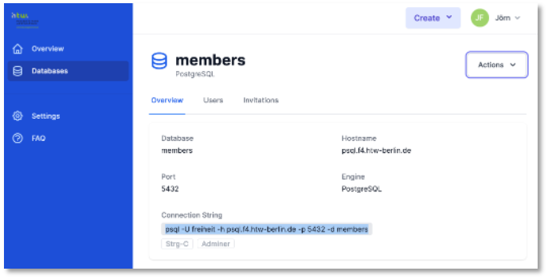

# REST-API (PostgreSQL)

Wir zeigen hier nochmal in schneller Zusammenfassung die Erstellung einer REST-API unter Verwendung von Node.js und Express. Dieses Mal wird als Datenbank jedoch PostgreSQL verwendet. 

## PostgreSQL

PostgreSQL können Sie sich selbst lokal [installieren](https://www.postgresql.org/download/) oder Sie nutzen den PostgreSQL-Server auf `ocean.f4.htw-berlin.de`. Das folgende Beispiel zeigt die Verwendung des Servers `ocean.f4.htw-berlin.de`. 

## Node.js und Express

Wir richten zunächst das Grundgerüst des Backends ein. 

1. Erstellen eines Node.js-Projektes `backend-pg`, Installieren von Express, dotenv, nodemon, cors

	```bash
	mkdir backend-postgresql
	cd backend-postgresql
	npm init
	npm install express 
	npm install nodemon --save-dev
	npm install dotenv 
	npm install cors 
	```

2. `package.json` anpassen

	```json linenums="1" hl_lines="5 7"
	{
	    "name": "backend-postgresql",
	    "version": "1.0.0",
	    "description": "",
	    "main": "server.js",
	    "scripts": {
	        "watch": "nodemon ./server.js",
	        "test": "echo \"Error: no test specified\" && exit 1"
	    },
	    "author": "",
	    "license": "ISC",
	    "dependencies": {
	    	"cors": "^2.8.5",
	        "dotenv": "^10.0.0",
	        "express": "^4.17.1"
	    },
	    "devDependencies": {
	        "nodemon": "^2.0.15"
	    }
	}
	```

3. `server.js` und `routes.js` erstellen

	=== "server.js"
		```js linenums="1"
		const express = require('express');
		const cors = require('cors');
		require('dotenv').config();
		const routes = require('./routes');

		const app = express();
		const PORT = 4000;

		app.use(express.json());
		app.use(cors());
		app.use('/', routes);

		app.listen(PORT, (error) => {
		    if (error) {
		        console.log(error);
		    } else {
		        console.log(`Server started and listening on port ${PORT} ...`);
		    }
		})
		```
	=== "routes.js"
		```js linenums="1"
		const express = require('express');
		const router = express.Router();

		// test
		router.get('/test', async(req, res) => {
		    res.send({ message: "jetzt mit PostgreSQL" });
		});

		module.exports = router;
		```

4. Backend starten (ist jetzt Port `4000`!) und `http://localhost:4000/test` aufrufen

	```bash
	npm run watch
	```

	


## PostgreSQL

Jetzt erstellen wir die Datenbank und binden sie an.

1. `ocean.f4.htw-berlin.de` aufrufen, als Name der Datenbank `members` eingeben und auf die `PostgreSQL`-Karte klicken

	

2. `.env` und `db.js` im Projektordner `backend-pg` erstellen

	=== ".env"
		```js linenums="1"
		PGUSER=ihr_account_name
		PGHOST=psql.f4.htw-berlin.de
		PGPASSWORD=ihr_passwort
		PGDATABASE=members
		PGPORT=5432
		```
	=== "db.js"
		```js linenums="1"
		const express = require('express');
		const router = express.Router();

		// test
		router.get('/test', async(req, res) => {
		    res.send({ message: "jetzt mit PostgreSQL" });
		});

		module.exports = router;
		```

