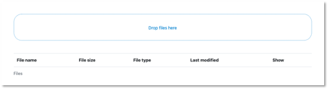
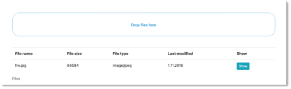

# Dateiupload

Wir wollen hier zeigen, wie man in Angular und mit Node.js

- eine Dateiupload per Drag & Drop gestaltet und
- ein Backend so baut, dass es in einer MongoDB Bilder und andere Dateien speichern und abrufen kann.

Wir beginnen mit der Erstellung des Backends. Ich zeige das Vorgehen hier an einem separaten Backend. Sie können den Code aber natürlich auch in Ihr bestehendes Backend einbinden. 


## Backend

Wir erstellen uns ein Backend für den Dateiupload:

```bash
mkdir backend-fileupload
cd backend-fileupload 
npm init
npm install cors express mongoose dotenv
npm install nodemon --save-dev
```

Sorgen Sie in der `package.json` dafür, dass Ihre `main`-Datei die `server.js` ist (`"main": "server.js"`) und dass Sie Ihre Anwendung unter Verwendung von `nodemon` starten können (`"scripts": {"watch": "nodemon ./server.js") }`). 

Wir erstellen eine `db.js` und eine `.env`:

=== "db.js"
	```js linenums="1"
	const mongoose = require('mongoose');
	require('dotenv').config();

	// connect to mongoDB
	mongoose.connect(process.env.DB_CONNECTION, { useNewUrlParser: true, useUnifiedTopology: true })
	    .then(
	        () => { console.log('connected to DB'); },
	        err => { console.error.bind(console, 'connection error:') }
	    );
	const db = mongoose.connection;

	module.exports = db;
	```

=== ".env"
	```js linenums="1"
	DB = mongodb://localhost:27017/fileupload
	PORT = 4000
	```

Die `server.js` implementieren wie folgt:

=== "server.js"
	```js linenums="1"
	const express = require('express');
	const cors = require('cors');
	require('dotenv').config();

	// Routes to Handle Request
	const uploadRoute = require('./routes/upload.route');
	const downloadRoute = require('./routes/download.route');
	const deleteRoute = require('./routes/delete.route');

	// Setup Express.js and Cors
	const app = express();
	app.use(express.json());
	app.use(cors());

	// API Routes
	app.use('/upload', uploadRoute);
	app.use('/download', downloadRoute);
	app.use('/delete', deleteRoute);

	const port = process.env.PORT || 4000;
	app.listen(port, () => {
	    console.log('Connected to port ' + port)
	})
	```


Das Backend lässt sich jedoch noch nicht ausführen, da die Dateien aus `routes` noch fehlen. Darum kümmern wir uns jetzt. 

### Multer und GridFS

Bis jetzt haben wir nur Daten im JSON-Format zwischen Frontend und Backend ausgetauscht und auch nur solche Daten in der MongoDB gespeichert. Bilder (und auch andere Dateien) sind [FormData-Objects](https://developer.mozilla.org/en-US/docs/Web/API/FormData/Using_FormData_Objects) im `multipart/form-data`-Format. Zur Behandlung solcher Daten verwenden wir ein *Middleware* für unser Backend, namens [Multer](https://www.npmjs.com/package/multer). 

MongoDB speichert Daten bis zu einer Größe von `16Mb` im Binärformat. Um auch größere Dateien (Bilder, Videos, pdf, ...) speichern zu können, werden die Dateien in *chunks* zerlegt und können dann aus diesen Stücken wieder zusammengesetzt werden. Dafür gibt es in der MongoDB eine [GridFS](https://docs.mongodb.com/manual/core/gridfs/)-Spezifikation (siehe auch [hier](https://medium.com/@kavitanambissan/uploading-and-retrieving-a-file-from-gridfs-using-multer-958dfc9255e8) oder [hier](https://www.topcoder.com/thrive/articles/storing-large-files-in-mongodb-using-gridfs)). Zur Verwendung von GridFS gibt es die beiden Pakte [multer-gridfs-storage](https://www.npmjs.com/package/multer-gridfs-storage) und [gridfs-stream](https://www.npmjs.com/package/gridfs-stream). 

Wir installieren im Backend-Projekt alle drei Pakete und zeigen im Folgenden deren Verwendung:

```bash
npm install multer multer-gridfs-storage gridfs-stream
```

Die `package.json` sollte nun ungefähr so aussehen:

=== "package.json"
	```js linenums="1"
	{
	    "name": "backend-fileupload",
	    "version": "1.0.0",
	    "description": "",
	    "main": "server.js",
	    "scripts": {
	        "watch": "nodemon ./server.js",
	        "test": "echo \"Error: no test specified\" && exit 1"
	    },
	    "author": "",
	    "license": "ISC",
	    "dependencies": {
	        "cors": "^2.8.5",
	        "dotenv": "^10.0.0",
	        "express": "^4.17.2",
	        "gridfs-stream": "^1.1.1",
	        "mongoose": "^6.1.5",
	        "multer": "^1.4.4",
	        "multer-gridfs-storage": "^5.0.2"
	    },
	    "devDependencies": {
	        "nodemon": "^2.0.15"
	    }
	}
	```

Wir kümmern uns nun zunächst darum, Bilder in die MongoDB *hochzuladen*.

### Upload von Bildern

Für den Upload der Bilder erstellen wir zunächst einen Ordner `middleware` und darin eine Datei `upload.js`. In dieser Datei wird unter Verwendung von `Multer` ein `GridFsStorage` eingerichtet. Die zu verwendende *Collection* benennen wir hier `fileupload` (siehe `bucketName`). Sie können diesen Namen frei wählen. Beachten Sie dann aber im Folgenden überall die Verwendung von `fileupload` (in der MongoDB entstehen die Collections `fileupload.files` und `fileupload.chunks` - siehe z.B. [hier](https://medium.com/@kavitanambissan/uploading-and-retrieving-a-file-from-gridfs-using-multer-958dfc9255e8) oder [hier](https://www.topcoder.com/thrive/articles/storing-large-files-in-mongodb-using-gridfs)).

=== "middleware/upload.js"
	```js linenums="1"
	const multer = require("multer");
	const {
	    GridFsStorage
	} = require("multer-gridfs-storage");

	const storage = new GridFsStorage({
	    url: process.env.DB,
	    options: { useNewUrlParser: true, useUnifiedTopology: true },
	    file: (req, file) => {
	        const match = ["image/png", "image/jpeg"];

	        if (match.indexOf(file.mimetype) === -1) {
	            console.log('file.mimetype === -1')
	            return `${Date.now()}-jf-${file.originalname}`;
	        }
	        console.log('store');
	        return {
	            bucketName: 'fileupload',
	            filename: `${Date.now()}-jf-${file.originalname}`,
	        };
	    },
	});

	module.exports = multer({ storage });
	```

Beachten Sie, dass wir beim Upload der Bilder für diese Bilder Dateinamen mithilfe von `${Date.now()}-jf-${file.originalname}` erstellen bzw. festlegen. Damit diese Dateinamen eindeutig sind, wird mithilfe von `Date.now()` der aktuelle Zeitstempel verwendet. Der String `-jf-` in der Mitte kann natürlich auch durch Ihre Initialen ersetzt (oder weggelassen) werden. Außerdem wird auch noch der originale Dateiname verwendet. Insgesamt sollte sichergestellt werden, dass die Dateinamen eindeutig sind (deshalb auch `Date.now()`). 

In Zeile `10` werden die Dateitypen festgelegt, die akzeptiert werden, hier `png` und `jpeg`. Diese Liste kann erweitert oder eingegrenzt werden.

Diese *Middleware* nutzen wir nun für den `POST`-Request des Bildes und erstellen einen Ordner `routes` und darin eine Datei `upload.routes.js` mit folgendem Inhalt:

=== "routes/upload.route.js"
	```js linenums="1"
	const express = require('express');
	const upload = require('../middleware/upload');
	const router = express.Router();

	router.post('/', upload.single('file'), (req, res) => {
	    // req.file is the `file` file
	    if (req.file === undefined) {

	        return res.send({
	            "message": "no file selected"
	        });
	    } else {
	        console.log('req.file', req.file);
	        const imgUrl = `http://localhost:4000/download/${req.file.filename}`;
	        return res.status(201).send({
	            url: imgUrl
	        });
	    }
	})

	module.exports = router;
	```

In Zeile `5` wird die *multer-Middleware* mit `update.single('file')` aufgerufen. Neben der Funktion `.single(fieldname)` stehen auch die Funktionen `.array(fieldname[, maxCount])` und `.fields(field)` zur Verfügung, um gleichzeitig mehrere Dateien hochzuladen (siehe [multer](https://www.npmjs.com/package/multer)). 

Als *Response* wird die URL zurückgegeben, unter der das Bild heruntergeladen werden kann (`http://localhost:4000/download/${req.file.filename}`). 

### Upload mithilfe von Postman

Das Hochladen der Bilder kann nun bereits getestet werden (dazu müssen in `server.js` noch die fehlerhaften Zeilen, in denen es um `download` und `delete` der Bilder geht, auskommentiert werden). Starten Sie das Backend. Öffnen Sie Postman und geben Sie als URL `http://localhost:4000/upload` ein und wählen als Anfragemethode `POST`. Klicken Sie auf `Body` und markieren dann `form-data`:


Geben Sie unter `KEY` den Schlüssel `file` ein und wählen Sie aus dem Dropdown-Menü `File`. Unter `VALUE` erscheint der Button `Select Files`. Klicken Sie darauf und wählen ein `png`- oder ein `jpeg`-Bild aus, das Sie hochladen wollen. Klicken Sie dann auf `Send`. Es erscheint:


Ich habe in diesem Beispiel die Datei `fiw.jpg` hochgeladen. 

Wenn Sie sich die MongoDB anschauen, dann finden Sie darin die beiden Collections `fileupload.files` und `fileupload.chunks`. In `fileupload.files` sind die Metadaten des hochgeladenen Bildes zu finden, z.B. 

```json
{
  "_id": {
    "$oid": "61e53675d69a075573a1b1b5"
  },
  "length": 86584,
  "chunkSize": 261120,
  "uploadDate": {
    "$date": "2022-01-17T09:27:18.096Z"
  },
  "filename": "1642411637621-jf-fiw.jpg",
  "contentType": "image/jpeg"
}
```

Die dazugehörige `_id` finden Sie auch in `fileupload.chunks` (können Sie sich in der `mongosh` mit `db.fileupload.chunks.find({ _id: "61e53675d69a075573a1b1b5" })` anschauen). Darin ist das Bild im Binary-Format gespeichert. 


### Download von Bildern

Für den Download der gespeicherten Bilder gehen wir ähnlich vor, wie beim Upload, benötigen dafür aber nicht mehr die *multer-Middleware*, dafür aber `gridfs-stream`. Wir erstellen im Ordner `routes` die Datei `download.route.js` mit folgendem Inhalt:


=== "routes/download.route.js"
	```js linenums="1"
	const express = require('express');
	const mongoose = require('mongoose');
	const Grid = require("gridfs-stream");
	const router = express.Router();

	const connect = mongoose.createConnection(process.env.DB, { useNewUrlParser: true, useUnifiedTopology: true });

	let gfs, gfsb;
	connect.once('open', () => {
	    // initialize stream
	    gfsb = new mongoose.mongo.GridFSBucket(connect.db, {
	        bucketName: "fileupload"
	    });

	    gfs = Grid(connect.db, mongoose.mongo);
	    gfs.collection('fileupload');
	});

	router.get('/:filename', async(req, res) => {
	    try {
	        const cursor = await gfs.collection('fileupload').find({ filename: req.params.filename });
	        cursor.forEach(doc => {
	            console.log('doc', doc);
	            gfsb.openDownloadStream(doc._id).pipe(res);
	        })
	    } catch (error) {
	        console.log('error', error);
	        res.send("not found");
	    }
	});

	module.exports = router;
	```


[GridFSBucket](https://mongodb.github.io/node-mongodb-native/3.2/api/GridFSBucket.html) ist eine Klasse aus der [Node.js-MongoDB-API](https://mongodb.github.io/node-mongodb-native/3.2/api/index.html). Diese hätten wir auch schon für das Upload verwenden können (siehe z.B. [hier](https://edupeeth.com/all-courses/nodejs/mongodb-gridfs-bucket)). 

Da wir über den Dateinamen auf die Datei zugreifen wollen, benötigen wir zunächst die entsprechende `_id` der Datei in der `fileupload.chunks`-Collection. Dazu greifen wir mithilfe von `find()` auf die `fileupload.files`-Collection zu und ermitteln die `_id`. Die `find()`-Funktion gibt einen sogenannten [Cursor](https://docs.mongodb.com/drivers/node/current/fundamentals/crud/read-operations/cursor/) auf das Array aller gefundenen Datensätze zurück. Mithilfe von `forEach()` durchlaufen wir dieses Array (enthält aber nur einen Datensatz) und ermitteln die `_id`. Mit der `openDownloadStream()`-Funktion der `GridFSBucket()`-Klasse öffnen wir den Download-Stream des Bildes und geben ihn als *response* `res` zurück. 


### Download mithilfe von Postman

Der Test des `GET http://localhost:4000/download/:filename`-Endpunktes ist einfach. Dazu verwenden wir einfach die URL, die durch den Upload als *Response*  zurückgegeben wurde (im obigen Beispiel also `"http://localhost:4000/download/1642411637621-jf-fiw.jpg"`):

Geben Sie in Postman also Ihre URL ein, wählen `GET` und klicken `Send`. Es erscheint das Bild:


### Delete von Bildern

Das Löschen der Bilder ist ganz ähnlich zum Download. Erstellen Sie die Datei `routes/delete.route.js`:

=== "routes/delete.route.js"
	```js linenums="1"
	const express = require('express');
	const mongoose = require('mongoose');
	const Grid = require("gridfs-stream");
	const router = express.Router();

	const connect = mongoose.createConnection(process.env.DB, { useNewUrlParser: true, useUnifiedTopology: true });

	let gfs;
	connect.once('open', () => {
	    gfs = Grid(connect.db, mongoose.mongo);
	    gfs.collection('fileupload');
	});

	router.delete('/:filename', async(req, res) => {
	    try {
	        await gfs.collection('fileupload').deleteOne({ filename: req.params.filename });
	        res.send({
	            "message": "deleted"
	        });
	    } catch (error) {
	        console.log('error', error);
	        res.send("An error occured.");
	    }
	});

	module.exports = router;
	```


### Delete mithilfe von Postman

Zum Testen verwenden Sie den gleichen Dateinamen wie beim Download und wählen als Anfragemethode `DELETE`. 


## Frontend 

Nun erstellen wir ein Frontend, in dem wir ein Bild per Drag&Drop hochladen können, verbinden das Frontend mit dem Backend und lassen uns das Bild wieder im Frontend anzeigen. Wir erstellen uns dazu eine Angular-Anwendung `fileupload`, Sie können aber den Code natürlich auch in ein bestehendes Frontend einbinden. Wir halten hier das Frontend bewusst einfach, verwenden kein *Routing* und auch nur die `AppComponent`.

```bash
ng new fileupload
```

Für das Drag&Drop verwenden wir hier das Paket [ngx-file-drop](https://www.npmjs.com/package/ngx-file-drop). Wir installieren dieses Paket mithilfe von `npm i ngx-file-drop` und fügen noch [Bootstrap](https://valor-software.com/ngx-bootstrap/#/documentation#getting-started) hinzu:

```bash
cd fileupload
npm i ngx-file-drop
ng add ngx-bootstrap
```

Die `app.component.html` implementieren wir wie folgt:

=== "app.component.html"
	```html linenums="1"
	<div class="container my-5 center">
	    <ngx-file-drop dropZoneLabel="Drop files here" (onFileDrop)="dropped($event)" (onFileOver)="fileOver($event)" (onFileLeave)="fileLeave($event)">

	    </ngx-file-drop>
	    <div class="my-5 upload-table">
	        <table id="table" class="table">
	            <caption>Files</caption>
	            <thead>
	                <tr>
	                    <th scope="col">File name</th>
	                    <th scope="col">File size</th>
	                    <th scope="col">File type</th>
	                    <th scope="col">Last modified</th>
	                    <th scope="col">Show</th>
	                </tr>
	            </thead>
	            <tbody class="upload-name-style">
	                <tr *ngFor="let file of fileinfos; let i=index">
	                    <td>{{ file.filename }}
	                    </td>
	                    <td>{{ file.filesize }}
	                    </td>
	                    <td>{{ file.filetype }}
	                    </td>
	                    <td>{{ file.lastModified }}
	                    </td>
	                    <td>
	                        <a class="btn btn-info btn-sm" (click)=" showImage(file.url) ">Show</a>
	                    </td>
	                </tr>
	            </tbody>
	        </table>
	    </div>
	</div>
	<div *ngIf=" showImg " class=" container my-5 center ">
	    
	</div>
	```

Die eigentliche Upload-Area ist dabei bereits mit 

```html
<ngx-file-drop dropZoneLabel="Drop files here" (onFileDrop)="dropped($event)" (onFileOver)="fileOver($event)" (onFileLeave)="fileLeave($event)">
</ngx-file-drop>
```

definiert. Mit der darunterliegenden Tabelle wollen wir nur die hochgeladenen Dateien auflisten. Ganz unten sehen wir noch ein `div` vor, in dem später das Bild angezeigt werden soll. 

Im Hintergrund wirkt in der *Upload-Area* ein `Button` vom Typ `type="file"`. Wenn Sie kein Drag&Drop verwenden, sondern die Eingabe der Datei direkt über einen Button realisieren wollen, dann achten Sie darauf, dass das Formular als `enctype` den Typ `multipart/form-data` zugewiesen bekommt:

```html
<form action="/profile" method="post" enctype="multipart/form-data">
  <input type="file" name="avatar" />
</form>
``` 

Die dazugehörige `app.component.ts` ist etwas umfangreicher und enthält bereits die *dependency injection* des `BackendService`, den wir noch erstellen müssen. 

=== "app.component.ts"
	```js linenums="1"
	import { BackendService } from './backend.service';
	import { Component } from '@angular/core';
	import { NgxFileDropEntry, FileSystemFileEntry, FileSystemDirectoryEntry } from 'ngx-file-drop';
	import { DomSanitizer, SafeUrl } from '@angular/platform-browser';

	interface Fileinfo {
	    filename: string;
	    filesize: number;
	    filetype: string;
	    lastModified: string;
	    url: string;
	}

	@Component({
	  selector: 'app-root',
	  templateUrl: './app.component.html',
	  styleUrls: ['./app.component.css']
	})
	export class AppComponent {
	  title = 'fileupload';

	  droppedfiles: NgxFileDropEntry[] = [];
	  files: File[] = [];
	  fileinfos: Fileinfo[] = [];
	  objectURL: string = "";
	  sanitizedUrl!: SafeUrl;
	  showImg = false;

	  constructor(private bs: BackendService, private sanitizer: DomSanitizer) {}

	  dropped(files: NgxFileDropEntry[]) {
	    console.log('fileDropped', files);
	    this.droppedfiles = files;
	    for (const droppedFile of files) {

	      // Is it a file?
	      if (droppedFile.fileEntry.isFile) {
	        const fileEntry = droppedFile.fileEntry as FileSystemFileEntry;
	        fileEntry.file((file: File) => {
	          this.files.push(file);
	          // Here you can access the real file
	          console.log(droppedFile.relativePath, file);

	          // You could upload it like this:
	          const formData = new FormData()
	          formData.append('file', file, droppedFile.relativePath)

	          this.bs.upload(formData)
	          .subscribe(url => {
	            console.log('url', url.url);
	            this.fileinfos.push({
	                filename: file.name,
	                filesize: file.size,
	                filetype: file.type,
	                lastModified: new Date(file.lastModified).toLocaleDateString(),
	                url: url.url
	            });
	          })

	        });
	      } else {
	        // It was a directory (empty directories are added, otherwise only files)
	        const fileEntry = droppedFile.fileEntry as FileSystemDirectoryEntry;
	        console.log(droppedFile.relativePath, fileEntry);
	      }
	    }
	  }

	  fileOver(event: DragEvent){
	    console.log('fileOver', event);
	  }

	  fileLeave(event: DragEvent){
	    console.log('fileLeave', event);
	  }

	  showImage(url: string){
	    this.bs.download(url)
	      .subscribe(blob => {
	        console.log('blob', blob);
	        this.objectURL = URL.createObjectURL(blob);
	        console.log('objectURL', this.objectURL);
	        this.showImg = true;
	        this.sanitizedUrl = this.sanitizer.bypassSecurityTrustUrl(this.objectURL);
	      });
	  }

	}

	```

Wenn ein Bild über die *Upload-Area* gezogen wird, erfolgt ein Aufruf der Funktion `fileOver()`, die aber nur eine Ausgabe auf der Konsole erzeugt. Ebenso die Funktion `fileLeave()`, die aufgerufen wird, sobald man das Bild wieder von der *Upload-Area* bewegt. Der eigentliche Upload erfolgt in der Funktion `dropped()`. Darin wird die Datei in eine `FormData` umgewandelt und diese `FormData` wird der Funktion `upload()` des `BackendService` übergeben. Fast alles andere sorgt dafür, die notwendigen Informationen aus der Datei auszulesen, um diese geeignet in die Tabelle auszugeben. 

### Anbindung an das Backend

Wir betrachten noch den `BackendService`, um die Anwendung starten zu können. Wir erstellen den Service mithilfe von 

```bash
ng g s backend
```

und implementieren

=== "backend.service.ts"
	```js linenums="1"
	import { HttpClient } from '@angular/common/http';
	import { Injectable } from '@angular/core';
	import { Observable } from 'rxjs';

	@Injectable({
	  providedIn: 'root'
	})
	export class BackendService {
	  baseUrl = 'http://localhost:4000';

	  constructor(private http: HttpClient) { }

	  upload(file: FormData): Observable<{url: string}>{
	    return this.http.post<{url: string}>(this.baseUrl + '/upload', file, { responseType: 'json' });
	  }

	  download(url: string): Observable<Blob>{
	    return this.http.get(url, {responseType: 'blob'});
	  }
	}	
	```


Achten Sie darauf, dass in der `app.module.ts` das `HttpClientModule` importiert ist:

=== "app.module.ts"
	```js linenums="1" hl_lines="7 18"
	import { NgModule } from '@angular/core';
	import { BrowserModule } from '@angular/platform-browser';

	import { AppRoutingModule } from './app-routing.module';
	import { AppComponent } from './app.component';
	import { BrowserAnimationsModule } from '@angular/platform-browser/animations';
	import { HttpClientModule } from '@angular/common/http';
	import { NgxFileDropModule } from 'ngx-file-drop';

	@NgModule({
	  declarations: [
	    AppComponent
	  ],
	  imports: [
	    BrowserModule,
	    AppRoutingModule,
	    BrowserAnimationsModule,
	    HttpClientModule,
	    NgxFileDropModule
	  ],
	  providers: [],
	  bootstrap: [AppComponent]
	})
	export class AppModule { }	
	```


### Ausführen der Anwendung

Um die Anwendung zu testen ist es wichtig, dass auch das Backend läuft. Wenn die Anwendung gestartet ist, erscheint folgende Ansicht:




Schieben Sie nun ein Bild über die *Upload-Area* und lassen Sie es dort los (im Beispiel `fiw.jpg`). Öffnen Sie auch die Developer Tools und betrachten Sie die Konsole. Im Code sind mehrere Ausgaben hinterlegt. Es erscheint:



Klicken Sie auf den `Show`-Button:


Laden Sie ruhig mehrere Bilder hoch und klicken abwechselnd auf die einzelnen `Show`-Buttons. Schauen Sie sich insbesondere die `dropped()`-Funktion aus der `app.component.ts` nochmal genauer an, um die Details nachzuvollziehen. 

!!! success
	Wir haben Bilder in der MongoDB gespeichert. Dazu haben wir ein Backend erstellt, mit dessen Hilfe in die MongoDB hochgeladen und von dort auch wieder ausgelesen werden können. Wir haben ein Frontend erstellt, in dem per Drag&Drop Bilder hochgeladen werden können. Dieses Frontend ist mit dem Backend verbunden. Es werden die Bilder vom Frontend über das Backend in die MongoDB gespeichert und von dort wieder ausgelesen und im Frontend angezeigt. 


