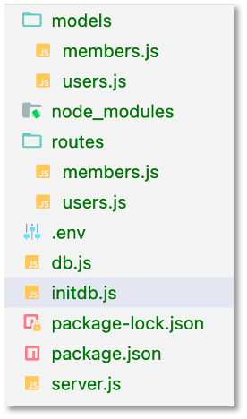
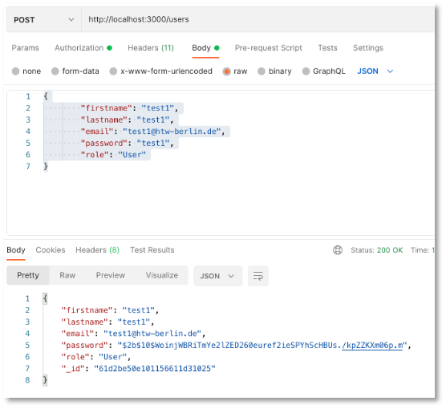
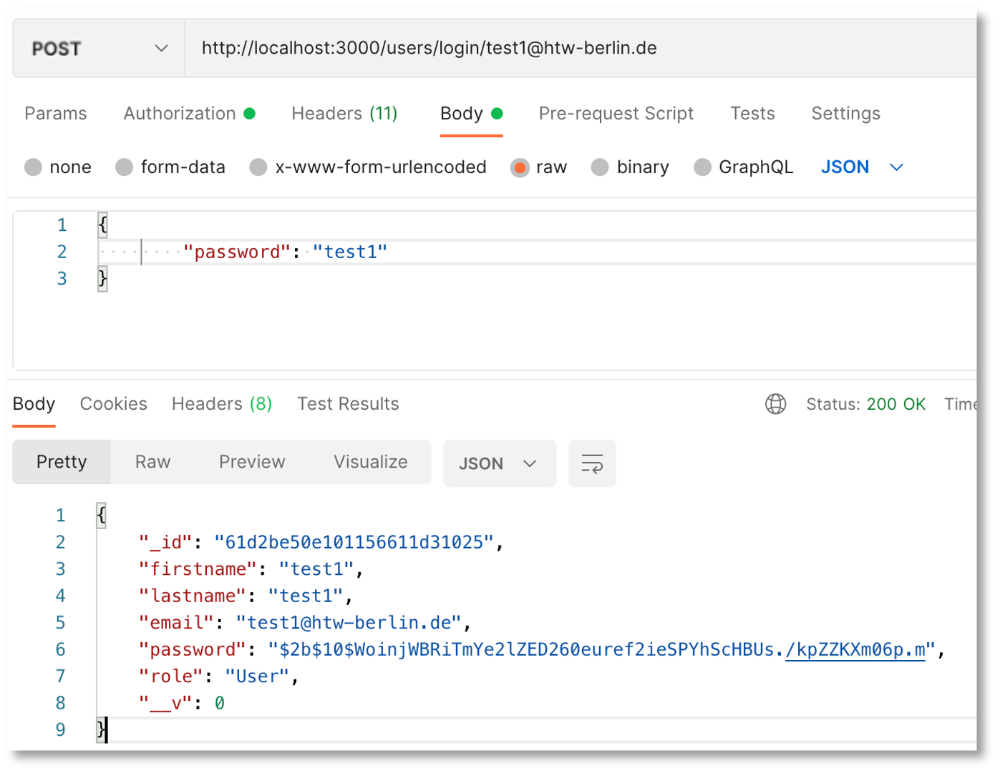
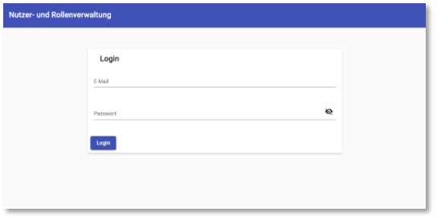

# Nutzerverwaltung und Material

Wir haben bis jetzt immer [Bootstrap](https://getbootstrap.com/) als CSS-Framework verwendet. Nun wollen wir stattdessen mal [Angular Material](https://material.angular.io/) nutzen. Es sei erwähnt, dass es sogar ein Framework gibt, dass beides vereint, nämlich [Material Design for Bottstrap (MDB)](https://mdbootstrap.com/). Das ist aber nur teilweise kostenlos. 

Inhaltlich geht es uns nicht nur um die Verwendung von *Angular Material*, sondern um eine Nutzer- und Rollenverwaltung, um einige weitere Konzepte anzuwenden, wie z.B. rollenbasierter Zugriff auf Komponenten und die Verschlüsselung und das Prüfen von Passwörtern. 


??? "Video aus der Vorlesung am 10.1.2022"
    <iframe src="https://mediathek.htw-berlin.de/media/embed?key=02f2878490647c26f0ef9a0267e4ea0d&width=720&height=466&autoplay=false&autolightsoff=false&loop=false&chapters=false&related=false&responsive=false&t=0&loadonclick=true&thumb=true" data-src="https://mediathek.htw-berlin.de/media/embed?key=02f2878490647c26f0ef9a0267e4ea0d&width=720&height=466&autoplay=false&autolightsoff=false&loop=false&chapters=false&related=false&responsive=false&t=0&loadonclick=true" class="" width="720" height="466" frameborder="0" allowfullscreen="allowfullscreen" allowtransparency="true" scrolling="no" aria-label="media embed code" style=""></iframe>


## Angular-Anwendung mit Registrierung und Login

Wir erstellen uns dafür eine Angular-Anwendung `users` mit Routing mit einer Navigations-, einer Registrierungs- und eine Login-Komponente.

```bash
ng new users --routing
```

Wir fügen dieser Anwendung [Angular Material] hinzu:

```bash
cd users
ng add @angular/material
```

Sie werden gefragt, welches `prebuilt theme` Sie verwenden wollen. Nehmen Sie ruhig `Custom`:

```bash
ℹ Using package manager: npm
✔ Found compatible package version: @angular/material@12.2.13.
✔ Package information loaded.
 
The package @angular/material@12.2.13 will be installed and executed.
Would you like to proceed? Yes
✔ Package successfully installed.
? Choose a prebuilt theme name, or "custom" for a custom theme: 
  Indigo/Pink        [ Preview: https://material.angular.io?theme=indigo-pink ] 
  Deep Purple/Amber  [ Preview: https://material.angular.io?theme=deeppurple-amber ] 
  Pink/Blue Grey     [ Preview: https://material.angular.io?theme=pink-bluegrey ] 
  Purple/Green       [ Preview: https://material.angular.io?theme=purple-green ] 
❯ Custom 
```

und beantworten Sie ruhig alle weiteren Fragen mit `y`(es):

```bash
✔ Package successfully installed.
? Choose a prebuilt theme name, or "custom" for a custom theme: Custom
? Set up global Angular Material typography styles? Yes
? Set up browser animations for Angular Material? Yes
UPDATE package.json (1135 bytes)
✔ Packages installed successfully.
CREATE src/custom-theme.scss (1416 bytes)
UPDATE src/app/app.module.ts (502 bytes)
UPDATE angular.json (3072 bytes)
UPDATE src/index.html (573 bytes)
UPDATE src/styles.css (181 bytes)
```

Die Verwendung von *Angular Material* ist leider etwas aufwendiger, als die von Bootstrap, weil alle Komponenten, die Sie von *Angular Material* verwenden wollen, explizit in der `app.module.ts` importiert werden müssen. Wir schauen uns das an einigen Beispielen an. 


### Navigation schematic - nav

Allerdings hat *Angular Material* ein recht nützlich Feature, nämlich sogenannte [Schematics](https://material.angular.io/guide/schematics). Das sind vorgefertigte Designkomponenten, die man häufig verwendet. Ein erstes Beispiel für ein solches *Schematic* ist das [Navigation schematic](https://material.angular.io/guide/schematics#navigation-schematic) mit dem wir unsere Navigationskomponente `nav` erstellen:

```bash
ng generate @angular/material:navigation nav
```

Die allgemeine Syntax zur Erstellung einer Navigationskomponente ist `ng generate @angular/material:navigation <component-name>`. Wir erzeugen somit also die Komponente namens `nav`. 

### Adress form schematic - register, login

Das [Adress form schematic](https://material.angular.io/guide/schematics#address-form-schematic) erzeugt zwar ein Formular für die Eingabe einer Adresse, aber da wir für unser Registrierungs-Formular und auch für das Login-Formular viele CSS-Klassen aus dem Material-Formular verwenden wollen, erzeugen wir uns mithilfe des [Adress form schematic](https://material.angular.io/guide/schematics#address-form-schematic) auch die `register`- und die `login`-Komponente:

```bash
ng generate @angular/material:address-form register
ng generate @angular/material:address-form login
```

### Dashboard schematic - home

Zuletzt verwenden wir noch das [Dashboard schematic](https://material.angular.io/guide/schematics#drag-and-drop-schematic), um uns eine `home`-Komponente zu erzeugen:

```bash
ng generate @angular/material:dashboard home
```

### Routing und AppComponent

Alle drei Komponenten rufen wir zunächst per Routing auf und passen deshalb unsere `app-routing.module` wie folgt an:

=== "app-routing.module.ts"
```ts linenums="1" hl_lines="3-5 7-18"
import { NgModule } from '@angular/core';
import { RouterModule, Routes } from '@angular/router';
import { HomeComponent } from './home/home.component';
import { LoginComponent } from './login/login.component';
import { RegisterComponent } from './register/register.component';

const routes: Routes = [{
  path: '',
  component: HomeComponent
},
{
  path: 'login',
  component: LoginComponent
},
{
  path: 'register',
  component: RegisterComponent
}];

@NgModule({
  imports: [RouterModule.forRoot(routes)],
  exports: [RouterModule]
})
export class AppRoutingModule { }
```

In der `app.component.html` binden wir nur die `nav`-Komponente ein (**nicht** `<router-outlet></router-outlet>` - das kommt in die `nav`-Komponente):

=== "app.component.html"
```html linenums="1"
<app-nav></app-nav>
```

### NavComponent

Nun passen wir unsere `NavComponent` an und öffnen dazu die `nav.component.html`:

=== "app.component.html"
```html linenums="1" hl_lines="5-8 15 18"
<mat-sidenav-container class="sidenav-container">
    <mat-sidenav #drawer class="sidenav" fixedInViewport [attr.role]="(isHandset$ | async) ? 'dialog' : 'navigation'" [mode]="(isHandset$ | async) ? 'over' : 'side'" [opened]="(isHandset$ | async) === false">
        <mat-toolbar>Menu</mat-toolbar>
        <mat-nav-list>
            <a mat-list-item [routerLink]="'/'">Home</a>
            <a mat-list-item [routerLink]="'/register'">Register</a>
            <a mat-list-item [routerLink]="'/login'">Login</a>
        </mat-nav-list>
    </mat-sidenav>
    <mat-sidenav-content>
        <mat-toolbar color="primary">
            <button type="button" aria-label="Toggle sidenav" mat-icon-button (click)="drawer.toggle()" *ngIf="isHandset$ | async">
			        <mat-icon aria-label="Side nav toggle icon">menu</mat-icon>
			      </button>
            <span>Nutzer- und Rollenverwaltung</span>
        </mat-toolbar>
        <!-- Add Content Here -->
        <router-outlet></router-outlet>
    </mat-sidenav-content>
</mat-sidenav-container>
```

Wichtig ist, dass die `<router-outlet></router-outlet>` an die Stelle des Kommentars `<!-- Add Content Here -->` kommt (Zeile `18`). Genau dort wird der Inhalt eingebunden, d.h. die Komponenten, die per Routing aufgerufen und eingebunden werden (bei uns `home`, `register` oder `login`). Der Eintrag in Zeile `15` ist wie eine Überschrift und in den Zeilen `5-8` werden die Menüeinträge (und die dazugehörigen Routen) definiert. Es entsteht folgende  (für die `home`-Komponente):


Verrringern Sie auch die Breite des Viewports, um zu sehen, wie responsive die einzelnen Komponenten (inkl. `nav`-Komponente) bereits sind. 

### Register-Formular

Wir passen nun das Formular zur Registrierung an. Das Standard-Shipping-Adress-Formular zeigt, was mit Formularen im *Material-Design*  alles möglich ist. Wir passen das Formular an, um die Registrierung einer Nutzerin mit ihrer Rolle zu ermöglichen:

=== "register.component.html"
```html linenums="1"
<form [formGroup]="registerForm" novalidate (ngSubmit)="onSubmit()">
    <mat-card class="shipping-card">
        <mat-card-header>
            <mat-card-title>Registrierung</mat-card-title>
        </mat-card-header>
        <mat-card-content>
            <p>
                <mat-form-field class="full-width" appearance="standard">
                    <mat-label>Vorname</mat-label>
                    <input matInput placeholder="Vorname" formControlName="firstName">
                    <mat-error *ngIf="registerForm.controls['firstName'].hasError('required')">
                        Vorname <strong>erforderlich</strong>
                    </mat-error>
                </mat-form-field>
            </p>
            <p>
                <mat-form-field class="full-width" appearance="standard">
                    <mat-label>Nachname</mat-label>
                    <input matInput placeholder="Nachname" formControlName="lastName">
                    <mat-error *ngIf="registerForm.controls['lastName'].hasError('required')">
                        Nachname <strong>erforderlich</strong>
                    </mat-error>
                </mat-form-field>
            </p>
            <p>
                <mat-form-field class="full-width" appearance="standard">
                    <mat-label>E-Mail</mat-label>
                    <input matInput placeholder="E-Mail" formControlName="email">
                    <mat-error *ngIf="registerForm.controls['email'].hasError('required')">
                        E-mail <strong>erforderlich</strong>
                    </mat-error>
                </mat-form-field>
            </p>
            <p>
                <mat-form-field class="full-width" appearance="standard">
                    <mat-label>Passwort</mat-label>
                    <input matInput placeholder="Passwort" formControlName="password" [type]="hide ? 'password' : 'text'">
                    <button mat-icon-button matSuffix (click)="hide = !hide" [attr.aria-label]="'Hide password'" [attr.aria-pressed]="hide">
      <mat-icon>{{hide ? 'visibility_off' : 'visibility'}}</mat-icon>
    </button>
                </mat-form-field>
            </p>
            <p>
                <mat-form-field class="full-width" appearance="standard">
                    <mat-label>Passwort wiederholen</mat-label>
                    <input matInput placeholder="Passwort wiederholen" formControlName="passwordrepeat" [type]="hide ? 'password' : 'text'">
                    <button mat-icon-button matSuffix (click)="hide = !hide" [attr.aria-label]="'Hide password'" [attr.aria-pressed]="hide">
      <mat-icon>{{hide ? 'visibility_off' : 'visibility'}}</mat-icon>
    </button>
                </mat-form-field>
            </p>
            <p>
                <mat-form-field class="full-width" appearance="standard">
                    <mat-label>Rolle</mat-label>
                    <mat-select placeholder="Rolle" formControlName="role">
                        <mat-option *ngFor="let role of roles" [value]="role.abbreviation">
                            {{ role.name }}
                        </mat-option>
                    </mat-select>
                    <mat-hint align="end">Wählen Sie eine Rolle</mat-hint>
                    <mat-error *ngIf="registerForm.controls['role'].hasError('required')">
                        State is <strong>required</strong>
                    </mat-error>
                </mat-form-field>
            </p>
        </mat-card-content>
        <mat-card-actions>
            <button mat-raised-button color="primary" type="submit">Registrieren</button>
        </mat-card-actions>
    </mat-card>
</form>
```

=== "register.component.ts"
```ts linenums="1"
import { Component } from '@angular/core';
import { AbstractControl, FormBuilder, ValidationErrors, ValidatorFn, Validators } from '@angular/forms';

@Component({
  selector: 'app-register',
  templateUrl: './register.component.html',
  styleUrls: ['./register.component.css']
})
export class RegisterComponent {
  hide = true;

  checkPasswords: ValidatorFn = (group: AbstractControl):  ValidationErrors | null => {
    let pass = this.registerForm?.get('password')?.value;
    let confirmPass = this.registerForm?.get('passwordrepeat')?.value
    return pass === confirmPass ? null : { notSame: true }
  }

  registerForm = this.fb.group({
    firstName: [null, Validators.required],
    lastName: [null, Validators.required],
    email: [null, [Validators.required, Validators.email]],
    password: [null, Validators.compose([
      Validators.required,
      Validators.pattern('^(?=.*[0-9])(?=.*[a-zA-Z])([a-zA-Z0-9]+)$'),
      Validators.minLength(8),
      Validators.maxLength(20)])
    ],
    passwordrepeat: [null],
    role: [null, Validators.required],
  }, { validators: this.checkPasswords });

  roles = [
    {name: 'Admin', abbreviation: 'admin'},
    {name: 'User', abbreviation: 'user'}
  ];

  constructor(private fb: FormBuilder) {}

  onSubmit(): void {
    alert('Registrierung erfolgreich!');
  }

}
```

=== "register.component.css"
```css linenums="1"
mat-card {
    margin: 5% 20%;
}

.full-width {
    width: 100%;
}
```

Es entsteht folgendes Formular:


## Backend

Wir erweiteren das [Backend](../backend/#rest-api-mongodb), das wir für die Verwaltung von `Member`-Einträgen in die MongoDB erstellt hatten. Wir führen entsprechende Erweiterungen durch. Der Verzeichnisbaum im Projekt sieht nun so aus:



Es wurde also ein `models`-Verzeichnis erstellt, in dem sowohl die `members.js` (also das Model für die `Members`) als auch das neue `users.js` enthalten ist. Ebenso wurden die Dateien `members.js` und `users.js` in dem Verzeichnis `routes` erstellt, in dem die jeweiligen Routen für die `Users` und die `Members` definiert sind. 

Die `server.js` sieht nun so aus:

=== "server.js"
    ```js linenums="1"
    const express = require('express');
    const cors = require('cors');
    const db = require('./db');
    const routesMembers = require('./routes/members');
    const routesUsers = require('./routes/users');
    const initDB = require('./initdb');

    const app = express();
    const PORT = 3000;

    app.use(express.json());
    // enable cors for all requests
    app.use(cors());
    app.use('/initdb', initDB);
    app.use('/members', routesMembers);
    app.use('/users', routesUsers);

    app.listen(PORT, (error) => {
        if (error) {
            console.log(error);
        } else {
            console.log(`Server started and listening on port ${PORT} ... `);
        }
    });
    ```

Die `db.js` hat folgendes Aussehen:

=== "db.js"
    ```js linenums="1"
    const mongoose = require('mongoose');
    require('dotenv').config();

    // connect to mongoDB
    mongoose.connect(process.env.DB_CONNECTION, { useNewUrlParser: true, useUnifiedTopology: true })
        .then(
            () => { console.log('connected to DB'); },
            err => { console.error.bind(console, 'connection error:') }
        );
    const db = mongoose.connection;

    module.exports = db;
    ```

und im `.env`-File ist nur 

```bash
DB_CONNECTION = mongodb://127.0.0.1:27017/members 
```

hinterlegt. Die in der `server.js` definierte Route `/initdb` bewirkt den Aufruf von `initdb.js`, die die `members`-Collection befüllt. Das kann aber auch weggelassen werden - oder Sie erweitern das Skript noch um eigene Einträge für die `users`-Collection:

??? "initdb.js"
    ```js linenums="1"
    const express = require('express');
    const router = express.Router();
    const {
        Members,
        Users
    } = require('./models/users');

    // create collection members
    router.post('/members', async(req, res) => {
        Members.insertMany([{
                "forename": "Catherine",
                "surname": "Williams",
                "email": "cwilliamsl@360.cn"
            },
            {
                "forename": "Adam",
                "surname": "Anderson",
                "email": "aanderson8@google.fr"
            },
            {
                "forename": "Susan",
                "surname": "Andrews",
                "email": "sandrewsn@google.co.jp"
            },
            {
                "forename": "Catherine",
                "surname": "Andrews",
                "email": "candrewsp@noaa.gov"
            },
            {
                "forename": "Alan",
                "surname": "Bradley",
                "email": "abradley1c@globo.com"
            },
            {
                "forename": "Anne",
                "surname": "Brooks",
                "email": "abrooks16@bravesites.com"
            },
            {
                "forename": "Russell",
                "surname": "Brown",
                "email": "rbrownq@nifty.com"
            },
            {
                "forename": "Ryan",
                "surname": "Burton",
                "email": "rburton18@foxnews.com"
            },
            {
                "forename": "Roy",
                "surname": "Campbell",
                "email": "rcampbell1@geocities.com"
            },
            {
                "forename": "Russell",
                "surname": "Campbell",
                "email": "rcampbell17@eventbrite.com"
            },
            {
                "forename": "Bonnie",
                "surname": "Coleman",
                "email": "bcoleman11@fc2.com"
            },
            {
                "forename": "Ernest",
                "surname": "Coleman",
                "email": "ecoleman15@businessweek.com"
            },
            {
                "forename": "Richard",
                "surname": "Cruz",
                "email": "rcruz7@unc.edu"
            },
            {
                "forename": "Sean",
                "surname": "Cruz",
                "email": "scruz10@answers.com"
            },
            {
                "forename": "Rebecca",
                "surname": "Cunningham",
                "email": "rcunninghamd@mac.com"
            },
            {
                "forename": "Margaret",
                "surname": "Evans",
                "email": "mevansh@pcworld.com"
            },
            {
                "forename": "Jeffrey",
                "surname": "Ford",
                "email": "jford14@cnet.com"
            },
            {
                "forename": "Andrea",
                "surname": "Gardner",
                "email": "agardnerv@woothemes.com"
            },
            {
                "forename": "Deborah",
                "surname": "George",
                "email": "dgeorge6@furl.net"
            },
            {
                "forename": "Sean",
                "surname": "Gibson",
                "email": "sgibsony@alexa.com"
            },
            {
                "forename": "Virginia",
                "surname": "Graham",
                "email": "vgrahamk@aol.com"
            },
            {
                "forename": "Steven",
                "surname": "Hamilton",
                "email": "shamiltonu@state.tx.us"
            },
            {
                "forename": "Virginia",
                "surname": "Hawkins",
                "email": "vhawkinsf@ehow.com"
            },
            {
                "forename": "Edward",
                "surname": "Hicks",
                "email": "ehicksc@pcworld.com"
            },
            {
                "forename": "Mark",
                "surname": "Johnson",
                "email": "mjohnsonj@hostgator.com"
            },
            {
                "forename": "Ruth",
                "surname": "Jordan",
                "email": "rjordan1a@smugmug.com"
            },
            {
                "forename": "Antonio",
                "surname": "Kim",
                "email": "akim4@odnoklassniki.ru"
            },
            {
                "forename": "Jennifer",
                "surname": "Marshall",
                "email": "jmarshallt@gnu.org"
            },
            {
                "forename": "Eric",
                "surname": "Matthews",
                "email": "ematthews5@independent.co.uk"
            },
            {
                "forename": "Raymond",
                "surname": "Mcdonald",
                "email": "rmcdonald2@ihg.com"
            },
            {
                "forename": "Eric",
                "surname": "Miller",
                "email": "emillere@creativecommons.org"
            },
            {
                "forename": "Jonathan",
                "surname": "Morales",
                "email": "jmoralesa@ovh.net"
            },
            {
                "forename": "Marie",
                "surname": "Morgan",
                "email": "mmorganb@cloudflare.com"
            },
            {
                "forename": "Amanda",
                "surname": "Nelson",
                "email": "anelson13@indiatimes.com"
            },
            {
                "forename": "Lisa",
                "surname": "Olson",
                "email": "lolsonr@telegraph.co.uk"
            },
            {
                "forename": "Alice",
                "surname": "Ortiz",
                "email": "aortizw@histats.com"
            },
            {
                "forename": "Peter",
                "surname": "Phillips",
                "email": "pphillipss@1688.com"
            },
            {
                "forename": "Matthew",
                "surname": "Porter",
                "email": "mporter9@europa.eu"
            },
            {
                "forename": "Tammy",
                "surname": "Ray",
                "email": "trayx@weather.com"
            },
            {
                "forename": "Mark",
                "surname": "Richardson",
                "email": "mrichardson1d@ihg.com"
            },
            {
                "forename": "Joan",
                "surname": "Roberts",
                "email": "jroberts12@alibaba.com"
            },
            {
                "forename": "Kathleen",
                "surname": "Rose",
                "email": "kroseg@pinterest.com"
            },
            {
                "forename": "Steve",
                "surname": "Sanders",
                "email": "ssanders1b@wikispaces.com"
            },
            {
                "forename": "Shirley",
                "surname": "Scott",
                "email": "sscottm@macromedia.com"
            },
            {
                "forename": "Lillian",
                "surname": "Stephens",
                "email": "lstephens19@hugedomains.com"
            },
            {
                "forename": "Nicole",
                "surname": "Thompson",
                "email": "nthompson3@admin.ch"
            },
            {
                "forename": "Marie",
                "surname": "Thompson",
                "email": "mthompsonz@yelp.com"
            },
            {
                "forename": "Alan",
                "surname": "Vasquez",
                "email": "avasquezo@miibeian.gov.cn"
            },
            {
                "forename": "Mildred",
                "surname": "Watkins",
                "email": "mwatkins0@miibeian.gov.cn"
            },
            {
                "forename": "Eugene",
                "surname": "Williams",
                "email": "ewilliamsi@deliciousdays.com"
            }
        ])
        const allMembers = await Members.find();
        console.log(allMembers);
        res.send(allMembers);
    });

    module.exports = router;
    ```

Die beiden `models` sind wie folgt definiert:

=== "models/users.js"
    ```js linenums="1"
    const mongoose = require('mongoose');

    // users Schema
    const usersSchema = new mongoose.Schema({
        firstname: String,
        lastname: String,
        email: String,
        password: String,
        role: String
    });

    // Exporting our model objects
    module.exports = mongoose.model('User', usersSchema);
    ```

=== "models/members.js"
    ```js linenums="1"
    const mongoose = require('mongoose');

    const schema = new mongoose.Schema({
        forename: String,
        surname: String,
        email: String
    });

    module.exports = mongoose.model('Member', schema);
    ```

An dem `routes/members.js` haben wir nichts geändert:

??? "routes/members.js"
    ```js linenums="1"
    const express = require('express');
    const router = express.Router();
    const Member = require('../models/members');

    // get all members
    router.get('/', async(req, res) => {
        const allMembers = await Member.find();
        console.log(allMembers);
        res.send(allMembers);
    });

    // post one member
    router.post('/', async(req, res) => {
        const newMember = new Member({
            forename: req.body.forename,
            surname: req.body.surname,
            email: req.body.email
        })
        await newMember.save();
        res.send(newMember);
    });

    // get one member via id
    router.get('/:id', async(req, res) => {
        try {
            const member = await Member.findOne({ _id: req.params.id });
            console.log(req.params);
            res.send(member);
        } catch {
            res.status(404);
            res.send({
                error: "Member does not exist!"
            });
        }
    });

    // update one member via id
    router.patch('/:id', async(req, res) => {
        try {
            const member = await Member.findOne({ _id: req.params.id })

            if (req.body.forename) {
                member.forename = req.body.forename
            }

            if (req.body.surname) {
                member.surname = req.body.surname
            }

            if (req.body.email) {
                member.email = req.body.email
            }

            await Member.updateOne({ _id: req.params.id }, member);
            res.send(member)
        } catch {
            res.status(404)
            res.send({ error: "Member does not exist!" })
        }
    });

    // delete one member via id
    router.delete('/:id', async(req, res) => {
        try {
            await Member.deleteOne({ _id: req.params.id })
            res.status(204).send()
        } catch {
            res.status(404)
            res.send({ error: "Member does not exist!" })
        }
    });

    module.exports = router;
    ```

Das Skript `routes/users.js` ist prinzipiell gleich aufgebaut, wie das `members.js`-Skript, denn auch dort sollen die `CRUD`-Funktionen abgebildet werden, allerdings kommt noch die Verschlüsselung von Passwörtern hinzu.

### Passwort-Verschlüsselung

Die Passwörter sollen nur verschlüsselt in der Datenbank abgelegt werden. Dazu verwenden wir das Paket [bcrypt](https://www.npmjs.com/package/bcrypt).

```bash
npm install bcrypt
```

Beim Einfügen eines neuen `User`-Eintrags wird das übermittelte Passwort verschlüsselt, bevor es in die Datenbank gespeichert wird:

=== "routes/users.js"
    ```js linenums="1" hl_lines="4 15-31 39-52"
    const express = require('express');
    const router = express.Router();
    const User = require('../models/users');
    const bcrypt = require('bcrypt');

    // get all users
    router.get('/', async(req, res) => {
        const allUsers = await User.find();
        console.log(allUsers);
        res.send(allUsers);
    });

    // post one user
    router.post('/', async(req, res) => {
        const saltRounds = 10;
        let pwHash = '';
        await bcrypt.genSalt(saltRounds, (err, salt) => {
            bcrypt.hash(req.body.password, salt, (errHash, hash) => {
                pwHash = hash;
                const newUser = new User({
                    firstname: req.body.firstname,
                    lastname: req.body.lastname,
                    email: req.body.email,
                    password: pwHash,
                    role: req.body.role
                });
                console.log('newUser', newUser);
                newUser.save();
                res.send(newUser);
            });
        });

    });

    // get one user via email and password
    router.post('/login/:email', async(req, res) => {
        try {
            const user = await User.findOne({ email: req.params.email });
            let sendPw = req.body.password;
            let userPW = user.password;
            bcrypt.compare(sendPw, userPW, (err, result) => {
                if (result) {
                    console.log('Passwort korekt!');
                    res.send(user);
                } else {
                    console.log('falsches Passwort!');
                    res.status(403);
                    res.send({
                        error: "Wrong password!"
                    });
                }
            });
        } catch {
            res.status(404);
            res.send({
                error: "User does not exist!"
            });
        }
    });

    // get one user via username
    router.get('/:email', async(req, res) => {
        try {
            const user = await User.findOne({ email: req.params.email });

            console.log(req.params);
            res.send(user);
        } catch {
            res.status(404);
            res.send({
                error: "User does not exist!"
            });
        }
    });

    // update one user via id
    router.patch('/:email', async(req, res) => {
        try {
            const user = await User.findOne({ username: req.params.email })

            if (req.body.email) {
                user.email = req.body.email
            }

            if (req.body.password) {
                user.password = req.body.password
            }

            if (req.body.role) {
                user.role = req.body.role
            }

            await User.updateOne({ email: req.params.email }, user);
            res.send(user)
        } catch {
            res.status(404)
            res.send({ error: "User does not exist!" })
        }
    });

    // delete one user via id
    router.delete('/:id', async(req, res) => {
        try {
            await User.deleteOne({ username: req.params.email })
            res.status(204).send()
        } catch {
            res.status(404)
            res.send({ error: "User does not exist!" })
        }
    });

    module.exports = router;    
    ```


Wird ein neuer Eintrag in die Datenbank geschrieben (ab Zeile `13`), wird das Passwort mithilfe der `hash`-Funktion von `bcrypt` verschlüsselt. Dieser Passwort-Hash (siehe Zeilen `19` und `24`) werden gespeichert. 

Von der `GET`-Anfrage für einen `user` gibt es zwei Routen. Die Route `router.get('/:email',...)` gibt den Eintrag einer `user`in für eine übergebene `:email` zurück. Dieser Eintrag enthält das Passwort als `hash`-Wert. Die Route `router.post('/login/:email', ...)` erwartet im `body` noch ein Passwort. Deshalb wird hier auch die `POST`-Anfragemethode verwendet. Es wird überprüft, ob das übergebene Passwort dem gespeicherten Passwort entspricht. Dies geschieht mithilfe der `compare`-Funktion von `bcrypt` (siehe Zeile `41`). 

Angenommen, es wird folgender Datensatz gepostet:

```json
{
        "firstname": "test1",
        "lastname": "test1",
        "email": "test1@htw-berlin.de",
        "password": "test1",
        "role": "User"
}
```

 

Dann wird ein Datensatz in die Datenbank gespeichert, der das *gehashte* Passwort enthält (bei Ihnen wird das Passwort und die `_id` jeweils anders sein):

 

Die Anfrage `GET http://localhost:3000/users/test1@htw-berlin.de` liefert entsprechend das Objekt zurück:

```json
{
    "_id": "61d2be50e101156611d31025",
    "firstname": "test1",
    "lastname": "test1",
    "email": "test1@htw-berlin.de",
    "password": "$2b$10$WoinjWBRiTmYe2lZED260euref2ieSPYhScHBUs./kpZZKXm06p.m",
    "role": "User",
    "__v": 0
}
```

Bei der Anfrage `POST http://localhost:3000/users/login/test1@htw-berlin.de` muss im `Body` des `Request` auch noch ein Passwort übergeben werden:

{style="width:70%"}

Nur, wenn das Passwort korrekt ist, wird das Objekt gesendet, ansonsten wird ein Fehlerobjekt versendet:

{style="width:50%"}

## Backend-Service im Frontend

Zur Anbindung an die oben beschriebene REST-API erstellen wir im Frontend einen Service

```bash
ng g s shared/backend
```

Diesen Service implementieren wir, wie [hier](../fe-be-anbindung/#service-fur-http) beschrieben. Das bedeutet, dass wir zunächst das `HttpClientModule` in der `app.module.ts` importieren:

??? "app.module.ts"
    ```js linenums="1" hl_lines="24 51"
    import { NgModule } from '@angular/core';
    import { BrowserModule } from '@angular/platform-browser';

    import { AppRoutingModule } from './app-routing.module';
    import { AppComponent } from './app.component';
    import { BrowserAnimationsModule } from '@angular/platform-browser/animations';
    import { NavComponent } from './nav/nav.component';
    import { LayoutModule } from '@angular/cdk/layout';
    import { MatToolbarModule } from '@angular/material/toolbar';
    import { MatButtonModule } from '@angular/material/button';
    import { MatSidenavModule } from '@angular/material/sidenav';
    import { MatIconModule } from '@angular/material/icon';
    import { MatListModule } from '@angular/material/list';
    import { RegisterComponent } from './register/register.component';
    import { MatInputModule } from '@angular/material/input';
    import { MatSelectModule } from '@angular/material/select';
    import { MatRadioModule } from '@angular/material/radio';
    import { MatCardModule } from '@angular/material/card';
    import { ReactiveFormsModule } from '@angular/forms';
    import { LoginComponent } from './login/login.component';
    import { HomeComponent } from './home/home.component';
    import { MatGridListModule } from '@angular/material/grid-list';
    import { MatMenuModule } from '@angular/material/menu';
    import { HttpClientModule } from '@angular/common/http';

    @NgModule({
      declarations: [
        AppComponent,
        NavComponent,
        RegisterComponent,
        LoginComponent,
        HomeComponent
      ],
      imports: [
        BrowserModule,
        AppRoutingModule,
        BrowserAnimationsModule,
        LayoutModule,
        MatToolbarModule,
        MatButtonModule,
        MatSidenavModule,
        MatIconModule,
        MatListModule,
        MatInputModule,
        MatSelectModule,
        MatRadioModule,
        MatCardModule,
        ReactiveFormsModule,
        MatGridListModule,
        MatMenuModule,
        HttpClientModule
      ],
      providers: [],
      bootstrap: [AppComponent]
    })
    export class AppModule { }
    ```


Im `BackendService` implementieren wir zunächst zwei Funktionen:

- `registerNewUser(user: User)` legt einen neuen `User` in der Datenbank an, d.h. der Endpunkt `POST http://localhost:3000/users` wird aufgerufen und die neuen `User`-Daten im `Body` des Requests übergeben,
- `checkIfExist(email: string)` prüft, ob die `email` bereits registriert ist, d.h. der Endpunkt `POST http://localhost:3000/users/:email` wird aufgerufen.

=== "shared/backend.service.ts"
    ```js linenums="1"
    import { HttpClient } from '@angular/common/http';
    import { Injectable } from '@angular/core';
    import { Observable } from 'rxjs';
    import { User } from './user';

    @Injectable({
      providedIn: 'root'
    })
    export class BackendService {
      userRoute = 'http://localhost:3000/users';
      memberRoute = 'http://localhost:3000/members';

      constructor(private http: HttpClient) { }

      registerNewUser(user: User): Observable<User>{
        return this.http.post<User>(this.userRoute, user);
      }

      checkIfExist(email: string): Observable<User>{
        return this.http.get<User>(this.userRoute + '/' + email);
      }
    }
    ```

### Prüfen, ob E-Mail bereits registriert

Wird eine neue E-Mail eingegeben, dann soll zunächst geprüft werden, ob diese bereits registriert ist. Dazu wird nicht erst das gesamte Formular *submitted*, sondern wir behandeln für das Eingabefeld der E-Mail direkt das `change`-Ereignis. Das `change`-Ereignis wird ausgelöst, nachdem die Eingabe im Eingabefeld abgeschlossen ist (d.h. entweder die `Enter`-taste gedrückt wird oder der Fokus vom Eingaefeld auf ein anderes Eingabefeld wechselt). Soll jede Tastatureingabe behandelt werden, bietet sich dafür das `input`-Ereignis an. Wir fügen hier die Behandlung des `change`-Ereignisses hinzu: 

=== "Ausschnitt aus register.component.html"
    ```html linenums="25"
    <p>
        <mat-form-field class="full-width" appearance="standard">
            <mat-label>E-Mail</mat-label>
            <input matInput placeholder="E-Mail" formControlName="email" (change)="checkIfExists($event.target)">
            <mat-error *ngIf="registerForm.controls['email'].hasError('required')">
                E-Mail <strong>erforderlich</strong>
            </mat-error>
        </mat-form-field>
    </p>
    ```

Neu ist darin also der Eintrag `(change)="checkIfExists($event.target)"`. Mithilfe der Funktion `checkIfExists()` soll also geprüft werden, ob die E-Mail-Adresse bereits in der Datenbank gespeichert ist. Der Funktion wird `$event.target` übergeben. Das ist das auslösende `input`-Element. 

Die `checkIfExists()`-Funktion wird in der `register.component.ts` definiert:


=== "Ausschnitt aus register.component.ts"
    ```js linenums="76"
      checkIfExists(evt: any): void {
        let email = this.registerForm.get('email')?.value;
        console.log('event-target', evt);
        console.log(email);
        this.bs.checkIfExist(email).subscribe(
          response => {
            console.log(response);
            if(response) {
              this.openDialog();
          }
        },
          error => {
            console.log(error);
          }
        );
      }
    ```

Die `email` selbst wird als `value` aus dem `input`-Element ausgelesen (Zeile `77`). Die Konsoleausgaben können natürlich auch weg. In Zeile `80` wird die `checkIfExist()`-Funktion des `BackendService` aufgerufen. Dieser muss per *dependency injection* eingebunden werden. Wenn als `response` ein Objekt zurückgesendet wird, dann existiert die E-Mail-Adresse bereits. Dann soll ein *modaler Dialog*  geöffnet werden, der dies anzeigt. Diese `openDialog()`-Funktion soll im Folgenden erstellt werden. 

### Dialoge mit Material

Angular Material unterstützt die Erstellung von [Dialogen](https://material.angular.io/components/dialog/overview). Um die Material-Dialoge verwenden zu können, müssen wir diese in der `app.module.ts`  (darin auch schon die `ExistDialogComponent`, die wir gleich erstellen):

=== "app.module.ts"
    ```js linenums="1" hl_lines="24 54"
    import { NgModule } from '@angular/core';
    import { BrowserModule } from '@angular/platform-browser';

    import { AppRoutingModule } from './app-routing.module';
    import { AppComponent } from './app.component';
    import { BrowserAnimationsModule } from '@angular/platform-browser/animations';
    import { NavComponent } from './nav/nav.component';
    import { LayoutModule } from '@angular/cdk/layout';
    import { MatToolbarModule } from '@angular/material/toolbar';
    import { MatButtonModule } from '@angular/material/button';
    import { MatSidenavModule } from '@angular/material/sidenav';
    import { MatIconModule } from '@angular/material/icon';
    import { MatListModule } from '@angular/material/list';
    import { RegisterComponent } from './register/register.component';
    import { MatInputModule } from '@angular/material/input';
    import { MatSelectModule } from '@angular/material/select';
    import { MatRadioModule } from '@angular/material/radio';
    import { MatCardModule } from '@angular/material/card';
    import { ReactiveFormsModule } from '@angular/forms';
    import { LoginComponent } from './login/login.component';
    import { HomeComponent } from './home/home.component';
    import { MatGridListModule } from '@angular/material/grid-list';
    import { MatMenuModule } from '@angular/material/menu';
    import { MatDialogModule } from '@angular/material/dialog';
    import { HttpClientModule } from '@angular/common/http';
    import { ExistDialogComponent } from './register/exist-dialog/exist-dialog.component';

    @NgModule({
      declarations: [
        AppComponent,
        NavComponent,
        RegisterComponent,
        LoginComponent,
        HomeComponent,
        ExistDialogComponent
      ],
      imports: [
        BrowserModule,
        AppRoutingModule,
        BrowserAnimationsModule,
        LayoutModule,
        MatToolbarModule,
        MatButtonModule,
        MatSidenavModule,
        MatIconModule,
        MatListModule,
        MatInputModule,
        MatSelectModule,
        MatRadioModule,
        MatCardModule,
        ReactiveFormsModule,
        MatGridListModule,
        MatMenuModule,
        MatDialogModule,
        HttpClientModule
      ],
      providers: [],
      bootstrap: [AppComponent]
    })
    export class AppModule { }

    ```


Wir erstellen uns einen einfachen Dialog für die Nachricht, dass die E-Mail-Adresse bereits existiert. Dazu erstellen wir eine weitere einfache Komponente, die wir im `register`-Ordner erstellen:

```bash
ng g c register/exist-dialog
```

Die `exist-dialog.component.ts` können wir kleinstmöglich gestalten: 

=== "register/exist-dialog.component.ts"
    ```js linenums="1"
    import { Component } from '@angular/core';

    @Component({
      selector: 'app-exist-dialog',
      templateUrl: './exist-dialog.component.html',
      styleUrls: ['./exist-dialog.component.css']
    })
    export class ExistDialogComponent {}
    ```

Für die `exist-dialog.component.html` bedienen wir uns aus den [Material-Dialog-Beispielen](https://material.angular.io/components/dialog/examples) :


=== "register/exist-dialog.component.html"
    ```html linenums="1"
    <h2 mat-dialog-title>E-Mail bereits verwendet</h2>

    <mat-dialog-content>
        Diese E-Mail ist bereits registriert!
    </mat-dialog-content>

    <mat-dialog-actions>
        <button mat-button mat-dialog-close>Ok</button>
    </mat-dialog-actions>
    ```


Nun können wir in der `register.component.ts` die `openDialog()`-Funktion implementieren. Wir zeigen die vollständige Datei (inkl. `onSubmit()`):


=== "register.component.ts"
    ```js linenums="1"
    import { ExistDialogComponent } from './exist-dialog/exist-dialog.component';
    import { Component } from '@angular/core';
    import { AbstractControl, FormBuilder, ValidationErrors, ValidatorFn, Validators } from '@angular/forms';
    import { MatDialog, MatDialogConfig } from '@angular/material/dialog';
    import { BackendService } from '../shared/backend.service';
    import { User } from '../shared/user';

    @Component({
      selector: 'app-register',
      templateUrl: './register.component.html',
      styleUrls: ['./register.component.css']
    })
    export class RegisterComponent {
      hide = true;
      user!: User;

      checkPasswords: ValidatorFn = (group: AbstractControl):  ValidationErrors | null => {
        let pass = this.registerForm?.get('password')?.value;
        let confirmPass = this.registerForm?.get('passwordrepeat')?.value
        return pass === confirmPass ? null : { notSame: true }
      }

      registerForm = this.fb.group({
        firstName: [null, Validators.required],
        lastName: [null, Validators.required],
        email: [null, [Validators.required, Validators.email]],
        password: [null, Validators.compose([
          Validators.required,
          Validators.pattern('^(?=.*[0-9])(?=.*[a-zA-Z])([a-zA-Z0-9]+)$'),
          Validators.minLength(8),
          Validators.maxLength(20)])
        ],
        passwordrepeat: [null],
        role: [null, Validators.required],
      }, { validators: this.checkPasswords });

      roles = [
        {name: 'Admin', abbreviation: 'admin'},
        {name: 'User', abbreviation: 'user'}
      ];

      constructor(private fb: FormBuilder, private bs: BackendService, private dialog: MatDialog) {}

      onSubmit(): void {
        const values = this.registerForm.value;
        console.log(values);
        this.user = {
          firstname: values.firstName,
          lastname: values.lastName,
        email: values.email,
        password: values.password,
        role: values.role
        };

        console.log("user : ", this.user);
        this.bs.registerNewUser(this.user).subscribe(
            response => {
              console.log(response);
              console.log(response.password);
            },
            error => {
              console.log(error);
            })
      }

      openDialog() {

            const dialogConfig = new MatDialogConfig();

            dialogConfig.disableClose = true;
            dialogConfig.autoFocus = true;

            this.dialog.open(ExistDialogComponent, dialogConfig);
        }

      checkIfExists(evt: any): void {
        let email = this.registerForm.get('email')?.value;
        console.log('event-target', evt);
        console.log(email);
        this.bs.checkIfExist(email).subscribe(
          response => {
            console.log(response);
            if(response) {
              this.openDialog();
          }
        },
          error => {
            console.log(error);
          }
        );
      }

    }
    ```


Angenommen, wir geben nun eine E-Mail-Adresse in das Registrierungs-Formular ein, die bereits existiert, dann erscheint eine Nachricht:


### Registrierung neue Nutzerin

Für die Registrierung einer neuen Nutzerin wird die `registerNewUser(user: User)`-Funktion aus dem `BackendService` in der `onSubmit()`-Funktion in der `register.component.ts` aufgerufen. Beide Funktionen sind bereits oben gezeigt. Auch hier könnte ein Bestätigungsdialog erstellt werden. 

## Login

Nachdem eine Nutzerin registriert ist, kann sie sich einloggen. Wir passen dazu die `LoginComponent` an. Wir erstellen uns erneut ein *reaktives Formular* mit den Einwahldaten `email` und `password`:

=== "login.component.ts"
    ```js linenums="1"
    import { Component } from '@angular/core';
    import { FormBuilder, Validators } from '@angular/forms';
    import { BackendService } from '../shared/backend.service';

    @Component({
      selector: 'app-login',
      templateUrl: './login.component.html',
      styleUrls: ['./login.component.css']
    })
    export class LoginComponent {
      hide = true;

      loginForm = this.fb.group({
        email: [null, Validators.required],
        password: [null, Validators.required]
      });

      constructor(private fb: FormBuilder, private bs: BackendService) {}

      onSubmit(): void {
        // Absenden des Formulars - kommt gleich
      }
    }

    ```

=== "login.component.html"
    ```html linenums="1"
    <form [formGroup]="loginForm" novalidate (ngSubmit)="onSubmit()">
        <mat-card class="shipping-card">
            <mat-card-header>
                <mat-card-title>Login</mat-card-title>
            </mat-card-header>
            <mat-card-content>
                <p>
                    <mat-form-field class="full-width" appearance="standard">
                        <mat-label>E-Mail</mat-label>
                        <input matInput placeholder="E-Mail" formControlName="email">
                        <mat-error *ngIf="loginForm.controls['email'].hasError('required')">
                            E-Mail <strong>erforderlich</strong>
                        </mat-error>
                    </mat-form-field>
                </p>
                <p>
                    <mat-form-field class="full-width" appearance="standard">
                        <mat-label>Passwort</mat-label>
                        <input matInput placeholder="Passwort" formControlName="password" [type]="hide ? 'password' : 'text'">
                        <button mat-icon-button matSuffix (click)="hide = !hide" [attr.aria-label]="'Hide password'" [attr.aria-pressed]="hide">
          <mat-icon>{{hide ? 'visibility_off' : 'visibility'}}</mat-icon>
        </button>
                    </mat-form-field>
                </p>
            </mat-card-content>
            <mat-card-actions>
                <button mat-raised-button color="primary" type="submit">Login</button>
            </mat-card-actions>
        </mat-card>
    </form>
    ```

=== "login.component.css"
    ```css linenums="1"
    mat-card {
        margin: 5% 20%;
    }

    .full-width {
        width: 100%;
    }
    ```

Die `LoginComponent` sieht dann so aus:



Jetzt passen wir noch den `BackendService` an. Dort wird der Endpunkt `POST http://localhost:3000/users/login/:email` verwendet, um zu überprüfen, ob die `email` existiert und das Passwort korrekt ist. Die entsprechende `loginUser()`-Funktion könnte so aussehen:

=== "backend.service.ts"
    ```ts linenums="1" hl_lines="23-25"
    import { HttpClient } from '@angular/common/http';
    import { Injectable } from '@angular/core';
    import { Observable } from 'rxjs';
    import { User } from './user';

    @Injectable({
      providedIn: 'root'
    })
    export class BackendService {
      userRoute = 'http://localhost:3000/users';
      memberRoute = 'http://localhost:3000/members';

      constructor(private http: HttpClient) { }

      registerNewUser(user: User): Observable<User>{
        return this.http.post<User>(this.userRoute, user);
      }

      checkIfExist(email: string): Observable<User>{
        return this.http.get<User>(this.userRoute + '/' + email);
      }

      loginUser(email: string, password: string): Observable<any>{
        return this.http.post<User>(this.userRoute+ '/login/' + email, { password: password });
      }
    }
    ```

Nun implementieren wir nur noch die `onSubmit()`-Funktion in der `login.component.ts`, um die eingegebenen Daten korrekt an das Backend zu senden und mit der `response` vernünftig umzugehen:


=== "login.component.ts"
    ```js linenums="1"
    import { Component } from '@angular/core';
    import { FormBuilder, Validators } from '@angular/forms';
    import { BackendService } from '../shared/backend.service';

    @Component({
      selector: 'app-login',
      templateUrl: './login.component.html',
      styleUrls: ['./login.component.css']
    })
    export class LoginComponent {
      hide = true;

      loginForm = this.fb.group({
        email: [null, Validators.required],
        password: [null, Validators.required]
      });

      constructor(private fb: FormBuilder, private bs: BackendService) {}

      onSubmit(): void {
        const values = this.loginForm.value;
        const email = values.email;
        const password =  values.password;

        this.bs.loginUser(email, password).subscribe(
            response => {
              console.log('response',response);
            },
            error => {
              console.log('error', error);
              console.log('error status', error.status);
              console.log('error error message', error.error.error);
            })
      }
    }
    ```

Es gibt zwei Möglichkeiten: 

1. Entweder die `email` existiert und das `password` ist korrekt. Dann besteht die `response` aus dem gesamten `User`-Datensatz (also `firstname`, `lastname`, `role` usw.). Das ist der `response`-Fall in der `subscribe()`-Funktion. 
2. Oder das Backend sendet einen `403`-Status in einem `HttpErrorResponse`-Objekt zurück. Das ist der `error`-Fall in der `subscribe()`-Funktion. 

Je nachdem, ist die Nutzerin danach eingelogged oder nicht. Wir wollen in einem weiteren Service verwalten, ob eine Nutzerin eingelogged ist und wenn ja, dann in welcher Rolle. 

## Authentisierungs-Service

In dem [Routing](../routing/#routing-und-services)-Abschnitt haben wir auch [Guards](../routing/#routen-absichern-mit-guards) kennengelernt. Darin ahtten wir auch bereits einen einfachen `AuthService` erstellt, der damals noch nur ein Dummy-Funktion hatte, um das Eingeloggtsein zu simulieren. Einen solchen `AuthService` wollen wir nun auf Basis der Login-Informationen erweiteren und für unsere *Guards*  verwenden.  Dazu erstellen wir uns einen solchen Service:

```bash
ng g service shared/auth
```

Der `AuthService` sieht zunächst wie folgt aus:

=== "shared/auth.service.ts"
    ```js linenums="1"
    import { Injectable } from '@angular/core';
    import { User } from './user';

    @Injectable({
      providedIn: 'root'
    })
    export class AuthService {
      user!: User | null;
      loggedIn = false;

      constructor() {}

      isAuthenticated(): boolean {
        return this.loggedIn;
      }

      login(user: User): void {
        this.loggedIn = true;
        this.user = user;
      }

      logout(): void {
        this.loggedIn = false;
        this.user = null;
      }

      getUser(): User | null {
        return this.user;
      }

      isAdmin(): boolean {
        if(this.user?.role === 'admin')
        {
          return true;
        }
        return false;
      }

      isUser(): boolean {
        if(this.user?.role === 'user')
        {
          return true;
        }
        return false;
      }
    }
    ```

Wir haben einige Objektvariablen und Objektfunktionen erstellt, um zu verwalten, ob eine Nutzerin eingelogged ist und welche Rolle sie hat. Am Anfang ist `loggedIn = false` und `user = null`. Wir werden nun in der `LoginComponent` diesen Service einbinden und die Funktionen entsprechend aufrufen:

=== "Auszug aus login.component.ts"
    ```js linenums="19" hl_lines="4 15 21"

      constructor(
        private fb: FormBuilder, 
        private bs: BackendService, 
        private auth: AuthService
      ) {}

      onSubmit(): void {
        const values = this.loginForm.value;
        const email = values.email;
        const password =  values.password;

        this.bs.loginUser(email, password).subscribe(
            response => {
              console.log('response',response);
              this.auth.login(response);
            },
            error => {
              console.log('error', error);
              console.log('error status', error.status);
              console.log('error error message', error.error.error);
              this.auth.logout();
            })
      }
    ```

Wenn das Login erfolgreich war, dann ist nun `user` im `AuthService` mit einem konkreten Objekt belegt und kann ausgelsen werden. Dazu sind ja bereits einige Funktionen im `AuthService` vorgesehen. Wir werden diese Funktionen nun in einem *Guard* verwenden, mit dem wir den Zugriff auf die Komponenten steuern. 

## Guards für den Komponentenzugriff

In [Routen absichern mit Guards](../routing/#routen-absichern-mit-guards) haben wir bereits die Grundidee von *Guards* vorgestellt. Wir wollen diese hier anwenden und beschränken uns dabei auf den *Guard-Typ* `CanActivate`. Wir wollen sicherstellen, dass die `HomeComponent` nur aktiviert werden kann, wenn man eingelogged ist und die `RegisterComponent` nur dann, wenn man als `admin` eingelogged ist, um das Prinzip zu verdeutlichen. Wir erstellen uns also einen `CanActivate`-Guard (im Ordner `guards`):

```bash
ng g guard guards/authguard --implements CanActivate
```

Diesen `AuthGuard` implementieren wir wie folgt: 

=== "guards/authguard.guards.ts"
    ```js linenums="1"
    import { Injectable } from '@angular/core';
    import { ActivatedRouteSnapshot, CanActivate, Router, RouterStateSnapshot, UrlTree } from '@angular/router';
    import { AuthService } from '../shared/auth.service';

    @Injectable({
      providedIn: 'root'
    })
    export class AuthguardGuard implements CanActivate {

      constructor(
        private as: AuthService,
        private router: Router
      ) {}

      canActivate(
        route: ActivatedRouteSnapshot,
        state: RouterStateSnapshot): boolean | UrlTree {
        return this.as.isAuthenticated()
          ? true
          : this.router.parseUrl('/login');
      }

    }
    ```

Dieser *Guard* gibt bei Aufruf der `canActivate()`-Funktion ein `true` zurück, wenn eine Nutzerin eingelogged ist (`isAuthenticated()` aus dem `AuthService`). Wenn niemand eingelogged ist, (wenn also `isAuthentivacated()` ein `false` zurückgibt), dann wird die aktuelle Route nach `/login` umgeleitet. Wir fügen diesen Guard nun in die `app-routing.module.ts` ein:

=== "app-routing.module.ts"
    ```js linenums="1" hl_lines="3 11 20"
    import { NgModule } from '@angular/core';
    import { RouterModule, Routes } from '@angular/router';
    import { AuthguardGuard } from './guards/authguard.guard';
    import { HomeComponent } from './home/home.component';
    import { LoginComponent } from './login/login.component';
    import { RegisterComponent } from './register/register.component';

    const routes: Routes = [{
      path: '',
      component: HomeComponent,
      canActivate: [AuthguardGuard]
    },
    {
      path: 'login',
      component: LoginComponent
    },
    {
      path: 'register',
      component: RegisterComponent,
      canActivate: [AuthguardGuard]
    }];

    @NgModule({
      imports: [RouterModule.forRoot(routes)],
      exports: [RouterModule]
    })
    export class AppRoutingModule { }

    ```

Wenn wir nun die Anwendung öffnen, dann kommen wir weder auf die `HomeComponent`, noch auf die `RegisterComponent`, sondern werden stets zur `LoginComponent` geleitet. Erst wenn wir eingelogged sind, sind die beiden Komponenten erreichbar. 

Wir erstellen noch einen weiteren Guard, um auch abzuprüfen, ob wir als `admin` eingelogged sind und wollen mit diesem Guard die `RegisterComponent` sichern. 

```bash
ng g guard guards/adminguard --implements CanActivate
```

=== "guards/adminguard.guards.ts"
    ```js linenums="1"
    import { Injectable } from '@angular/core';
    import { ActivatedRouteSnapshot, CanActivate, Router, RouterStateSnapshot, UrlTree } from '@angular/router';
    import { AuthService } from '../shared/auth.service';

    @Injectable({
      providedIn: 'root'
    })
    export class AdminguardGuard implements CanActivate {

      constructor(
        private as: AuthService,
        private router: Router
      ) {}

      canActivate(
        route: ActivatedRouteSnapshot,
        state: RouterStateSnapshot): boolean | UrlTree {
        return this.as.isAdmin()
          ? true
          : this.router.parseUrl('');
      }

    }
    ```

Dieses Mal wird geprüft, ob die Nutzerin eingelogged **und** in der `admin`-Rolle ist. Diesen Guard fügen wir der `/register`-Route hinzu. Nur ein `admin` darf Registrierungen vornehmen (wird hier exemplarisch angenommen).


=== "app-routing.module.ts"
    ```js linenums="1" hl_lines="3 11 20"
    import { NgModule } from '@angular/core';
    import { RouterModule, Routes } from '@angular/router';
    import { AuthguardGuard } from './guards/authguard.guard';
    import { HomeComponent } from './home/home.component';
    import { LoginComponent } from './login/login.component';
    import { RegisterComponent } from './register/register.component';

    const routes: Routes = [{
      path: '',
      component: HomeComponent,
      canActivate: [AuthguardGuard]
    },
    {
      path: 'login',
      component: LoginComponent
    },
    {
      path: 'register',
      component: RegisterComponent,
      canActivate: [AuthguardGuard]
    }];

    @NgModule({
      imports: [RouterModule.forRoot(routes)],
      exports: [RouterModule]
    })
    export class AppRoutingModule { }

    ```

Wenn nun eine `admin`-Userin eingelogged ist, kann sie die `HomeComponent`, die `RegisterComponent` und die `LoginComponent` öffnen. Ist eine `user`-Userin eingelogged, hat sie keinen Zugriff auf die `RegisterComponent`, sondern nur auf die `LoginComponent` und die `HomeComponent`. Ist niemand eingelogged, kann nur die `LoginComponent` verwendet werden. 

!!! success
    Wir haben eine (sehr einfache) Nutzerverwaltung implementiert. Eine Nutzerin kann sich registrieren und einloggen. Die Registrierungsdaten werden in der Datenbank gespeichert. Das Passwort wird verschlüsselt abgelegt. Jeder Nutzerin kann eine Rolle zugewiesen werden. Abhängig davon, ob jemand eingelogged ist bzw. in welcher Rolle sind die Komponenten unterschiedlich erreichbar. Dies wurde mit Guards realisiert. Für das Layout wurde Angular Material verwendet. Die Nutzerverwaltung ist noch sehr rudimentär. Es fehlt z.B. noch das Ausloggen. Es wäre auch gut, wenn die Nutzerin nach der Registrierung oder nach dem Einloggen eine entsprechende Erfolgsnachricht bekäme und z.B. auf die Home- oder die Login-Komponente weitergelitet würde. Die Konzepte für eine Dialoggestaltung, für die Erweitereung und Anbindung des Backends sowie für eine Weitereleitung auf eine ander Komponente wurden jedoch alle exemplarisch gezeigt.  