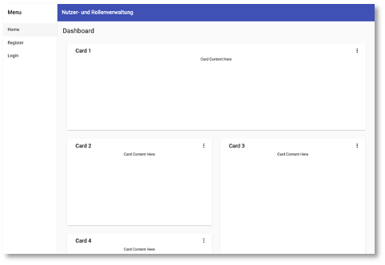

# Nutzerverwaltung und Material

Wir haben bis jetzt immer [Bootstrap](https://getbootstrap.com/) als CSS-Framework verwendet. Nun wollen wir stattdessen mal [Angular Material](https://material.angular.io/) nutzen. Es sei erwähnt, dass es sogar ein Framework gibt, dass beides vereint, nämlich [Material Design for Bottstrap (MDB)](https://mdbootstrap.com/). Das ist aber nur teilweise kostenlos. 

Inhaltlich geht es uns nicht nur um die Verwendung von *Angular Material*, sondern um eine Nutzer- und Rollenverwaltung, um einige weitere Konzepte anzuwenden, wie z.B. rollenbasierter Zugriff auf Komponenten und die Verschlüsselung und das Prüfen von Passwörtern. 

## Angular-Anwendung mit Registrierung und Login

Wir erstellen uns dafür eine Angular-Anwendung `users` mit Routing mit einer Navigations-, einer Registrierungs- und eine Login-Komponente.

```bash
ng new users --routing
```

Wir fügen dieser Anwendung [Angular Material] hinzu:

```bash
cd users
ng add @angular/material
```

Sie werden gefragt, welches `prebuilt theme` Sie verwenden wollen. Nehmen Sie ruhig `Custom`:

```bash
ℹ Using package manager: npm
✔ Found compatible package version: @angular/material@12.2.13.
✔ Package information loaded.
 
The package @angular/material@12.2.13 will be installed and executed.
Would you like to proceed? Yes
✔ Package successfully installed.
? Choose a prebuilt theme name, or "custom" for a custom theme: 
  Indigo/Pink        [ Preview: https://material.angular.io?theme=indigo-pink ] 
  Deep Purple/Amber  [ Preview: https://material.angular.io?theme=deeppurple-amber ] 
  Pink/Blue Grey     [ Preview: https://material.angular.io?theme=pink-bluegrey ] 
  Purple/Green       [ Preview: https://material.angular.io?theme=purple-green ] 
❯ Custom 
```

und beantworten Sie ruhig alle weiteren Fragen mit `y`(es):

```bash
✔ Package successfully installed.
? Choose a prebuilt theme name, or "custom" for a custom theme: Custom
? Set up global Angular Material typography styles? Yes
? Set up browser animations for Angular Material? Yes
UPDATE package.json (1135 bytes)
✔ Packages installed successfully.
CREATE src/custom-theme.scss (1416 bytes)
UPDATE src/app/app.module.ts (502 bytes)
UPDATE angular.json (3072 bytes)
UPDATE src/index.html (573 bytes)
UPDATE src/styles.css (181 bytes)
```

Die Verwendung von *Angular Material* ist leider etwas aufwendiger, als die von Bootstrap, weil alle Komponenten, die Sie von *Angular Material* verwenden wollen, explizit in der `app.module.ts` importiert werden müssen. Wir schauen uns das an einigen Beispielen an. 


### Navigation schematic - nav

Allerdings hat *Angular Material* ein recht nützlich Feature, nämlich sogenannte [Schematics](https://material.angular.io/guide/schematics). Das sind vorgefertigte Designkomponenten, die man häufig verwendet. Ein erstes Beispiel für ein solches *Schematic* ist das [Navigation schematic](https://material.angular.io/guide/schematics#navigation-schematic) mit dem wir unsere Navigationskomponente `nav` erstellen:

```bash
ng generate @angular/material:navigation nav
```

Die allgemeine Syntax zur Erstellung einer Navigationskomponente ist `ng generate @angular/material:navigation <component-name>`. Wir erzeugen somit also die Komponente namens `nav`. 

### Adress form schematic - register, login

Das [Adress form schematic](https://material.angular.io/guide/schematics#address-form-schematic) erzeugt zwar ein Formular für die Eingabe einer Adresse, aber da wir für unser Registrierungs-Formular und auch für das Login-Formular viele CSS-Klassen aus dem Material-Formular verwenden wollen, erzeugen wir uns mithilfe des [Adress form schematic](https://material.angular.io/guide/schematics#address-form-schematic) auch die `register`- und die `login`-Komponente:

```bash
ng generate @angular/material:address-form register
ng generate @angular/material:address-form login
```

### Dashboard schematic - home

Zuletzt verwenden wir noch das [Dashboard schematic](https://material.angular.io/guide/schematics#drag-and-drop-schematic), um uns eine `home`-Komponente zu erzeugen:

```bash
ng generate @angular/material:dashboard home
```

### Routing und AppComponent

Alle drei Komponenten rufen wir zunächst per Routing auf und passen deshalb unsere `app-routing.module` wie folgt an:

=== "app-routing.module.ts"
```ts linenums="1" hl_lines="3-5 7-18"
import { NgModule } from '@angular/core';
import { RouterModule, Routes } from '@angular/router';
import { HomeComponent } from './home/home.component';
import { LoginComponent } from './login/login.component';
import { RegisterComponent } from './register/register.component';

const routes: Routes = [{
  path: '',
  component: HomeComponent
},
{
  path: 'login',
  component: LoginComponent
},
{
  path: 'register',
  component: RegisterComponent
}];

@NgModule({
  imports: [RouterModule.forRoot(routes)],
  exports: [RouterModule]
})
export class AppRoutingModule { }
```

In der `app.component.html` binden wir nur die `nav`-Komponente ein (**nicht** `<router-outlet></router-outlet>` - das kommt in die `nav`-Komponente):

=== "app.component.html"
```html linenums="1"
<app-nav></app-nav>
```

### NavComponent

Nun passen wir unsere `NavComponent` an und öffnen dazu die `nav.component.html`:

=== "app.component.html"
```html linenums="1" hl_lines="5-8 15 18"
<mat-sidenav-container class="sidenav-container">
    <mat-sidenav #drawer class="sidenav" fixedInViewport [attr.role]="(isHandset$ | async) ? 'dialog' : 'navigation'" [mode]="(isHandset$ | async) ? 'over' : 'side'" [opened]="(isHandset$ | async) === false">
        <mat-toolbar>Menu</mat-toolbar>
        <mat-nav-list>
            <a mat-list-item [routerLink]="'/'">Home</a>
            <a mat-list-item [routerLink]="'/register'">Register</a>
            <a mat-list-item [routerLink]="'/login'">Login</a>
        </mat-nav-list>
    </mat-sidenav>
    <mat-sidenav-content>
        <mat-toolbar color="primary">
            <button type="button" aria-label="Toggle sidenav" mat-icon-button (click)="drawer.toggle()" *ngIf="isHandset$ | async">
			        <mat-icon aria-label="Side nav toggle icon">menu</mat-icon>
			      </button>
            <span>Nutzer- und Rollenverwaltung</span>
        </mat-toolbar>
        <!-- Add Content Here -->
        <router-outlet></router-outlet>
    </mat-sidenav-content>
</mat-sidenav-container>
```

Wichtig ist, dass die `<router-outlet></router-outlet>` an die Stelle des Kommentars `<!-- Add Content Here -->` kommt (Zeile `18`). Genau dort wird der Inhalt eingebunden, d.h. die Komponenten, die per Routing aufgerufen und eingebunden werden (bei uns `home`, `register` oder `login`). Der Eintrag in Zeile `15` ist wie eine Überschrift und in den Zeilen `5-8` werden die Menüeinträge (und die dazugehörigen Routen) definiert. Es entsteht folgende  (für die `home`-Komponente):



Verrringern Sie auch die Breite des Viewports, um zu sehen, wie responsive die einzelnen Komponenten (inkl. `nav`-Komponente) bereits sind. 

### Register-Formular

Wir passen nun das Formular zur Registrierung an. Das Standard-Shipping-Adress-Formular zeigt, was mit Formularen im *Material-Design*  alles möglich ist. Wir passen das Formular an, um die Registrierung einer Nutzerin mit ihrer Rolle zu ermöglichen:

=== "register.component.html"
```html linenums="1"
<form [formGroup]="registerForm" novalidate (ngSubmit)="onSubmit()">
    <mat-card class="shipping-card">
        <mat-card-header>
            <mat-card-title>Registrierung</mat-card-title>
        </mat-card-header>
        <mat-card-content>
            <p>
                <mat-form-field class="full-width" appearance="standard">
                    <mat-label>Vorname</mat-label>
                    <input matInput placeholder="Vorname" formControlName="firstName">
                    <mat-error *ngIf="registerForm.controls['firstName'].hasError('required')">
                        Vorname <strong>erforderlich</strong>
                    </mat-error>
                </mat-form-field>
            </p>
            <p>
                <mat-form-field class="full-width" appearance="standard">
                    <mat-label>Nachname</mat-label>
                    <input matInput placeholder="Nachname" formControlName="lastName">
                    <mat-error *ngIf="registerForm.controls['lastName'].hasError('required')">
                        Nachname <strong>erforderlich</strong>
                    </mat-error>
                </mat-form-field>
            </p>
            <p>
                <mat-form-field class="full-width" appearance="standard">
                    <mat-label>Passwort</mat-label>
                    <input matInput [type]="hide ? 'password' : 'text'">
                    <button mat-icon-button matSuffix (click)="hide = !hide" [attr.aria-label]="'Hide password'" [attr.aria-pressed]="hide">
      <mat-icon>{{hide ? 'visibility_off' : 'visibility'}}</mat-icon>
    </button>
                </mat-form-field>
            </p>
            <p>
                <mat-form-field class="full-width" appearance="standard">
                    <mat-label>E-Mail</mat-label>
                    <input matInput placeholder="E-Mail" formControlName="email">
                    <mat-error *ngIf="registerForm.controls['email'].hasError('required')">
                        E-mail <strong>erforderlich</strong>
                    </mat-error>
                </mat-form-field>
            </p>
            <p>
                <mat-form-field class="full-width" appearance="standard">
                    <mat-label>Rolle</mat-label>
                    <mat-select placeholder="Rolle" formControlName="role">
                        <mat-option *ngFor="let role of roles" [value]="role.abbreviation">
                            {{ role.name }}
                        </mat-option>
                    </mat-select>
                    <mat-hint align="end">Wählen Sie eine Rolle</mat-hint>
                    <mat-error *ngIf="registerForm.controls['role'].hasError('required')">
                        State is <strong>required</strong>
                    </mat-error>
                </mat-form-field>
            </p>
        </mat-card-content>
        <mat-card-actions>
            <button mat-raised-button color="primary" type="submit">Registrieren</button>
        </mat-card-actions>
    </mat-card>
</form>
```

=== "register.component.ts"
```ts linenums="1"
import { Component } from '@angular/core';
import { FormBuilder, Validators } from '@angular/forms';

@Component({
  selector: 'app-register',
  templateUrl: './register.component.html',
  styleUrls: ['./register.component.css']
})
export class RegisterComponent {
  hide = true;

  registerForm = this.fb.group({
    firstName: [null, Validators.required],
    lastName: [null, Validators.required],
    email: [null, Validators.required, Validators.email],
    password: [null, Validators.compose([
      Validators.required, Validators.minLength(8), Validators.maxLength(20)])
    ],
    role: [null, Validators.required],
  });

  roles = [
    {name: 'Admin', abbreviation: 'admin'},
    {name: 'User', abbreviation: 'user'}
  ];

  constructor(private fb: FormBuilder) {}

  onSubmit(): void {
    alert('Registrierung erfolgreich!');
  }
}
```

=== "register.component.css"
```css linenums="1"
mat-card {
    margin: 5% 20%;
}

.full-width {
    width: 100%;
}
```

Es entsteht folgendes Formular:


## Backend für Nutzerverwaltung


