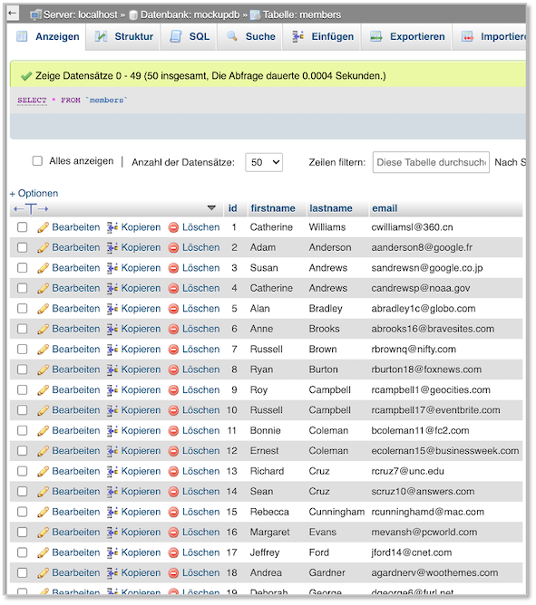

# MySQL


Bevor wir mit der Implementierung des Backends fortfahren, erstellen wir unsere Datenbank. Am einfachsten ist es, wenn wir `phpmyadmin` unter `localhost` öffnen (`http://localhost/phpmyadmin`) und dort zunächst eine Datenbank anlegen (unter `Neu`); benennen Sie die Datenbank am besten `mockupdb` und darin folgende `sql`-Datei importieren:

??? "members.sql"
	```sql
	-- phpMyAdmin SQL Dump
	-- version 5.0.2
	-- https://www.phpmyadmin.net/
	--
	-- Host: localhost
	-- Erstellungszeit: 23. Nov 2020 um 16:23
	-- Server-Version: 8.0.17
	-- PHP-Version: 7.3.22-(to be removed in future macOS)

	SET SQL_MODE = "NO_AUTO_VALUE_ON_ZERO";
	START TRANSACTION;
	SET time_zone = "+00:00";


	/*!40101 SET @OLD_CHARACTER_SET_CLIENT=@@CHARACTER_SET_CLIENT */;
	/*!40101 SET @OLD_CHARACTER_SET_RESULTS=@@CHARACTER_SET_RESULTS */;
	/*!40101 SET @OLD_COLLATION_CONNECTION=@@COLLATION_CONNECTION */;
	/*!40101 SET NAMES utf8mb4 */;

	--
	-- Datenbank: `mockupdb`
	--

	-- --------------------------------------------------------

	--
	-- Tabellenstruktur für Tabelle `members`
	--

	CREATE TABLE `members` (
	  `id` int(11) NOT NULL,
	  `firstname` varchar(25) NOT NULL,
	  `lastname` varchar(25) NOT NULL,
	  `email` varchar(30) NOT NULL
	) ENGINE=InnoDB DEFAULT CHARSET=utf8mb4 COLLATE=utf8mb4_0900_ai_ci;

	--
	-- Daten für Tabelle `members`
	--

	INSERT INTO `members` (`id`, `firstname`, `lastname`, `email`) VALUES
	(1, 'Catherine', 'Williams', 'cwilliamsl@360.cn'),
	(2, 'Adam', 'Anderson', 'aanderson8@google.fr'),
	(3, 'Susan', 'Andrews', 'sandrewsn@google.co.jp'),
	(4, 'Catherine', 'Andrews', 'candrewsp@noaa.gov'),
	(5, 'Alan', 'Bradley', 'abradley1c@globo.com'),
	(6, 'Anne', 'Brooks', 'abrooks16@bravesites.com'),
	(7, 'Russell', 'Brown', 'rbrownq@nifty.com'),
	(8, 'Ryan', 'Burton', 'rburton18@foxnews.com'),
	(9, 'Roy', 'Campbell', 'rcampbell1@geocities.com'),
	(10, 'Russell', 'Campbell', 'rcampbell17@eventbrite.com'),
	(11, 'Bonnie', 'Coleman', 'bcoleman11@fc2.com'),
	(12, 'Ernest', 'Coleman', 'ecoleman15@businessweek.com'),
	(13, 'Richard', 'Cruz', 'rcruz7@unc.edu'),
	(14, 'Sean', 'Cruz', 'scruz10@answers.com'),
	(15, 'Rebecca', 'Cunningham', 'rcunninghamd@mac.com'),
	(16, 'Margaret', 'Evans', 'mevansh@pcworld.com'),
	(17, 'Jeffrey', 'Ford', 'jford14@cnet.com'),
	(18, 'Andrea', 'Gardner', 'agardnerv@woothemes.com'),
	(19, 'Deborah', 'George', 'dgeorge6@furl.net'),
	(20, 'Sean', 'Gibson', 'sgibsony@alexa.com'),
	(21, 'Virginia', 'Graham', 'vgrahamk@aol.com'),
	(22, 'Steven', 'Hamilton', 'shamiltonu@state.tx.us'),
	(23, 'Virginia', 'Hawkins', 'vhawkinsf@ehow.com'),
	(24, 'Edward', 'Hicks', 'ehicksc@pcworld.com'),
	(25, 'Mark', 'Johnson', 'mjohnsonj@hostgator.com'),
	(26, 'Ruth', 'Jordan', 'rjordan1a@smugmug.com'),
	(27, 'Antonio', 'Kim', 'akim4@odnoklassniki.ru'),
	(28, 'Jennifer', 'Marshall', 'jmarshallt@gnu.org'),
	(29, 'Eric', 'Matthews', 'ematthews5@independent.co.uk'),
	(30, 'Raymond', 'Mcdonald', 'rmcdonald2@ihg.com'),
	(31, 'Eric', 'Miller', 'emillere@creativecommons.org'),
	(32, 'Jonathan', 'Morales', 'jmoralesa@ovh.net'),
	(33, 'Marie', 'Morgan', 'mmorganb@cloudflare.com'),
	(34, 'Amanda', 'Nelson', 'anelson13@indiatimes.com'),
	(35, 'Lisa', 'Olson', 'lolsonr@telegraph.co.uk'),
	(36, 'Alice', 'Ortiz', 'aortizw@histats.com'),
	(37, 'Peter', 'Phillips', 'pphillipss@1688.com'),
	(38, 'Matthew', 'Porter', 'mporter9@europa.eu'),
	(39, 'Tammy', 'Ray', 'trayx@weather.com'),
	(40, 'Mark', 'Richardson', 'mrichardson1d@ihg.com'),
	(41, 'Joan', 'Roberts', 'jroberts12@alibaba.com'),
	(42, 'Kathleen', 'Rose', 'kroseg@pinterest.com'),
	(43, 'Steve', 'Sanders', 'ssanders1b@wikispaces.com'),
	(44, 'Shirley', 'Scott', 'sscottm@macromedia.com'),
	(45, 'Lillian', 'Stephens', 'lstephens19@hugedomains.com'),
	(46, 'Nicole', 'Thompson', 'nthompson3@admin.ch'),
	(47, 'Marie', 'Thompson', 'mthompsonz@yelp.com'),
	(48, 'Alan', 'Vasquez', 'avasquezo@miibeian.gov.cn'),
	(49, 'Mildred', 'Watkins', 'mwatkins0@miibeian.gov.cn'),
	(50, 'Eugene', 'Williams', 'ewilliamsi@deliciousdays.com');

	--
	-- Indizes der exportierten Tabellen
	--

	--
	-- Indizes für die Tabelle `members`
	--
	ALTER TABLE `members`
	  ADD PRIMARY KEY (`id`);

	--
	-- AUTO_INCREMENT für exportierte Tabellen
	--

	--
	-- AUTO_INCREMENT für Tabelle `members`
	--
	ALTER TABLE `members`
	  MODIFY `id` int(11) NOT NULL AUTO_INCREMENT, AUTO_INCREMENT=51;
	COMMIT;

	/*!40101 SET CHARACTER_SET_CLIENT=@OLD_CHARACTER_SET_CLIENT */;
	/*!40101 SET CHARACTER_SET_RESULTS=@OLD_CHARACTER_SET_RESULTS */;
	/*!40101 SET COLLATION_CONNECTION=@OLD_COLLATION_CONNECTION */;
	```

Falls Sie MySQL vom Studi-Server verwenden, dann müssen Sie 

```sql
COLLATE=utf8mb4_0900_ai_ci
```

durch 

```sql
COLLATE=utf8mb4_general_ci
```

ersetzen! Sie können sich diese Datei auch [hier](./files/members.sql) herunterladen. Prüfen Sie, ob alle 50 Datensätze korrekt eingelsen wurden. Unter `Anzeigen` in `phpmyadmin` sollte folgende Tabelle erscheinen:



### Datenbank im Backend anbinden

Wir binden nun die Datenbank an unser Backend an. Erstellen Sie sich am besten in Ihrem `backend`-Ordner einen Ordner `config` und darin eine `db.config.js`-Datei mit folgendem Inhalt:

=== "config/db.config.js"
	```javascript
	module.exports = {
	    HOST: "localhost",
	    USER: "root",
	    PASSWORD: "IhrPasswort",
	    DB: "mockupdb"
	};
	```

Falls Sie MySQL des Studi-Servers verwenden, sieht die `db.config.js` so aus:

=== "config/db.config.js"
	```javascript
	module.exports = {
	    HOST: "db.f4.htw-berlin.de",
	    USER: "s05xxx",
	    PASSWORD: "IhrPassword",
	    DB: "_s05xxx__mockupdb"
	};
	```


Sie müssen Ihr Passwort eintragen und, falls Sie Ihre Datenbank anders genannt haben, auch den Datenbanknamen anpassen. 

Erstellen Sie sich in Ihrem `backend`-Ordner einen Ordner `app` und darin einen Ordner `model`. In diesem Ordner erstellen Sie sich ein `db.js`, um die Verbindung zur Datenbank zu implementieren: 

=== "app/model/db.js"
	```javascript
	const mysql = require("mysql");
	const dbConfig = require("//config/db.config.js");

	// Create a connection to the database
	const connection = mysql.createConnection({
	    host: dbConfig.HOST,
	    user: dbConfig.USER,
	    password: dbConfig.PASSWORD,
	    database: dbConfig.DB
	});

	// open the MySQL connection
	connection.connect(error => {
	    if (error) throw error;
	    console.log("Successfully connected to the database.");
	});

	module.exports = connection;
	```

