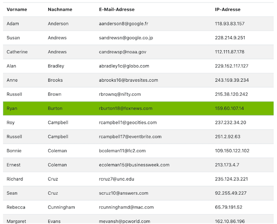
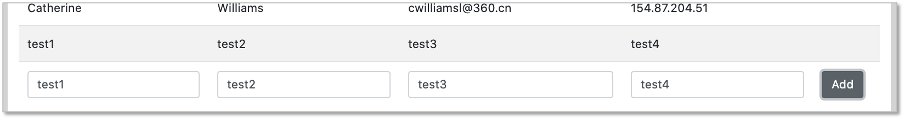
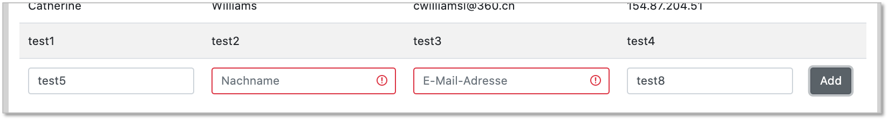

# Übungen

#### Übung 0

??? question "Infrastruktur einrichten"
    - wählen Sie eine [**IDE**](../tools/#integrated-development-environment-ide) aus und installieren Sie diese 
    - richten Sie sich ein Git-Repository ein (z.B. `WebTech21`) und pushen Sie es auf einen zentralen Dienst ([**siehe**](../tools/#git))
    - laden Sie mich zu Ihrem Git-Dienst ein ([**siehe**](../tools/#git))
    - commiten und pushen Sie Ihr Repository


#### Übung 1

??? question "Übungsaufgabe 1 (HTML)"
    - Erstellen Sie in einem `Uebung1`-Ordner eine Datei `uebung1.html`. Das `body`-Element soll ein `header`-Element, ein `nav`-Element, ein `section`-Element und ein `footer`-Element enthalten. 
    - Unter dieser Übungsaufgabe (siehe `mockupdata`) ist der HTML-Code einer Tabelle mit allen Teilnehmerinnen einer Veranstaltung. Kopieren Sie den Inhalt der Datei so in Ihren HTML-Code, dass folgende Seite erscheint:
    

    - Es sollen 4 Unterseiten erstellt werden. Bei Klick auf diese Seiten soll die Tabelle jeweils nur die Teilnehmerinnen enthalten, deren Nachname mit dem entsprechenden Anfangsbuchstaben beginnt (also in `ag.html` nur alle Nachnamen, die mit A bis G beginnen). Die Seiten `ag.html`, `hl.html`, `mr.html` und `sz.html` sollen im Ordner `NN` abgelegt werden, der Unterordner von `Uebung1` ist.
    - Achten Sie darauf, dass man von jeder Unterseite auf jede andere Unterseite und auch auf die Hauptseite (`uebung1.html`) wechseln können muss.
    - Das einzubindende Logo des Studiengangs liegt [hier](./files/fiw.jpg). Es soll in einen `images`-Ordner gespeichert werden, der in der Ordner-Hierarchie neben dem `Uebung1`-Ordner liegt. Um die Größe des Bildes festzulegen, können Sie mit Hilfe des `style`-Attributes die Höhe und die Breite bestimmen: `style="width:53px; height:48px;"` 
    - Nächste Woche wird Uebung1 um CSS erweitert. 

??? "mockupdata"
    ```html
    <table>
        <thead>
            <tr>
                <th>Vorname</th>
                <th>Nachname</th>
                <th>E-Mail-Adresse</th>
                <th>IP-Adresse</th>
            </tr>
        </thead>
        <tbody>
            <tr>
                <td>Adam</td>
                <td>Anderson</td>
                <td>aanderson8@google.fr</td>
                <td>118.93.83.157</td>
            </tr>
            <tr>
                <td>Susan</td>
                <td>Andrews</td>
                <td>sandrewsn@google.co.jp</td>
                <td>228.214.9.251</td>
            </tr>
            <tr>
                <td>Catherine</td>
                <td>Andrews</td>
                <td>candrewsp@noaa.gov</td>
                <td>112.111.87.178</td>
            </tr>
            <tr>
                <td>Alan</td>
                <td>Bradley</td>
                <td>abradley1c@globo.com</td>
                <td>229.152.117.127</td>
            </tr>
            <tr>
                <td>Anne</td>
                <td>Brooks</td>
                <td>abrooks16@bravesites.com</td>
                <td>243.159.39.234</td>
            </tr>
            <tr>
                <td>Russell</td>
                <td>Brown</td>
                <td>rbrownq@nifty.com</td>
                <td>215.38.120.242</td>
            </tr>
            <tr>
                <td>Ryan</td>
                <td>Burton</td>
                <td>rburton18@foxnews.com</td>
                <td>159.60.107.14</td>
            </tr>
            <tr>
                <td>Roy</td>
                <td>Campbell</td>
                <td>rcampbell1@geocities.com</td>
                <td>237.232.34.20</td>
            </tr>
            <tr>
                <td>Russell</td>
                <td>Campbell</td>
                <td>rcampbell17@eventbrite.com</td>
                <td>251.2.92.63</td>
            </tr>
            <tr>
                <td>Bonnie</td>
                <td>Coleman</td>
                <td>bcoleman11@fc2.com</td>
                <td>109.150.122.102</td>
            </tr>
            <tr>
                <td>Ernest</td>
                <td>Coleman</td>
                <td>ecoleman15@businessweek.com</td>
                <td>213.173.4.7</td>
            </tr>
            <tr>
                <td>Richard</td>
                <td>Cruz</td>
                <td>rcruz7@unc.edu</td>
                <td>235.124.23.221</td>
            </tr>
            <tr>
                <td>Sean</td>
                <td>Cruz</td>
                <td>scruz10@answers.com</td>
                <td>92.255.49.227</td>
            </tr>
            <tr>
                <td>Rebecca</td>
                <td>Cunningham</td>
                <td>rcunninghamd@mac.com</td>
                <td>65.79.191.52</td>
            </tr>
            <tr>
                <td>Margaret</td>
                <td>Evans</td>
                <td>mevansh@pcworld.com</td>
                <td>162.10.86.196</td>
            </tr>
            <tr>
                <td>Jeffrey</td>
                <td>Ford</td>
                <td>jford14@cnet.com</td>
                <td>210.216.54.14</td>
            </tr>
            <tr>
                <td>Andrea</td>
                <td>Gardner</td>
                <td>agardnerv@woothemes.com</td>
                <td>179.91.0.30</td>
            </tr>
            <tr>
                <td>Deborah</td>
                <td>George</td>
                <td>dgeorge6@furl.net</td>
                <td>201.76.47.162</td>
            </tr>
            <tr>
                <td>Sean</td>
                <td>Gibson</td>
                <td>sgibsony@alexa.com</td>
                <td>48.114.103.55</td>
            </tr>
            <tr>
                <td>Virginia</td>
                <td>Graham</td>
                <td>vgrahamk@aol.com</td>
                <td>165.219.171.1</td>
            </tr>
            <tr>
                <td>Steven</td>
                <td>Hamilton</td>
                <td>shamiltonu@state.tx.us</td>
                <td>38.194.91.201</td>
            </tr>
            <tr>
                <td>Virginia</td>
                <td>Hawkins</td>
                <td>vhawkinsf@ehow.com</td>
                <td>93.120.46.203</td>
            </tr>
            <tr>
                <td>Edward</td>
                <td>Hicks</td>
                <td>ehicksc@pcworld.com</td>
                <td>199.153.27.1</td>
            </tr>
            <tr>
                <td>Mark</td>
                <td>Johnson</td>
                <td>mjohnsonj@hostgator.com</td>
                <td>73.87.135.206</td>
            </tr>
            <tr>
                <td>Ruth</td>
                <td>Jordan</td>
                <td>rjordan1a@smugmug.com</td>
                <td>193.140.80.64</td>
            </tr>
            <tr>
                <td>Antonio</td>
                <td>Kim</td>
                <td>akim4@odnoklassniki.ru</td>
                <td>168.244.191.78</td>
            </tr>
            <tr>
                <td>Jennifer</td>
                <td>Marshall</td>
                <td>jmarshallt@gnu.org</td>
                <td>104.191.49.94</td>
            </tr>
            <tr>
                <td>Eric</td>
                <td>Matthews</td>
                <td>ematthews5@independent.co.uk</td>
                <td>138.194.30.1</td>
            </tr>
            <tr>
                <td>Raymond</td>
                <td>Mcdonald</td>
                <td>rmcdonald2@ihg.com</td>
                <td>161.24.42.24</td>
            </tr>
            <tr>
                <td>Eric</td>
                <td>Miller</td>
                <td>emillere@creativecommons.org</td>
                <td>122.159.17.218</td>
            </tr>
            <tr>
                <td>Jonathan</td>
                <td>Morales</td>
                <td>jmoralesa@ovh.net</td>
                <td>97.65.110.105</td>
            </tr>
            <tr>
                <td>Marie</td>
                <td>Morgan</td>
                <td>mmorganb@cloudflare.com</td>
                <td>226.79.152.112</td>
            </tr>
            <tr>
                <td>Amanda</td>
                <td>Nelson</td>
                <td>anelson13@indiatimes.com</td>
                <td>161.185.121.245</td>
            </tr>
            <tr>
                <td>Lisa</td>
                <td>Olson</td>
                <td>lolsonr@telegraph.co.uk</td>
                <td>77.245.172.100</td>
            </tr>
            <tr>
                <td>Alice</td>
                <td>Ortiz</td>
                <td>aortizw@histats.com</td>
                <td>179.52.222.21</td>
            </tr>
            <tr>
                <td>Peter</td>
                <td>Phillips</td>
                <td>pphillipss@1688.com</td>
                <td>11.158.255.76</td>
            </tr>
            <tr>
                <td>Matthew</td>
                <td>Porter</td>
                <td>mporter9@europa.eu</td>
                <td>174.81.178.88</td>
            </tr>
            <tr>
                <td>Tammy</td>
                <td>Ray</td>
                <td>trayx@weather.com</td>
                <td>192.243.38.190</td>
            </tr>
            <tr>
                <td>Mark</td>
                <td>Richardson</td>
                <td>mrichardson1d@ihg.com</td>
                <td>209.217.14.154</td>
            </tr>
            <tr>
                <td>Joan</td>
                <td>Roberts</td>
                <td>jroberts12@alibaba.com</td>
                <td>4.91.143.62</td>
            </tr>
            <tr>
                <td>Kathleen</td>
                <td>Rose</td>
                <td>kroseg@pinterest.com</td>
                <td>222.172.140.56</td>
            </tr>
            <tr>
                <td>Steve</td>
                <td>Sanders</td>
                <td>ssanders1b@wikispaces.com</td>
                <td>91.61.109.245</td>
            </tr>
            <tr>
                <td>Shirley</td>
                <td>Scott</td>
                <td>sscottm@macromedia.com</td>
                <td>219.237.108.82</td>
            </tr>
            <tr>
                <td>Lillian</td>
                <td>Stephens</td>
                <td>lstephens19@hugedomains.com</td>
                <td>89.85.137.204</td>
            </tr>
            <tr>
                <td>Nicole</td>
                <td>Thompson</td>
                <td>nthompson3@admin.ch</td>
                <td>13.183.208.155</td>
            </tr>
            <tr>
                <td>Marie</td>
                <td>Thompson</td>
                <td>mthompsonz@yelp.com</td>
                <td>162.164.5.231</td>
            </tr>
            <tr>
                <td>Alan</td>
                <td>Vasquez</td>
                <td>avasquezo@miibeian.gov.cn</td>
                <td>178.109.86.172</td>
            </tr>
            <tr>
                <td>Mildred</td>
                <td>Watkins</td>
                <td>mwatkins0@miibeian.gov.cn</td>
                <td>150.67.132.64</td>
            </tr>
            <tr>
                <td>Eugene</td>
                <td>Williams</td>
                <td>ewilliamsi@deliciousdays.com</td>
                <td>67.208.26.182</td>
            </tr>
            <tr>
                <td>Catherine</td>
                <td>Williams</td>
                <td>cwilliamsl@360.cn</td>
                <td>154.87.204.51</td>
            </tr>
        </tbody>
    </table>
    ```

??? note "Eine mögliche Lösung für Übung 1"
    ```html
    <!DOCTYPE html>
    <html lang="en">
    <head>
        <meta charset="UTF-8">
        <title>Aufgabe 1</title>
    </head>
    <body>
        <header>
            <h1>Teilnehmerinnen WebTech</h1>
            
        </header>
        <nav>
            <a href="#">ALLE</a>
            <a href="./NN/ag.html">A-G</a>
            <a href="./NN/hl.html">H-L</a>
            <a href="./NN/mr.html">M-R</a>
            <a href="./NN/sz.html">S-Z</a>
            <a href="../index.html">Startseite</a>
        </nav>
        <section>
            <table>
                <tr>
                    <th>Vorname</th>
                    <th>Nachname</th>
                    <th>E-Mail-Adresse</th>
                    <th>IP-Adresse</th>
                </tr>
                <tr>
                    <td>Adam</td>
                    <td>Anderson</td>
                    <td>aanderson8@google.fr</td>
                    <td>118.93.83.157</td>
                </tr>
                <tr>
                    <td>Susan</td>
                    <td>Andrews</td>
                    <td>sandrewsn@google.co.jp</td>
                    <td>228.214.9.251</td>
                </tr>
                <tr>
                    <td>Catherine</td>
                    <td>Andrews</td>
                    <td>candrewsp@noaa.gov</td>
                    <td>112.111.87.178</td>
                </tr>
                <tr>
                    <td>Alan</td>
                    <td>Bradley</td>
                    <td>abradley1c@globo.com</td>
                    <td>229.152.117.127</td>
                </tr>
                <tr>
                    <td>Anne</td>
                    <td>Brooks</td>
                    <td>abrooks16@bravesites.com</td>
                    <td>243.159.39.234</td>
                </tr>
                <tr>
                    <td>Russell</td>
                    <td>Brown</td>
                    <td>rbrownq@nifty.com</td>
                    <td>215.38.120.242</td>
                </tr>
                <tr>
                    <td>Ryan</td>
                    <td>Burton</td>
                    <td>rburton18@foxnews.com</td>
                    <td>159.60.107.14</td>
                </tr>
                <tr>
                    <td>Roy</td>
                    <td>Campbell</td>
                    <td>rcampbell1@geocities.com</td>
                    <td>237.232.34.20</td>
                </tr>
                <tr>
                    <td>Russell</td>
                    <td>Campbell</td>
                    <td>rcampbell17@eventbrite.com</td>
                    <td>251.2.92.63</td>
                </tr>
                <tr>
                    <td>Bonnie</td>
                    <td>Coleman</td>
                    <td>bcoleman11@fc2.com</td>
                    <td>109.150.122.102</td>
                </tr>
                <tr>
                    <td>Ernest</td>
                    <td>Coleman</td>
                    <td>ecoleman15@businessweek.com</td>
                    <td>213.173.4.7</td>
                </tr>
                <tr>
                    <td>Richard</td>
                    <td>Cruz</td>
                    <td>rcruz7@unc.edu</td>
                    <td>235.124.23.221</td>
                </tr>
                <tr>
                    <td>Sean</td>
                    <td>Cruz</td>
                    <td>scruz10@answers.com</td>
                    <td>92.255.49.227</td>
                </tr>
                <tr>
                    <td>Rebecca</td>
                    <td>Cunningham</td>
                    <td>rcunninghamd@mac.com</td>
                    <td>65.79.191.52</td>
                </tr>
                <tr>
                    <td>Margaret</td>
                    <td>Evans</td>
                    <td>mevansh@pcworld.com</td>
                    <td>162.10.86.196</td>
                </tr>
                <tr>
                    <td>Jeffrey</td>
                    <td>Ford</td>
                    <td>jford14@cnet.com</td>
                    <td>210.216.54.14</td>
                </tr>
                <tr>
                    <td>Andrea</td>
                    <td>Gardner</td>
                    <td>agardnerv@woothemes.com</td>
                    <td>179.91.0.30</td>
                </tr>
                <tr>
                    <td>Deborah</td>
                    <td>George</td>
                    <td>dgeorge6@furl.net</td>
                    <td>201.76.47.162</td>
                </tr>
                <tr>
                    <td>Sean</td>
                    <td>Gibson</td>
                    <td>sgibsony@alexa.com</td>
                    <td>48.114.103.55</td>
                </tr>
                <tr>
                    <td>Virginia</td>
                    <td>Graham</td>
                    <td>vgrahamk@aol.com</td>
                    <td>165.219.171.1</td>
                </tr>
                <tr>
                    <td>Steven</td>
                    <td>Hamilton</td>
                    <td>shamiltonu@state.tx.us</td>
                    <td>38.194.91.201</td>
                </tr>
                <tr>
                    <td>Virginia</td>
                    <td>Hawkins</td>
                    <td>vhawkinsf@ehow.com</td>
                    <td>93.120.46.203</td>
                </tr>
                <tr>
                    <td>Edward</td>
                    <td>Hicks</td>
                    <td>ehicksc@pcworld.com</td>
                    <td>199.153.27.1</td>
                </tr>
                <tr>
                    <td>Mark</td>
                    <td>Johnson</td>
                    <td>mjohnsonj@hostgator.com</td>
                    <td>73.87.135.206</td>
                </tr>
                <tr>
                    <td>Ruth</td>
                    <td>Jordan</td>
                    <td>rjordan1a@smugmug.com</td>
                    <td>193.140.80.64</td>
                </tr>
                <tr>
                    <td>Antonio</td>
                    <td>Kim</td>
                    <td>akim4@odnoklassniki.ru</td>
                    <td>168.244.191.78</td>
                </tr>
                <tr>
                    <td>Jennifer</td>
                    <td>Marshall</td>
                    <td>jmarshallt@gnu.org</td>
                    <td>104.191.49.94</td>
                </tr>
                <tr>
                    <td>Eric</td>
                    <td>Matthews</td>
                    <td>ematthews5@independent.co.uk</td>
                    <td>138.194.30.1</td>
                </tr>
                <tr>
                    <td>Raymond</td>
                    <td>Mcdonald</td>
                    <td>rmcdonald2@ihg.com</td>
                    <td>161.24.42.24</td>
                </tr>
                <tr>
                    <td>Eric</td>
                    <td>Miller</td>
                    <td>emillere@creativecommons.org</td>
                    <td>122.159.17.218</td>
                </tr>
                <tr>
                    <td>Jonathan</td>
                    <td>Morales</td>
                    <td>jmoralesa@ovh.net</td>
                    <td>97.65.110.105</td>
                </tr>
                <tr>
                    <td>Marie</td>
                    <td>Morgan</td>
                    <td>mmorganb@cloudflare.com</td>
                    <td>226.79.152.112</td>
                </tr>
                <tr>
                    <td>Amanda</td>
                    <td>Nelson</td>
                    <td>anelson13@indiatimes.com</td>
                    <td>161.185.121.245</td>
                </tr>
                <tr>
                    <td>Lisa</td>
                    <td>Olson</td>
                    <td>lolsonr@telegraph.co.uk</td>
                    <td>77.245.172.100</td>
                </tr>
                <tr>
                    <td>Alice</td>
                    <td>Ortiz</td>
                    <td>aortizw@histats.com</td>
                    <td>179.52.222.21</td>
                </tr>
                <tr>
                    <td>Peter</td>
                    <td>Phillips</td>
                    <td>pphillipss@1688.com</td>
                    <td>11.158.255.76</td>
                </tr>
                <tr>
                    <td>Matthew</td>
                    <td>Porter</td>
                    <td>mporter9@europa.eu</td>
                    <td>174.81.178.88</td>
                </tr>
                <tr>
                    <td>Tammy</td>
                    <td>Ray</td>
                    <td>trayx@weather.com</td>
                    <td>192.243.38.190</td>
                </tr>
                <tr>
                    <td>Mark</td>
                    <td>Richardson</td>
                    <td>mrichardson1d@ihg.com</td>
                    <td>209.217.14.154</td>
                </tr>
                <tr>
                    <td>Joan</td>
                    <td>Roberts</td>
                    <td>jroberts12@alibaba.com</td>
                    <td>4.91.143.62</td>
                </tr>
                <tr>
                    <td>Kathleen</td>
                    <td>Rose</td>
                    <td>kroseg@pinterest.com</td>
                    <td>222.172.140.56</td>
                </tr>
                <tr>
                    <td>Steve</td>
                    <td>Sanders</td>
                    <td>ssanders1b@wikispaces.com</td>
                    <td>91.61.109.245</td>
                </tr>
                <tr>
                    <td>Shirley</td>
                    <td>Scott</td>
                    <td>sscottm@macromedia.com</td>
                    <td>219.237.108.82</td>
                </tr>
                <tr>
                    <td>Lillian</td>
                    <td>Stephens</td>
                    <td>lstephens19@hugedomains.com</td>
                    <td>89.85.137.204</td>
                </tr>
                <tr>
                    <td>Nicole</td>
                    <td>Thompson</td>
                    <td>nthompson3@admin.ch</td>
                    <td>13.183.208.155</td>
                </tr>
                <tr>
                    <td>Marie</td>
                    <td>Thompson</td>
                    <td>mthompsonz@yelp.com</td>
                    <td>162.164.5.231</td>
                </tr>
                <tr>
                    <td>Alan</td>
                    <td>Vasquez</td>
                    <td>avasquezo@miibeian.gov.cn</td>
                    <td>178.109.86.172</td>
                </tr>
                <tr>
                    <td>Mildred</td>
                    <td>Watkins</td>
                    <td>mwatkins0@miibeian.gov.cn</td>
                    <td>150.67.132.64</td>
                </tr>
                <tr>
                    <td>Eugene</td>
                    <td>Williams</td>
                    <td>ewilliamsi@deliciousdays.com</td>
                    <td>67.208.26.182</td>
                </tr>
                <tr>
                    <td>Catherine</td>
                    <td>Williams</td>
                    <td>cwilliamsl@360.cn</td>
                    <td>154.87.204.51</td>
                </tr>
            </table>

        </section>
        <footer>
          Übung 1 - Jörn Freiheit
        </footer>
    </body>
    </html>
    ```


#### Übung 2

??? question "Übungsaufgabe 2 (CSS)"
    - Erstellen Sie (falls noch nicht geschehen) eine `index.html`-Datei in Ihrem Repository-Ordner (also z.B. `DocumentRoot/Webtech21`) derart, dass diese direkte Links auf Ihre Lösungen der Übungen enthalten (z.B. in einer Tabelle oder einer Liste).
    - Kopieren Sie den Ordner `Uebung1` in den Ordner `Uebung2` (also inkl. Ordner `NN`). Ändern Sie darin die Datei `uebung1.html` zu `uebung2.html` (umbenennen). Ändern Sie entsprechend alle Links innerhalb der Datei, damit Sie z.B. auf den Ordner `Uebung2/NN` zugreifen und nicht mehr auf `Uebung1/NN`.
    - Legen Sie sich im `Uebung2`-Ordner einen Ordner `styles` an. Erstellen Sie in dem `styles`-Ordner eine Datei `mystyles.css`.
    - Fügen Sie im `<head>`-Bereich der `uebung2.html` eine logische Verknüpfung zur `mystyles.css`-Datei ein (`<link href="./styles/mystyles.css" rel="stylesheet">`). 
    - In `mystyles.css` definieren Sie (versuchen Sie mind. 6 der genannten 8 Punkte umzusetzen):
        - Verdana als Schriftart für das ganze Dokument
        - der `<header>` soll das HTW-Grau als Hintergrundfarbe, HTW-Orange als Schriftfarbe und der Text zentriert sein (siehe [**HTW Corporate Design**](http://corporatedesign.htw-berlin.de/schrift-farbe/markenfarben/)).
        - die Tabelle soll ungefähr wie dargestellt aussehen: 
           
        - d.h. mit Rahmen, mit einem Schatten, die Spaltenüberschriften in weiß, mit HTW-grünem Hintergrund.   
        - Das `<nav>`-Feld hat einen Abstand nach oben und nach unten von jeweils `50px`.
        - `<a>`-Elemente in einem `<nav>`-Element haben einen grauen Rand, deren Ecken abgerundet sind. Die Hintergrundfarbe ist HTW-blau. Schriftart ist weiß und bold. `<a>`-Elemente in einem `<nav>`-Element sind nicht unterstrichen!
        - Fährt man mit der Maus über ein `<a>`-Element in einem `<nav>`-Element ändert sich die Hintergrundfarbe in HTW-grau und die Schriftfarbe in HTW-orange. 
            
        - Die Tabelle hat eine Breite von 80% des `<section>`-Elements. 
        - Der `<footer>` ist in HTW-Orange, die Schrift ist schwarz, der Text ist mittig und die Schrift ist kleiner. Die Höhe des footers entsteht dadurch, dass die Schrift einen Abstand nach oben und nach unten von jeweils `20px` hat.
    - Am Ende soll es *ungefähr* so aussehen:  
       


??? note "Eine mögliche Lösung für Übung 2"
    === "uebung2.html"
        ```html
        <!DOCTYPE html>
        <html lang="en">

        <head>
            <meta charset="UTF-8">
            <meta name="viewport" content="width=device-width, initial-scale=1.0">
            <title>Uebung 2</title>
            <link href="./styles/mystyles.css" rel="stylesheet">
        </head>

        <body>
            <header>
                <h1>Teilnehmerinnen Webtech</h1>
                
            </header>
            <nav>
                <a href="#">ALLE</a>
                <a href="NN/ag.html" title="Alle Nachnamen A-G">A-G</a>
                <a href="NN/hl.html">H-L</a>
                <a href="NN/mr.html">M-R</a>
                <a href="NN/sz.html">S-Z</a>
                <a href="../index.html">Startseite</a>
            </nav>
            <section>
                <table>
                    <thead>
                        <tr>
                            <th>Vorname</th>
                            <th>Nachname</th>
                            <th>E-Mail-Adresse</th>
                            <th>IP-Adresse</th>
                        </tr>
                    </thead>
                    <tbody>
                        <tr>
                            <td>Adam</td>
                            <td>Anderson</td>
                            <td>aanderson8@google.fr</td>
                            <td>118.93.83.157</td>
                        </tr>
                        <tr>
                            <td>Susan</td>
                            <td>Andrews</td>
                            <td>sandrewsn@google.co.jp</td>
                            <td>228.214.9.251</td>
                        </tr>
                        <tr>
                            <td>Catherine</td>
                            <td>Andrews</td>
                            <td>candrewsp@noaa.gov</td>
                            <td>112.111.87.178</td>
                        </tr>
                        <tr>
                            <td>Alan</td>
                            <td>Bradley</td>
                            <td>abradley1c@globo.com</td>
                            <td>229.152.117.127</td>
                        </tr>
                        <tr>
                            <td>Anne</td>
                            <td>Brooks</td>
                            <td>abrooks16@bravesites.com</td>
                            <td>243.159.39.234</td>
                        </tr>
                        <tr>
                            <td>Russell</td>
                            <td>Brown</td>
                            <td>rbrownq@nifty.com</td>
                            <td>215.38.120.242</td>
                        </tr>
                        <tr>
                            <td>Ryan</td>
                            <td>Burton</td>
                            <td>rburton18@foxnews.com</td>
                            <td>159.60.107.14</td>
                        </tr>
                        <tr>
                            <td>Roy</td>
                            <td>Campbell</td>
                            <td>rcampbell1@geocities.com</td>
                            <td>237.232.34.20</td>
                        </tr>
                        <tr>
                            <td>Russell</td>
                            <td>Campbell</td>
                            <td>rcampbell17@eventbrite.com</td>
                            <td>251.2.92.63</td>
                        </tr>
                        <tr>
                            <td>Bonnie</td>
                            <td>Coleman</td>
                            <td>bcoleman11@fc2.com</td>
                            <td>109.150.122.102</td>
                        </tr>
                        <tr>
                            <td>Ernest</td>
                            <td>Coleman</td>
                            <td>ecoleman15@businessweek.com</td>
                            <td>213.173.4.7</td>
                        </tr>
                        <tr>
                            <td>Richard</td>
                            <td>Cruz</td>
                            <td>rcruz7@unc.edu</td>
                            <td>235.124.23.221</td>
                        </tr>
                        <tr>
                            <td>Sean</td>
                            <td>Cruz</td>
                            <td>scruz10@answers.com</td>
                            <td>92.255.49.227</td>
                        </tr>
                        <tr>
                            <td>Rebecca</td>
                            <td>Cunningham</td>
                            <td>rcunninghamd@mac.com</td>
                            <td>65.79.191.52</td>
                        </tr>
                        <tr>
                            <td>Margaret</td>
                            <td>Evans</td>
                            <td>mevansh@pcworld.com</td>
                            <td>162.10.86.196</td>
                        </tr>
                        <tr>
                            <td>Jeffrey</td>
                            <td>Ford</td>
                            <td>jford14@cnet.com</td>
                            <td>210.216.54.14</td>
                        </tr>
                        <tr>
                            <td>Andrea</td>
                            <td>Gardner</td>
                            <td>agardnerv@woothemes.com</td>
                            <td>179.91.0.30</td>
                        </tr>
                        <tr>
                            <td>Deborah</td>
                            <td>George</td>
                            <td>dgeorge6@furl.net</td>
                            <td>201.76.47.162</td>
                        </tr>
                        <tr>
                            <td>Sean</td>
                            <td>Gibson</td>
                            <td>sgibsony@alexa.com</td>
                            <td>48.114.103.55</td>
                        </tr>
                        <tr>
                            <td>Virginia</td>
                            <td>Graham</td>
                            <td>vgrahamk@aol.com</td>
                            <td>165.219.171.1</td>
                        </tr>
                        <tr>
                            <td>Steven</td>
                            <td>Hamilton</td>
                            <td>shamiltonu@state.tx.us</td>
                            <td>38.194.91.201</td>
                        </tr>
                        <tr>
                            <td>Virginia</td>
                            <td>Hawkins</td>
                            <td>vhawkinsf@ehow.com</td>
                            <td>93.120.46.203</td>
                        </tr>
                        <tr>
                            <td>Edward</td>
                            <td>Hicks</td>
                            <td>ehicksc@pcworld.com</td>
                            <td>199.153.27.1</td>
                        </tr>
                        <tr>
                            <td>Mark</td>
                            <td>Johnson</td>
                            <td>mjohnsonj@hostgator.com</td>
                            <td>73.87.135.206</td>
                        </tr>
                        <tr>
                            <td>Ruth</td>
                            <td>Jordan</td>
                            <td>rjordan1a@smugmug.com</td>
                            <td>193.140.80.64</td>
                        </tr>
                        <tr>
                            <td>Antonio</td>
                            <td>Kim</td>
                            <td>akim4@odnoklassniki.ru</td>
                            <td>168.244.191.78</td>
                        </tr>
                        <tr>
                            <td>Jennifer</td>
                            <td>Marshall</td>
                            <td>jmarshallt@gnu.org</td>
                            <td>104.191.49.94</td>
                        </tr>
                        <tr>
                            <td>Eric</td>
                            <td>Matthews</td>
                            <td>ematthews5@independent.co.uk</td>
                            <td>138.194.30.1</td>
                        </tr>
                        <tr>
                            <td>Raymond</td>
                            <td>Mcdonald</td>
                            <td>rmcdonald2@ihg.com</td>
                            <td>161.24.42.24</td>
                        </tr>
                        <tr>
                            <td>Eric</td>
                            <td>Miller</td>
                            <td>emillere@creativecommons.org</td>
                            <td>122.159.17.218</td>
                        </tr>
                        <tr>
                            <td>Jonathan</td>
                            <td>Morales</td>
                            <td>jmoralesa@ovh.net</td>
                            <td>97.65.110.105</td>
                        </tr>
                        <tr>
                            <td>Marie</td>
                            <td>Morgan</td>
                            <td>mmorganb@cloudflare.com</td>
                            <td>226.79.152.112</td>
                        </tr>
                        <tr>
                            <td>Amanda</td>
                            <td>Nelson</td>
                            <td>anelson13@indiatimes.com</td>
                            <td>161.185.121.245</td>
                        </tr>
                        <tr>
                            <td>Lisa</td>
                            <td>Olson</td>
                            <td>lolsonr@telegraph.co.uk</td>
                            <td>77.245.172.100</td>
                        </tr>
                        <tr>
                            <td>Alice</td>
                            <td>Ortiz</td>
                            <td>aortizw@histats.com</td>
                            <td>179.52.222.21</td>
                        </tr>
                        <tr>
                            <td>Peter</td>
                            <td>Phillips</td>
                            <td>pphillipss@1688.com</td>
                            <td>11.158.255.76</td>
                        </tr>
                        <tr>
                            <td>Matthew</td>
                            <td>Porter</td>
                            <td>mporter9@europa.eu</td>
                            <td>174.81.178.88</td>
                        </tr>
                        <tr>
                            <td>Tammy</td>
                            <td>Ray</td>
                            <td>trayx@weather.com</td>
                            <td>192.243.38.190</td>
                        </tr>
                        <tr>
                            <td>Mark</td>
                            <td>Richardson</td>
                            <td>mrichardson1d@ihg.com</td>
                            <td>209.217.14.154</td>
                        </tr>
                        <tr>
                            <td>Joan</td>
                            <td>Roberts</td>
                            <td>jroberts12@alibaba.com</td>
                            <td>4.91.143.62</td>
                        </tr>
                        <tr>
                            <td>Kathleen</td>
                            <td>Rose</td>
                            <td>kroseg@pinterest.com</td>
                            <td>222.172.140.56</td>
                        </tr>
                        <tr>
                            <td>Steve</td>
                            <td>Sanders</td>
                            <td>ssanders1b@wikispaces.com</td>
                            <td>91.61.109.245</td>
                        </tr>
                        <tr>
                            <td>Shirley</td>
                            <td>Scott</td>
                            <td>sscottm@macromedia.com</td>
                            <td>219.237.108.82</td>
                        </tr>
                        <tr>
                            <td>Lillian</td>
                            <td>Stephens</td>
                            <td>lstephens19@hugedomains.com</td>
                            <td>89.85.137.204</td>
                        </tr>
                        <tr>
                            <td>Nicole</td>
                            <td>Thompson</td>
                            <td>nthompson3@admin.ch</td>
                            <td>13.183.208.155</td>
                        </tr>
                        <tr>
                            <td>Marie</td>
                            <td>Thompson</td>
                            <td>mthompsonz@yelp.com</td>
                            <td>162.164.5.231</td>
                        </tr>
                        <tr>
                            <td>Alan</td>
                            <td>Vasquez</td>
                            <td>avasquezo@miibeian.gov.cn</td>
                            <td>178.109.86.172</td>
                        </tr>
                        <tr>
                            <td>Mildred</td>
                            <td>Watkins</td>
                            <td>mwatkins0@miibeian.gov.cn</td>
                            <td>150.67.132.64</td>
                        </tr>
                        <tr>
                            <td>Eugene</td>
                            <td>Williams</td>
                            <td>ewilliamsi@deliciousdays.com</td>
                            <td>67.208.26.182</td>
                        </tr>
                        <tr>
                            <td>Catherine</td>
                            <td>Williams</td>
                            <td>cwilliamsl@360.cn</td>
                            <td>154.87.204.51</td>
                        </tr>
                    </tbody>
                </table>
            </section>
            <footer>
                Jörn Freiheit - Übung 2
            </footer>
        </body>

        </html>
        ```
    === "mystyles.css"
        ```css
        body {
            font-family: Verdana;
        }
        
        header {
            background-color: #AFAFAF;
            color: #FF5F00;
            text-align: center;
        }
        
        nav {
            margin-top: 3%;
            margin-bottom: 3%;
        }
        
        table {
            border-collapse: collapse;
            width: 80%;
            box-shadow: 10px 10px 5px grey;
        }
        
        table thead {
            background-color: #76B900;
            color: white;
        }
        
        table td,
        table th {
            border: 1px solid #ddd;
            padding: 8px;
        }
        
        table tr:nth-child(even) {
            background-color: #f2f2f2;
        }
        
        table tr:hover {
            background-color: #ddd;
        }
        
        nav a {
            text-decoration: none;
            border: 1px solid #0082D1;
            background-color: #0082D1;
            border-radius: 7px;
            color: white;
            font-weight: bold;
            text-align: center;
            padding: 10px;
            box-shadow: 5px 5px 5px grey;
        }
        
        nav a:hover {
            border: 1px solid #AFAFAF;
            background-color: #AFAFAF;
            color: #FF5F00;
        }
        
        footer {
            background-color: #FF5F00;
            color: black;
            text-align: center;
            padding: 20px;
        }
        ```

#### Übung 3

??? question "Übungsaufgabe 3 (Grid und Box-Model)"
    - Erstellen Sie einen `Uebung3`-Ordner und darin eine Datei `uebung3.html`. 
    - Laden Sie sich [hier die Datei images.zip](./files/images.zip) herunter, entpacken Sie sie und schieben Sie den `images`-Ordner samt Inhalt in den `Uebung3`-Ordner.
    - Implementieren Sie die `uebung3.html` so, dass *ungefähr* folgendes Aussehen entsteht:
       
    - Sie können die CSS-Eigenschaften innerhalb der `uebung3.html` im `<style>`-Element definieren oder wieder in einer externen Datei. 
    - Ziele der Übung sind die Anwendung von *CSS-Grid* und ein Verständnis vom *Box-Model* sowie die Verwendung von Größen. Lassen Sie Ihrer Kreativität freien Lauf!


??? note "Eine mögliche Lösung für Übung 3"
    ```html
    <!DOCTYPE html>
    <html lang="en">

    <head>
        <meta charset="UTF-8">
        <meta http-equiv="X-UA-Compatible" content="IE=edge">
        <meta name="viewport" content="width=device-width, initial-scale=1.0">
        <title>Uebung 3</title>
        <style>
            body {
                margin: 1%;
            }
            
            header {
                background-color: green;
                color: whitesmoke;
                text-align: center;
                padding: 0.5%;
                margin-bottom: 0.5%x;
            }
            
            .wrapper {
                display: grid;
                grid-template-columns: repeat(4, 1fr);
                grid-gap: 1%;
                margin-top: 1%;
            }
            
            .citycard {
                display: grid;
                grid-template-rows: 3fr 1fr;
                box-shadow: 0 4px 8px 0 rgba(0, 0, 0, 0.2), 0 6px 20px 0 rgba(0, 0, 0, 0.19);
                margin-bottom: 1%;
            }
            
            .cityimage img {
                display: block;
                margin: auto;
                padding-top: 50%;
                height: 50%;
            }
            
            .cityname {
                text-align: center;
                padding: 1%;
            }
        </style>
    </head>

    <body>
        <header>
            <h2>STÄDTE</h2>
        </header>
        <main>


            <section class="wrapper">
                <div class="citycard">

                    <div class="cityimage">
                        
                    </div>
                    <div class="cityname">
                        <p>Berlin</p>
                    </div>
                </div>

                <div class="citycard">
                    <div class="cityimage">
                        
                    </div>
                    <div class="cityname">
                        <p>Bernau</p>
                    </div>
                </div>

                <div class="citycard">
                    <div class="cityimage">
                        
                    </div>
                    <div class="cityname">
                        <p>Brandenburg</p>
                    </div>
                </div>

                <div class="citycard">
                    <div class="cityimage">
                        
                    </div>
                    <div class="cityname">
                        <p>Bremen</p>
                    </div>
                </div>

                <div class="citycard">
                    <div class="cityimage">
                        
                    </div>
                    <div class="cityname">
                        <p>Bremerhaven</p>
                    </div>
                </div>

                <div class="citycard">
                    <div class="cityimage">
                        
                    </div>
                    <div class="cityname">
                        <p>Madrid</p>
                    </div>
                </div>

                <div class="citycard">
                    <div class="cityimage">
                        
                    </div>
                    <div class="cityname">
                        <p>Magdeburg</p>
                    </div>
                </div>

                <div class="citycard">
                    <div class="cityimage">
                        
                    </div>
                    <div class="cityname">
                        <p>Mainz</p>
                    </div>
                </div>

                <div class="citycard">
                    <div class="cityimage">
                        
                    </div>
                    <div class="cityname">
                        <p>Mannheim</p>
                    </div>
                </div>

                <div class="citycard">
                    <div class="cityimage">
                        
                    </div>
                    <div class="cityname">
                        <p>Marburg</p>
                    </div>
                </div>

                <div class="citycard">
                    <div class="cityimage">
                        
                    </div>
                    <div class="cityname">
                        <p>New York</p>
                    </div>
                </div>

                <div class="citycard">
                    <div class="cityimage">
                        
                    </div>
                    <div class="cityname">
                        <p>Stockholm</p>
                    </div>
                </div>

            </section>
        </main>
        <footer>

        </footer>
    </body>

    </html>    
    ```


#### Übung 4

??? question "Übungsaufgabe 4 (RWD + Bootstrap)"
    - Kopieren Sie `uebung2.html` aus Übung 2 in einen neuen `Uebung4`-Ordner und benennen Sie die Datei in `uebung4.html` um (der `NN`-Ordner muss nicht mehr mitkopiert werden). Achten Sie aber darauf, dass das FIW-Logo noch angezeigt wird
    - Binden Sie in Ihre `uebung4.html` Bootstrap ein (entweder per CDN oder als lokalen Zugriff – siehe [**Bootstrap**](../rwd/#bootstrap))
    - **Header**:
        - Der `<header>` enthält das FIW-Logo und die Überschrift `<h1>Teilnehmerinnen WebTech</h1>`
        - Verwenden Sie für den `<header>` verschiedene Utilities, so dass Sie ungefähr das Aussehen wie auf dem Bild erreichen [**siehe auch hier**](https://getbootstrap.com/docs/5.0/examples/jumbotron/).
        - Verwenden Sie für den `<header>` das Grid-Konzept von Bootstrap, so dass das Bild und die Überschrift nebeneinander sind.
        - Der header soll ungefähr so aussehen (Navigation und Anfang des Hauptteils sind auch schon zu sehen): 
    - **Navigation**: 
        - *interne Links* (Links innerhalb der Seite) funktionieren wie folgt: Sie weisen einem Element eine `id` zu, z.B. der Tabellenzeile, die den ersten Nachnamen enthält, der mit "H" beginnt: 
        ```html
            <tr id="H">
                <td>Steven</td>
                <td>Hamilton</td>
                <td>shamiltonu@state.tx.us</td>
                <td>38.194.91.201</td>
            </tr>
        ```
        - Jetzt können Sie in einem internen Link mithilfe des Doppelkreuzes (`#`) und des Bezeichners für die id (`H`) darauf verweisen, z.B.
        ```html 
            <a class="nav-link" href="#H">H-L</a>
        ```
        - Vergeben Sie entsprechend IDs für die entsprechenden Tabellenzeilen (A, H, M, S) und passen Sie Ihre Hyperlinks im Navigationsmenü entsprechend an
        - Weisen Sie Ihrem `<nav>`-Element einen lightgrey-Hintergrund zu
        - Erstellen Sie für die einzelnen Links eine `<ul>`, deren `<li>` jeweils ein `<a>`-Element mit den Referenzen auf die oben beschriebenen IDs enthalten
        - Informieren Sie sich unter [**Navs**](https://getbootstrap.com/docs/5.0/components/navs-tabs/) (oder wo Sie möchten) über „Navs“ und erstellen Sie Ihr Navigationsmenü so, wie oben in der Abbildung (siehe **Header**) gezeigt
        - Ändern Sie aber die Farbe der Links so, dass sie im HTW-Orange (`#FF5F00`) erscheinen und wenn man mit der Maus darüber fährt im HTW-Blau (`#0082D1`) (Definieren Sie sich gerne [**Custom Properties**](../css/#custom-properties) und wenden Sie diese an)
    - **Hauptteil**:
        - der Hauptteil (ein Container) soll aus drei Containern bestehen: einer, der nur das Wort (Überschrift) "links" enthält, einer, der die Tabelle enthält und ein dritter, der nur das Wort (Überschrift) "rechts" enthält
        - Weisen Sie diesem Hauptteil die Klasse `row` zu und gestalten gestalten Sie die drei inneren Container (links, Tabelle, rechts) so, dass
            - sie ab einer Viewportbreite `>= 992px` (`lg`) nebeneinander sind, wobei die Tabelle 4x so breit ist wie die jeweiligen Container an der Seite
            - unterhalb der Viewportbreite von `992px` sollen die drei Teile untereinander sein
            - Abbildung für Breite unter `992px`:  
            
            - Abbildung für Breite oberhalb `992px`:  
            
        -   Mithilfe eigener Media-Queries sollen Sie dafür sorgen, dass die beiden Container links und rechts 
            - einen orangenen Hintergrund und eine Höhe von `100px` haben, wenn der Viewport kleiner als `992px` ist und 
            - einen hellgrauen (`lightgrey`) Hintergrund und eine automatische Höhe (`height: auto;`), wenn der Viewport größer ist
        -   Tabelle: 
            - Erkundigen Sie sich unter [**Tables**](https://getbootstrap.com/docs/5.0/content/tables/) und gestalten Sie die Tabelle so, dass sie ungefähr so aussieht: 
            - Sie müssen mit einer eigenen CSS-Definition dafür sorgen, dass die Zeile, in der Sie mit der Maus sind, nicht mehr dunkelgrau, sondern in HTW-Grün erscheint


??? note "Eine mögliche Lösung für Übung 4"
    ```html
    <!DOCTYPE html>
    <html lang="en">

    <head>
        <meta charset="UTF-8">
        <meta name="viewport" content="width=device-width, initial-scale=1.0">
        <title>Uebung 4</title>
        <link href="../rwd/css/bootstrap.min.css" rel="stylesheet">
        <style>
            * {
                --htw-green: #76B900;
                --htw-orange: #FF5F00;
                --htw-blue: #0082D1;
            }
            
            .table tbody tr:hover {
                background-color: var(--htw-green);
            }
            
            nav {
                background-color: lightgrey;
            }
            
            #links,
            #rechts {
                background-color: #FF5F00;
                height: 100px;
            }
            
            main {
                margin: 1%;
            }
            
            ul li.nav-item a.nav-link {
                color: #FF5F00;
            }
            
            ul li.nav-item a:hover {
                color: #0082D1;
            }
            
            footer {
                background-color: grey;
                color: white;
                text-align: center;
                padding: 10px;
            }
            
            @media screen and (min-width: 992px) {
                #links,
                #rechts {
                    background-color: lightgrey;
                    height: auto;
                }
            }
        </style>
    </head>

    <body>
        <header class="p-5 mb-4 bg-light rounded-3 row">

            <div class="col-3">
                
            </div>
            <div class="col-9">

                <h1>Teilnehmerinnen Webtech</h1>

            </div>

        </header>
        <nav class="m-1 ">
            <ul class="nav nav-pills nav-fills ">
                <li class="nav-item active ">
                    <a class="nav-link " href="# ">ALLE</a>
                </li>
                <li class="nav-item ">
                    <a class="nav-link " href="#A ">A-G</a>
                </li>
                <li class="nav-item ">
                    <a class="nav-link " href="#H ">H-L</a>
                </li>
                <li class="nav-item ">
                    <a class="nav-link " href="#M ">M-R</a>
                </li>
                <li class="nav-item ">
                    <a class="nav-link " href="#S ">S-Z</a>
                </li>
            </ul>
        </nav>
        <main class="row mx-1 ">
            <aside id="links" class="col-12 col-lg-2 ">
                <h5 class="pt-3 ">links</h5>
            </aside>
            <section class="col-12 col-lg-8 ">
                <table class="table table-striped table-responsive-md table-hover ">
                    <thead>
                        <tr>
                            <th>Vorname</th>
                            <th>Nachname</th>
                            <th>E-Mail-Adresse</th>
                            <th>IP-Adresse</th>
                        </tr>
                    </thead>
                    <tbody>
                        <tr id="A ">
                            <td>Adam</td>
                            <td>Anderson</td>
                            <td>aanderson8@google.fr</td>
                            <td>118.93.83.157</td>
                        </tr>
                        <tr>
                            <td>Susan</td>
                            <td>Andrews</td>
                            <td>sandrewsn@google.co.jp</td>
                            <td>228.214.9.251</td>
                        </tr>
                        <tr>
                            <td>Catherine</td>
                            <td>Andrews</td>
                            <td>candrewsp@noaa.gov</td>
                            <td>112.111.87.178</td>
                        </tr>
                        <tr>
                            <td>Alan</td>
                            <td>Bradley</td>
                            <td>abradley1c@globo.com</td>
                            <td>229.152.117.127</td>
                        </tr>
                        <tr>
                            <td>Anne</td>
                            <td>Brooks</td>
                            <td>abrooks16@bravesites.com</td>
                            <td>243.159.39.234</td>
                        </tr>
                        <tr>
                            <td>Russell</td>
                            <td>Brown</td>
                            <td>rbrownq@nifty.com</td>
                            <td>215.38.120.242</td>
                        </tr>
                        <tr>
                            <td>Ryan</td>
                            <td>Burton</td>
                            <td>rburton18@foxnews.com</td>
                            <td>159.60.107.14</td>
                        </tr>
                        <tr>
                            <td>Roy</td>
                            <td>Campbell</td>
                            <td>rcampbell1@geocities.com</td>
                            <td>237.232.34.20</td>
                        </tr>
                        <tr>
                            <td>Russell</td>
                            <td>Campbell</td>
                            <td>rcampbell17@eventbrite.com</td>
                            <td>251.2.92.63</td>
                        </tr>
                        <tr>
                            <td>Bonnie</td>
                            <td>Coleman</td>
                            <td>bcoleman11@fc2.com</td>
                            <td>109.150.122.102</td>
                        </tr>
                        <tr>
                            <td>Ernest</td>
                            <td>Coleman</td>
                            <td>ecoleman15@businessweek.com</td>
                            <td>213.173.4.7</td>
                        </tr>
                        <tr>
                            <td>Richard</td>
                            <td>Cruz</td>
                            <td>rcruz7@unc.edu</td>
                            <td>235.124.23.221</td>
                        </tr>
                        <tr>
                            <td>Sean</td>
                            <td>Cruz</td>
                            <td>scruz10@answers.com</td>
                            <td>92.255.49.227</td>
                        </tr>
                        <tr>
                            <td>Rebecca</td>
                            <td>Cunningham</td>
                            <td>rcunninghamd@mac.com</td>
                            <td>65.79.191.52</td>
                        </tr>
                        <tr>
                            <td>Margaret</td>
                            <td>Evans</td>
                            <td>mevansh@pcworld.com</td>
                            <td>162.10.86.196</td>
                        </tr>
                        <tr>
                            <td>Jeffrey</td>
                            <td>Ford</td>
                            <td>jford14@cnet.com</td>
                            <td>210.216.54.14</td>
                        </tr>
                        <tr>
                            <td>Andrea</td>
                            <td>Gardner</td>
                            <td>agardnerv@woothemes.com</td>
                            <td>179.91.0.30</td>
                        </tr>
                        <tr>
                            <td>Deborah</td>
                            <td>George</td>
                            <td>dgeorge6@furl.net</td>
                            <td>201.76.47.162</td>
                        </tr>
                        <tr>
                            <td>Sean</td>
                            <td>Gibson</td>
                            <td>sgibsony@alexa.com</td>
                            <td>48.114.103.55</td>
                        </tr>
                        <tr>
                            <td>Virginia</td>
                            <td>Graham</td>
                            <td>vgrahamk@aol.com</td>
                            <td>165.219.171.1</td>
                        </tr>
                        <tr id="H ">
                            <td>Steven</td>
                            <td>Hamilton</td>
                            <td>shamiltonu@state.tx.us</td>
                            <td>38.194.91.201</td>
                        </tr>
                        <tr>
                            <td>Virginia</td>
                            <td>Hawkins</td>
                            <td>vhawkinsf@ehow.com</td>
                            <td>93.120.46.203</td>
                        </tr>
                        <tr>
                            <td>Edward</td>
                            <td>Hicks</td>
                            <td>ehicksc@pcworld.com</td>
                            <td>199.153.27.1</td>
                        </tr>
                        <tr>
                            <td>Mark</td>
                            <td>Johnson</td>
                            <td>mjohnsonj@hostgator.com</td>
                            <td>73.87.135.206</td>
                        </tr>
                        <tr>
                            <td>Ruth</td>
                            <td>Jordan</td>
                            <td>rjordan1a@smugmug.com</td>
                            <td>193.140.80.64</td>
                        </tr>
                        <tr>
                            <td>Antonio</td>
                            <td>Kim</td>
                            <td>akim4@odnoklassniki.ru</td>
                            <td>168.244.191.78</td>
                        </tr>
                        <tr id="M ">
                            <td>Jennifer</td>
                            <td>Marshall</td>
                            <td>jmarshallt@gnu.org</td>
                            <td>104.191.49.94</td>
                        </tr>
                        <tr>
                            <td>Eric</td>
                            <td>Matthews</td>
                            <td>ematthews5@independent.co.uk</td>
                            <td>138.194.30.1</td>
                        </tr>
                        <tr>
                            <td>Raymond</td>
                            <td>Mcdonald</td>
                            <td>rmcdonald2@ihg.com</td>
                            <td>161.24.42.24</td>
                        </tr>
                        <tr>
                            <td>Eric</td>
                            <td>Miller</td>
                            <td>emillere@creativecommons.org</td>
                            <td>122.159.17.218</td>
                        </tr>
                        <tr>
                            <td>Jonathan</td>
                            <td>Morales</td>
                            <td>jmoralesa@ovh.net</td>
                            <td>97.65.110.105</td>
                        </tr>
                        <tr>
                            <td>Marie</td>
                            <td>Morgan</td>
                            <td>mmorganb@cloudflare.com</td>
                            <td>226.79.152.112</td>
                        </tr>
                        <tr>
                            <td>Amanda</td>
                            <td>Nelson</td>
                            <td>anelson13@indiatimes.com</td>
                            <td>161.185.121.245</td>
                        </tr>
                        <tr>
                            <td>Lisa</td>
                            <td>Olson</td>
                            <td>lolsonr@telegraph.co.uk</td>
                            <td>77.245.172.100</td>
                        </tr>
                        <tr>
                            <td>Alice</td>
                            <td>Ortiz</td>
                            <td>aortizw@histats.com</td>
                            <td>179.52.222.21</td>
                        </tr>
                        <tr>
                            <td>Peter</td>
                            <td>Phillips</td>
                            <td>pphillipss@1688.com</td>
                            <td>11.158.255.76</td>
                        </tr>
                        <tr>
                            <td>Matthew</td>
                            <td>Porter</td>
                            <td>mporter9@europa.eu</td>
                            <td>174.81.178.88</td>
                        </tr>
                        <tr>
                            <td>Tammy</td>
                            <td>Ray</td>
                            <td>trayx@weather.com</td>
                            <td>192.243.38.190</td>
                        </tr>
                        <tr>
                            <td>Mark</td>
                            <td>Richardson</td>
                            <td>mrichardson1d@ihg.com</td>
                            <td>209.217.14.154</td>
                        </tr>
                        <tr>
                            <td>Joan</td>
                            <td>Roberts</td>
                            <td>jroberts12@alibaba.com</td>
                            <td>4.91.143.62</td>
                        </tr>
                        <tr>
                            <td>Kathleen</td>
                            <td>Rose</td>
                            <td>kroseg@pinterest.com</td>
                            <td>222.172.140.56</td>
                        </tr>
                        <tr id="S ">
                            <td>Steve</td>
                            <td>Sanders</td>
                            <td>ssanders1b@wikispaces.com</td>
                            <td>91.61.109.245</td>
                        </tr>
                        <tr>
                            <td>Shirley</td>
                            <td>Scott</td>
                            <td>sscottm@macromedia.com</td>
                            <td>219.237.108.82</td>
                        </tr>
                        <tr>
                            <td>Lillian</td>
                            <td>Stephens</td>
                            <td>lstephens19@hugedomains.com</td>
                            <td>89.85.137.204</td>
                        </tr>
                        <tr>
                            <td>Nicole</td>
                            <td>Thompson</td>
                            <td>nthompson3@admin.ch</td>
                            <td>13.183.208.155</td>
                        </tr>
                        <tr>
                            <td>Marie</td>
                            <td>Thompson</td>
                            <td>mthompsonz@yelp.com</td>
                            <td>162.164.5.231</td>
                        </tr>
                        <tr>
                            <td>Alan</td>
                            <td>Vasquez</td>
                            <td>avasquezo@miibeian.gov.cn</td>
                            <td>178.109.86.172</td>
                        </tr>
                        <tr>
                            <td>Mildred</td>
                            <td>Watkins</td>
                            <td>mwatkins0@miibeian.gov.cn</td>
                            <td>150.67.132.64</td>
                        </tr>
                        <tr>
                            <td>Eugene</td>
                            <td>Williams</td>
                            <td>ewilliamsi@deliciousdays.com</td>
                            <td>67.208.26.182</td>
                        </tr>
                        <tr>
                            <td>Catherine</td>
                            <td>Williams</td>
                            <td>cwilliamsl@360.cn</td>
                            <td>154.87.204.51</td>
                        </tr>
                    </tbody>
                </table>
            </section>

            <section id="rechts" class="col-12 col-lg-2 ">
                <h5 class="pt-3 ">rechts</h5>
            </section>
        </main>
        <footer>
            Jörn Freiheit - Übung 4
        </footer>
    </body>

    </html>
    ```


#### Übung 5
    
??? question "Übungsaufgabe 5 (JavaScript, DOM)"
    - Kopieren Sie den `Uebung4`-Ordner in einen `Uebung5`-Ordner und benennen Sie die `uebung4.html` in `uebung5.html` um
    - Fügen Sie Ihrer Tabelle eine fünfte Spalte hinzu mit leerer Überschrift, also einfach ein weiteres `<th></th>`. Fügen Sie im Table-Body `<tbody>` auch in allen Zeilen ein fünftes `<td></td>` hinzu (nicht händisch! - *Find and Replace* der IDE nutzen!) 
    - Fügen Sie Ihrer Tablle nun in HTML eine weitere Zeile hinzu, die wie folgt aussehen soll:
      
    - Verwenden Sie für den Button das Attribut `onclick` und rufen Sie eine JavaScript-Funktion `checkAndAdd()` auf, die Sie selbst schreiben
    - in der `checkAndAdd()`-Funktion soll folgendes geschehen:
        - sie prüfen, ob in jedem der vier `<input>`-Felder (Vorname, Nachname, E-Mail-Adresse, IP-Adresse) etwas eingegeben wurde
        - wenn ja, dann werden diese Werte für eine neue Tabellenzeile (über der Eingabezeile) verwendet (in der folgenden Abbildung wurde `test1`, `test2`, `test3`, `test4` eingegeben):
        
        - wenn nicht, dann werden die Felder, in denen nichts eingegeben wurde, durch Bootstrap rot umrandet (`is-invalid` - siehe Tipps):
        
    - **Tipps:**
        - am einfachsten ist es sicherlich, wenn Sie für den `<tbody>`, die vier neuen `<input>`-Elemente und auch die Tabellenzeile `<tr>`, in der die `<input>`-Elemente sind, eine `id` vergeben, damit Sie in Ihrer Funktion `checkAndAdd()` jeweils mit `document.getElementById()` direkt darauf zugreifen können (siehe [**lokalisieren**](../javascript/#dom-funktionen-lokalisation-von-elementen))
        - benutzen Sie für Ihre `<input>`-Elemente die Bootstrap-Klasse `form-control`, also z.B. `<input id="i1" type="text" class="form-control" placeholder="Vorname" />` (siehe [**Bootstrap Forms**](https://getbootstrap.com/docs/4.5/components/forms/))
        - haben Sie ein `input`-Objekt lokalisiert, z.B. durch `let i1 = document.getElementById('i1')`, dann können Sie über `i1.value` auf den eingegeben Wert zugreifen (siehe Beispiele in [**HTML-Ereignisse**](../javascript/#html-ereignisse) und [**create**](../javascript/#create))
        - Angenommen, Sie haben den `value` von `i1` in der Variablen `value_i1` gespeichert, dann können Sie mithilfe von `value_i1 === ""` prüfen, ob der eingegebene String leer ist, ob also nichts eingegeben wurde (`===` steht für identisch, d.h. Inhalt und Typ sind gleich - `==` würde auch gehen, dann muss der Typ nicht unbedingt gleich sein, der Inhalt aber schon - siehe z.B. [**Vergleichsoperatoren**](https://developer.mozilla.org/de/docs/Web/JavaScript/Reference/Operators/Vergleichsoperatoren))
        - einem solchen `i1`-Objekt können Sie die CSS-Klasse `is-invalid` mit `i1.classList.add('is-invalid')` hinzufügen und mit `i1.classList.remove('is-invalid')` wieder entfernen (selbst, wenn dem Element die Klasse gar nicht zuegordnet ist, gibt es keinen Fehler - siehe z.B. [**hier**](../javascript/#beispiel-vollstandig-mit-javascript-erzeugt))
        - für die neu entstehende Tabellenzeile müssen Sie fünf neue `td`-Obejkte kreieren und diese an ein neu kreiertes `tr`-Objekt anhängen. Die ersten vier `td`-Obejkte bekommen für ihr `innerHTML` den entsprechenden `value` des `input`-Objektes (siehe [**create**](../javascript/#create))
        - fügen Sie das neue `tr`-Objekt in den `tbody` vor der Tabellenzeile mit den `input`-Feldern ein (siehe [**create**](../javascript/#create))
    - **Zusatz:** sehr beeindruckend wäre es, wenn Sie die neue Zeile nicht immer direkt vor die Eingabezeile einfügen, sondern alphabetisch korrekt nach dem Wert des Nachnamens. Sollte das jemand von Ihnen schaffen, schicken Sie mir bitte einen *Pull-Request*. Das wäre sehr cool!


??? note "Eine mögliche Lösung für Übung 5"
    ```html
    <!DOCTYPE html>
    <html lang="en">

    <head>
        <meta charset="UTF-8">
        <meta name="viewport" content="width=device-width, initial-scale=1.0">
        <title>Uebung 5</title>
        <link href="../rwd/css/bootstrap.min.css" rel="stylesheet">
        <style>
            * {
                --htw-green: #76B900;
                --htw-orange: #FF5F00;
                --htw-blue: #0082D1;
            }
            
            .table tbody tr:hover {
                background-color: var(--htw-green);
            }
            
            nav {
                background-color: lightgrey;
            }
            
            #links,
            #rechts {
                background-color: #FF5F00;
                height: 100px;
            }
            
            main {
                margin: 1%;
            }
            
            ul li.nav-item a.nav-link {
                color: #FF5F00;
            }
            
            ul li.nav-item a:hover {
                color: #0082D1;
            }
            
            footer {
                background-color: grey;
                color: white;
                text-align: center;
                padding: 10px;
            }
            
            @media screen and (min-width: 992px) {
                #links,
                #rechts {
                    background-color: lightgrey;
                    height: auto;
                }
            }
        </style>
    </head>

    <body>
        <header class="p-5 mb-4 bg-light rounded-3 row">

            <div class="col-3">
                
            </div>
            <div class="col-9">

                <h1>Teilnehmerinnen Webtech</h1>

            </div>

        </header>
        <nav class="m-1 ">
            <ul class="nav nav-pills nav-fills ">
                <li class="nav-item active ">
                    <a class="nav-link " href="# ">ALLE</a>
                </li>
                <li class="nav-item ">
                    <a class="nav-link " href="#A ">A-G</a>
                </li>
                <li class="nav-item ">
                    <a class="nav-link " href="#H ">H-L</a>
                </li>
                <li class="nav-item ">
                    <a class="nav-link " href="#M ">M-R</a>
                </li>
                <li class="nav-item ">
                    <a class="nav-link " href="#S ">S-Z</a>
                </li>
            </ul>
        </nav>
        <main class="row mx-1 ">
            <aside id="links" class="col-12 col-lg-2 ">
                <h5 class="pt-3 ">links</h5>
            </aside>
            <section class="col-12 col-lg-8 ">
                <table class="table table-striped table-responsive-md table-hover ">
                    <thead>
                        <tr>
                            <th>Vorname</th>
                            <th>Nachname</th>
                            <th>E-Mail-Adresse</th>
                            <th>IP-Adresse</th>
                            <th></th>
                        </tr>
                    </thead>
                    <tbody id="table_body">
                        <tr id="A ">
                            <td>Adam</td>
                            <td>Anderson</td>
                            <td>aanderson8@google.fr</td>
                            <td>118.93.83.157</td>
                            <td></td>
                        </tr>
                        <tr>
                            <td>Susan</td>
                            <td>Andrews</td>
                            <td>sandrewsn@google.co.jp</td>
                            <td>228.214.9.251</td>
                            <td></td>
                        </tr>
                        <tr>
                            <td>Catherine</td>
                            <td>Andrews</td>
                            <td>candrewsp@noaa.gov</td>
                            <td>112.111.87.178</td>
                            <td></td>
                        </tr>
                        <tr>
                            <td>Alan</td>
                            <td>Bradley</td>
                            <td>abradley1c@globo.com</td>
                            <td>229.152.117.127</td>
                            <td></td>
                        </tr>
                        <tr>
                            <td>Anne</td>
                            <td>Brooks</td>
                            <td>abrooks16@bravesites.com</td>
                            <td>243.159.39.234</td>
                            <td></td>
                        </tr>
                        <tr>
                            <td>Russell</td>
                            <td>Brown</td>
                            <td>rbrownq@nifty.com</td>
                            <td>215.38.120.242</td>
                            <td></td>
                        </tr>
                        <tr>
                            <td>Ryan</td>
                            <td>Burton</td>
                            <td>rburton18@foxnews.com</td>
                            <td>159.60.107.14</td>
                            <td></td>
                        </tr>
                        <tr>
                            <td>Roy</td>
                            <td>Campbell</td>
                            <td>rcampbell1@geocities.com</td>
                            <td>237.232.34.20</td>
                            <td></td>
                        </tr>
                        <tr>
                            <td>Russell</td>
                            <td>Campbell</td>
                            <td>rcampbell17@eventbrite.com</td>
                            <td>251.2.92.63</td>
                            <td></td>
                        </tr>
                        <tr>
                            <td>Bonnie</td>
                            <td>Coleman</td>
                            <td>bcoleman11@fc2.com</td>
                            <td>109.150.122.102</td>
                            <td></td>
                        </tr>
                        <tr>
                            <td>Ernest</td>
                            <td>Coleman</td>
                            <td>ecoleman15@businessweek.com</td>
                            <td>213.173.4.7</td>
                            <td></td>
                        </tr>
                        <tr>
                            <td>Richard</td>
                            <td>Cruz</td>
                            <td>rcruz7@unc.edu</td>
                            <td>235.124.23.221</td>
                            <td></td>
                        </tr>
                        <tr>
                            <td>Sean</td>
                            <td>Cruz</td>
                            <td>scruz10@answers.com</td>
                            <td>92.255.49.227</td>
                            <td></td>
                        </tr>
                        <tr>
                            <td>Rebecca</td>
                            <td>Cunningham</td>
                            <td>rcunninghamd@mac.com</td>
                            <td>65.79.191.52</td>
                            <td></td>
                        </tr>
                        <tr>
                            <td>Margaret</td>
                            <td>Evans</td>
                            <td>mevansh@pcworld.com</td>
                            <td>162.10.86.196</td>
                            <td></td>
                        </tr>
                        <tr>
                            <td>Jeffrey</td>
                            <td>Ford</td>
                            <td>jford14@cnet.com</td>
                            <td>210.216.54.14</td>
                            <td></td>
                        </tr>
                        <tr>
                            <td>Andrea</td>
                            <td>Gardner</td>
                            <td>agardnerv@woothemes.com</td>
                            <td>179.91.0.30</td>
                            <td></td>
                        </tr>
                        <tr>
                            <td>Deborah</td>
                            <td>George</td>
                            <td>dgeorge6@furl.net</td>
                            <td>201.76.47.162</td>
                            <td></td>
                        </tr>
                        <tr>
                            <td>Sean</td>
                            <td>Gibson</td>
                            <td>sgibsony@alexa.com</td>
                            <td>48.114.103.55</td>
                            <td></td>
                        </tr>
                        <tr>
                            <td>Virginia</td>
                            <td>Graham</td>
                            <td>vgrahamk@aol.com</td>
                            <td>165.219.171.1</td>
                            <td></td>
                        </tr>
                        <tr id="H ">
                            <td>Steven</td>
                            <td>Hamilton</td>
                            <td>shamiltonu@state.tx.us</td>
                            <td>38.194.91.201</td>
                            <td></td>
                        </tr>
                        <tr>
                            <td>Virginia</td>
                            <td>Hawkins</td>
                            <td>vhawkinsf@ehow.com</td>
                            <td>93.120.46.203</td>
                            <td></td>
                        </tr>
                        <tr>
                            <td>Edward</td>
                            <td>Hicks</td>
                            <td>ehicksc@pcworld.com</td>
                            <td>199.153.27.1</td>
                            <td></td>
                        </tr>
                        <tr>
                            <td>Mark</td>
                            <td>Johnson</td>
                            <td>mjohnsonj@hostgator.com</td>
                            <td>73.87.135.206</td>
                            <td></td>
                        </tr>
                        <tr>
                            <td>Ruth</td>
                            <td>Jordan</td>
                            <td>rjordan1a@smugmug.com</td>
                            <td>193.140.80.64</td>
                            <td></td>
                        </tr>
                        <tr>
                            <td>Antonio</td>
                            <td>Kim</td>
                            <td>akim4@odnoklassniki.ru</td>
                            <td>168.244.191.78</td>
                            <td></td>
                        </tr>
                        <tr id="M ">
                            <td>Jennifer</td>
                            <td>Marshall</td>
                            <td>jmarshallt@gnu.org</td>
                            <td>104.191.49.94</td>
                            <td></td>
                        </tr>
                        <tr>
                            <td>Eric</td>
                            <td>Matthews</td>
                            <td>ematthews5@independent.co.uk</td>
                            <td>138.194.30.1</td>
                            <td></td>
                        </tr>
                        <tr>
                            <td>Raymond</td>
                            <td>Mcdonald</td>
                            <td>rmcdonald2@ihg.com</td>
                            <td>161.24.42.24</td>
                            <td></td>
                        </tr>
                        <tr>
                            <td>Eric</td>
                            <td>Miller</td>
                            <td>emillere@creativecommons.org</td>
                            <td>122.159.17.218</td>
                            <td></td>
                        </tr>
                        <tr>
                            <td>Jonathan</td>
                            <td>Morales</td>
                            <td>jmoralesa@ovh.net</td>
                            <td>97.65.110.105</td>
                            <td></td>
                        </tr>
                        <tr>
                            <td>Marie</td>
                            <td>Morgan</td>
                            <td>mmorganb@cloudflare.com</td>
                            <td>226.79.152.112</td>
                            <td></td>
                        </tr>
                        <tr>
                            <td>Amanda</td>
                            <td>Nelson</td>
                            <td>anelson13@indiatimes.com</td>
                            <td>161.185.121.245</td>
                            <td></td>
                        </tr>
                        <tr>
                            <td>Lisa</td>
                            <td>Olson</td>
                            <td>lolsonr@telegraph.co.uk</td>
                            <td>77.245.172.100</td>
                            <td></td>
                        </tr>
                        <tr>
                            <td>Alice</td>
                            <td>Ortiz</td>
                            <td>aortizw@histats.com</td>
                            <td>179.52.222.21</td>
                            <td></td>
                        </tr>
                        <tr>
                            <td>Peter</td>
                            <td>Phillips</td>
                            <td>pphillipss@1688.com</td>
                            <td>11.158.255.76</td>
                            <td></td>
                        </tr>
                        <tr>
                            <td>Matthew</td>
                            <td>Porter</td>
                            <td>mporter9@europa.eu</td>
                            <td>174.81.178.88</td>
                            <td></td>
                        </tr>
                        <tr>
                            <td>Tammy</td>
                            <td>Ray</td>
                            <td>trayx@weather.com</td>
                            <td>192.243.38.190</td>
                            <td></td>
                        </tr>
                        <tr>
                            <td>Mark</td>
                            <td>Richardson</td>
                            <td>mrichardson1d@ihg.com</td>
                            <td>209.217.14.154</td>
                            <td></td>
                        </tr>
                        <tr>
                            <td>Joan</td>
                            <td>Roberts</td>
                            <td>jroberts12@alibaba.com</td>
                            <td>4.91.143.62</td>
                            <td></td>
                        </tr>
                        <tr>
                            <td>Kathleen</td>
                            <td>Rose</td>
                            <td>kroseg@pinterest.com</td>
                            <td>222.172.140.56</td>
                            <td></td>
                        </tr>
                        <tr id="S ">
                            <td>Steve</td>
                            <td>Sanders</td>
                            <td>ssanders1b@wikispaces.com</td>
                            <td>91.61.109.245</td>
                            <td></td>
                        </tr>
                        <tr>
                            <td>Shirley</td>
                            <td>Scott</td>
                            <td>sscottm@macromedia.com</td>
                            <td>219.237.108.82</td>
                            <td></td>
                        </tr>
                        <tr>
                            <td>Lillian</td>
                            <td>Stephens</td>
                            <td>lstephens19@hugedomains.com</td>
                            <td>89.85.137.204</td>
                            <td></td>
                        </tr>
                        <tr>
                            <td>Nicole</td>
                            <td>Thompson</td>
                            <td>nthompson3@admin.ch</td>
                            <td>13.183.208.155</td>
                            <td></td>
                        </tr>
                        <tr>
                            <td>Marie</td>
                            <td>Thompson</td>
                            <td>mthompsonz@yelp.com</td>
                            <td>162.164.5.231</td>
                            <td></td>
                        </tr>
                        <tr>
                            <td>Alan</td>
                            <td>Vasquez</td>
                            <td>avasquezo@miibeian.gov.cn</td>
                            <td>178.109.86.172</td>
                            <td></td>
                        </tr>
                        <tr>
                            <td>Mildred</td>
                            <td>Watkins</td>
                            <td>mwatkins0@miibeian.gov.cn</td>
                            <td>150.67.132.64</td>
                            <td></td>
                        </tr>
                        <tr>
                            <td>Eugene</td>
                            <td>Williams</td>
                            <td>ewilliamsi@deliciousdays.com</td>
                            <td>67.208.26.182</td>
                            <td></td>
                        </tr>
                        <tr>
                            <td>Catherine</td>
                            <td>Williams</td>
                            <td>cwilliamsl@360.cn</td>
                            <td>154.87.204.51</td>
                            <td></td>
                        </tr>
                        <tr id="input_tr">
                            <td>
                                <input id="inp1" type="text" class="form-control" placeholder="Vorname" />
                            </td>
                            <td>
                                <input id="inp2" type="text" class="form-control" placeholder="Nachname" />
                            </td>
                            <td>
                                <input id="inp3" type="text" class="form-control" placeholder="E-Mail-Adresse" />
                            </td>
                            <td>
                                <input id="inp4" type="text" class="form-control" placeholder="IP-Adresse" />
                            </td>
                            <td>
                                <button type="button" class="btn btn-secondary" onclick="checkAndAdd()">
                                    Add
                                </button>
                            </td>
                        </tr>
                    </tbody>
                </table>
            </section>

            <section id="rechts" class="col-12 col-lg-2 ">
                <h5 class="pt-3 ">rechts</h5>
            </section>
        </main>
        <footer>
            Jörn Freiheit - Übung 5
        </footer>
        <script>
            function checkAndAdd() {
                console.log('Button geklickt!');

                let inputs = document.getElementsByTagName('input');    // inputs ist Array
                console.log('inputs :', inputs);

                let inputOk = true;
                for (let i = 0; i < inputs.length; i++) {
                    console.log(i + ": ", inputs[i]);
                    if (inputs[i].value === "") {
                        inputOk = false;
                        inputs[i].classList.remove('is-valid');
                        inputs[i].classList.add('is-invalid');
                    } else {
                        inputs[i].classList.remove('is-invalid');
                        inputs[i].classList.add('is-valid');
                    }
                }

                if (inputOk) {
                    let newTr = document.createElement('tr');
                    let td1 = document.createElement('td');
                    let td2 = document.createElement('td');
                    let td3 = document.createElement('td');
                    let td4 = document.createElement('td');
                    let td5 = document.createElement('td');
                    td1.innerHTML = inputs[0].value;
                    td2.innerHTML = inputs[1].value;
                    td3.innerHTML = inputs[2].value;
                    td4.innerHTML = inputs[3].value;
                    td5.innerHTML = "";

                    newTr.appendChild(td1);
                    newTr.appendChild(td2);
                    newTr.appendChild(td3);
                    newTr.appendChild(td4);
                    newTr.appendChild(td5);

                    let tbody = document.getElementById('table_body');
                    let inputTr = document.getElementById('input_tr');

                    /* naechsten beiden Zeilen Standardloesung */
                    // tbody.appendChild(newTr);            // an die Tabelle anhaengen
                    tbody.insertBefore(newTr, inputTr);     // vor die Input-Zeile einfuegen

                    /* oder ab hier Zusatz - alphabetisch nach Nachnamen einfuegen */
                    let notFound = true;
                    let allTr = document.getElementById('table_body').getElementsByTagName('tr');
                    for(let i=0; i<allTr.length && notFound; i++) {
                        //console.log(allTr[i]);
                        let curRow = allTr[i];
                        let allTd = allTr[i].getElementsByTagName('td');
                        if(allTd[1].innerHTML > inputs[1].value) {
                            console.log(allTd[1].innerHTML);
                            tbody.insertBefore(newTr, curRow);
                            notFound = false;
                        }
                    }

                    if(notFound) tbody.insertBefore(newTr, input_tr);   // wie oben

                    /* ab hier wieder fuer beide Loesungen - Input-Felder leeren und Fokus auf das erste */
                    for(let i=0; i<inputs.length; i++) inputs[i].value = "";
                    inputs[0].focus();

                }
            }
        </script>
    </body>

    </html>
    ```

#### Übung 6
    
??? question "Übungsaufgabe 6 (Angular, Komponenten)"
    - Erstellen Sie einen Ordner `Uebung6`. Erstellen Sie in diesem Ordner ein neues Angular-Projekt `uebung6` (siehe  [hier](./angular/#erstes-projekt-erstellen)). 
    - Erstellen Sie die folgenden vier Komponenten: `header`, `nav`, `main`, `footer` (siehe  [hier](./angular/#eine-neue-komponente-erzeugen)). 
    - Bilden Sie das Ergebnis von [Übung2](./webtech/uebungen/#ubung-2) nach, d.h. am Ende soll die Seite *ungefähr* so aussehen:
        
    - Deployen Sie Ihre Lösung (siehe [hier](./angular/#deployment-des-projektes)). 
    - Beachten Sie: 
        - Um Bilder einzubinden, sollten Sie diese Bilder in einen `images`-Ordner im `assets`-Ordner ablegen, also z.B. `src/assets/images/fiw.jpg`. Das Einbinden dieses Bildes erfolgt dann mit dem Pfad `assets/images/fiw.jpg` (der Ausgangspfad ist also immer `src`).
        - Die Hyperlinks müssen nicht funktionieren (tragen Sie z.B. jeweils `href="#"` ein).


#### Übung 7
    
??? question "Übungsaufgabe 7 (JSON, Direktiven, Bindings)"
    - Erstellen Sie einen Ordner `Uebung7`. Erstellen Sie in diesem Ordner ein neues Angular-Projekt `uebung7` (siehe  [hier](./angular/#erstes-projekt-erstellen)). 
    - Erstellen Sie mindestens eine `main`-Komponente (gerne auch noch `header` und `footer` - so wie auf den Bildern). 
    - Erstellen Sie im `assets`-Ordner eine Datei `members.json` mit folgendem Inhalt:

        ??? "assets/members.json"

            ```json
            [{
                "forename": "Catherine",
                "surname": "Williams",
                "email": "cwilliamsl@360.cn"
            },
            {
                "forename": "Adam",
                "surname": "Anderson",
                "email": "aanderson8@google.fr"
            },
            {
                "forename": "Susan",
                "surname": "Andrews",
                "email": "sandrewsn@google.co.jp"
            },
            {
                "forename": "Catherine",
                "surname": "Andrews",
                "email": "candrewsp@noaa.gov"
            },
            {
                "forename": "Alan",
                "surname": "Bradley",
                "email": "abradley1c@globo.com"
            },
            {
                "forename": "Anne",
                "surname": "Brooks",
                "email": "abrooks16@bravesites.com"
            },
            {
                "forename": "Russell",
                "surname": "Brown",
                "email": "rbrownq@nifty.com"
            },
            {
                "forename": "Ryan",
                "surname": "Burton",
                "email": "rburton18@foxnews.com"
            },
            {
                "forename": "Roy",
                "surname": "Campbell",
                "email": "rcampbell1@geocities.com"
            },
            {
                "forename": "Russell",
                "surname": "Campbell",
                "email": "rcampbell17@eventbrite.com"
            },
            {
                "forename": "Bonnie",
                "surname": "Coleman",
                "email": "bcoleman11@fc2.com"
            },
            {
                "forename": "Ernest",
                "surname": "Coleman",
                "email": "ecoleman15@businessweek.com"
            },
            {
                "forename": "Richard",
                "surname": "Cruz",
                "email": "rcruz7@unc.edu"
            },
            {
                "forename": "Sean",
                "surname": "Cruz",
                "email": "scruz10@answers.com"
            },
            {
                "forename": "Rebecca",
                "surname": "Cunningham",
                "email": "rcunninghamd@mac.com"
            },
            {
                "forename": "Margaret",
                "surname": "Evans",
                "email": "mevansh@pcworld.com"
            },
            {
                "forename": "Jeffrey",
                "surname": "Ford",
                "email": "jford14@cnet.com"
            },
            {
                "forename": "Andrea",
                "surname": "Gardner",
                "email": "agardnerv@woothemes.com"
            },
            {
                "forename": "Deborah",
                "surname": "George",
                "email": "dgeorge6@furl.net"
            },
            {
                "forename": "Sean",
                "surname": "Gibson",
                "email": "sgibsony@alexa.com"
            },
            {
                "forename": "Virginia",
                "surname": "Graham",
                "email": "vgrahamk@aol.com"
            },
            {
                "forename": "Steven",
                "surname": "Hamilton",
                "email": "shamiltonu@state.tx.us"
            },
            {
                "forename": "Virginia",
                "surname": "Hawkins",
                "email": "vhawkinsf@ehow.com"
            },
            {
                "forename": "Edward",
                "surname": "Hicks",
                "email": "ehicksc@pcworld.com"
            },
            {
                "forename": "Mark",
                "surname": "Johnson",
                "email": "mjohnsonj@hostgator.com"
            },
            {
                "forename": "Ruth",
                "surname": "Jordan",
                "email": "rjordan1a@smugmug.com"
            },
            {
                "forename": "Antonio",
                "surname": "Kim",
                "email": "akim4@odnoklassniki.ru"
            },
            {
                "forename": "Jennifer",
                "surname": "Marshall",
                "email": "jmarshallt@gnu.org"
            },
            {
                "forename": "Eric",
                "surname": "Matthews",
                "email": "ematthews5@independent.co.uk"
            },
            {
                "forename": "Raymond",
                "surname": "Mcdonald",
                "email": "rmcdonald2@ihg.com"
            },
            {
                "forename": "Eric",
                "surname": "Miller",
                "email": "emillere@creativecommons.org"
            },
            {
                "forename": "Jonathan",
                "surname": "Morales",
                "email": "jmoralesa@ovh.net"
            },
            {
                "forename": "Marie",
                "surname": "Morgan",
                "email": "mmorganb@cloudflare.com"
            },
            {
                "forename": "Amanda",
                "surname": "Nelson",
                "email": "anelson13@indiatimes.com"
            },
            {
                "forename": "Lisa",
                "surname": "Olson",
                "email": "lolsonr@telegraph.co.uk"
            },
            {
                "forename": "Alice",
                "surname": "Ortiz",
                "email": "aortizw@histats.com"
            },
            {
                "forename": "Peter",
                "surname": "Phillips",
                "email": "pphillipss@1688.com"
            },
            {
                "forename": "Matthew",
                "surname": "Porter",
                "email": "mporter9@europa.eu"
            },
            {
                "forename": "Tammy",
                "surname": "Ray",
                "email": "trayx@weather.com"
            },
            {
                "forename": "Mark",
                "surname": "Richardson",
                "email": "mrichardson1d@ihg.com"
            },
            {
                "forename": "Joan",
                "surname": "Roberts",
                "email": "jroberts12@alibaba.com"
            },
            {
                "forename": "Kathleen",
                "surname": "Rose",
                "email": "kroseg@pinterest.com"
            },
            {
                "forename": "Steve",
                "surname": "Sanders",
                "email": "ssanders1b@wikispaces.com"
            },
            {
                "forename": "Shirley",
                "surname": "Scott",
                "email": "sscottm@macromedia.com"
            },
            {
                "forename": "Lillian",
                "surname": "Stephens",
                "email": "lstephens19@hugedomains.com"
            },
            {
                "forename": "Nicole",
                "surname": "Thompson",
                "email": "nthompson3@admin.ch"
            },
            {
                "forename": "Marie",
                "surname": "Thompson",
                "email": "mthompsonz@yelp.com"
            },
            {
                "forename": "Alan",
                "surname": "Vasquez",
                "email": "avasquezo@miibeian.gov.cn"
            },
            {
                "forename": "Mildred",
                "surname": "Watkins",
                "email": "mwatkins0@miibeian.gov.cn"
            },
            {
                "forename": "Eugene",
                "surname": "Williams",
                "email": "ewilliamsi@deliciousdays.com"
            }
            ]
            ```

    - Binden Sie in der `main.component.ts` diese JSON-Datei wie folgt ein:

        === "main.component.ts"

            ```js linenums="1"
            import { Component, OnInit } from '@angular/core';
            import MembersJson from '../../assets/members.json';

            interface MEMBER {
              forename: string;
              surname: string;
              email: string;
            }

            @Component({
              selector: 'app-main',
              templateUrl: './main.component.html',
              styleUrls: ['./main.component.css']
            })
            export class MainComponent implements OnInit {
              tableOn = true;
              buttonText = 'Tabelle verstecken';
              members: MEMBER[] = MembersJson;

              constructor() {}

              ngOnInit(): void {
                console.log(this.members);
              }

              tableOnOff() {
                // diese Funktion muss implementiert werden
                // buttonText aendern und
                // tableOn umschalten
              }
            }
            ```

    - Damit der Import der `json`-Datei fehlerfrei erfolgt, sind folgende zwei Anpassungen in der `tsconfig.json` notwendig:

        === "tsconfig.json"

            ```js linenums="1" hl_lines="23-24"
            /* To learn more about this file see: https://angular.io/config/tsconfig. */
            {
              "compileOnSave": false,
              "compilerOptions": {
                "baseUrl": "./",
                "outDir": "./dist/out-tsc",
                "forceConsistentCasingInFileNames": true,
                "strict": true,
                "noImplicitReturns": true,
                "noFallthroughCasesInSwitch": true,
                "sourceMap": true,
                "declaration": false,
                "downlevelIteration": true,
                "experimentalDecorators": true,
                "moduleResolution": "node",
                "importHelpers": true,
                "target": "es2017",
                "module": "es2020",
                "lib": [
                  "es2018",
                  "dom"
                ],
                "resolveJsonModule": true,
                "esModuleInterop": true,  
              },
              "angularCompilerOptions": {
                "enableI18nLegacyMessageIdFormat": false,
                "strictInjectionParameters": true,
                "strictInputAccessModifiers": true,
                "strictTemplates": true
              }
            }
            ```

    - Erstellen Sie in der `main`-Komponente eine Tabelle mit 3 Spalten (Vorname, Nachname, E-Mail-Adresse) und fügen Sie die Daten aus der `members.json` in die Tabelle mithilfe der Strukturdirektive `*ngFor` (siehe [hier](../angular2/#strukturdirektiven)) und Interpolation (siehe [hier](../angular2/#interpolation)) ein. 
    - Fügen Sie oberhalb der Tabelle einen Button hinzu. Verwenden Sie `buttonText` aus der `main.component.ts` als  Text im Button. Behandeln Sie das Klick-Ereignis des Buttons in der `tableOnOff()`-Funktion (siehe [hier](../angular2/#event-bindings)). 
    - Ändern Sie in der `tableOnOff()`-Funktion die Werte von `tableOn` und `buttonText`. Vewenden Sie die Strukturdirektive `*ngIf` so, dass abhängig vom Wert von `tableOn` entweder die Tabelle erscheint oder das folgende Bild erscheint: 
        

        Achten Sie auch auf die Änderung der Inschrift des Buttons:
         

    - Deployen Sie Ihre Lösung (siehe [hier](./angular/#deployment-des-projektes)). 
